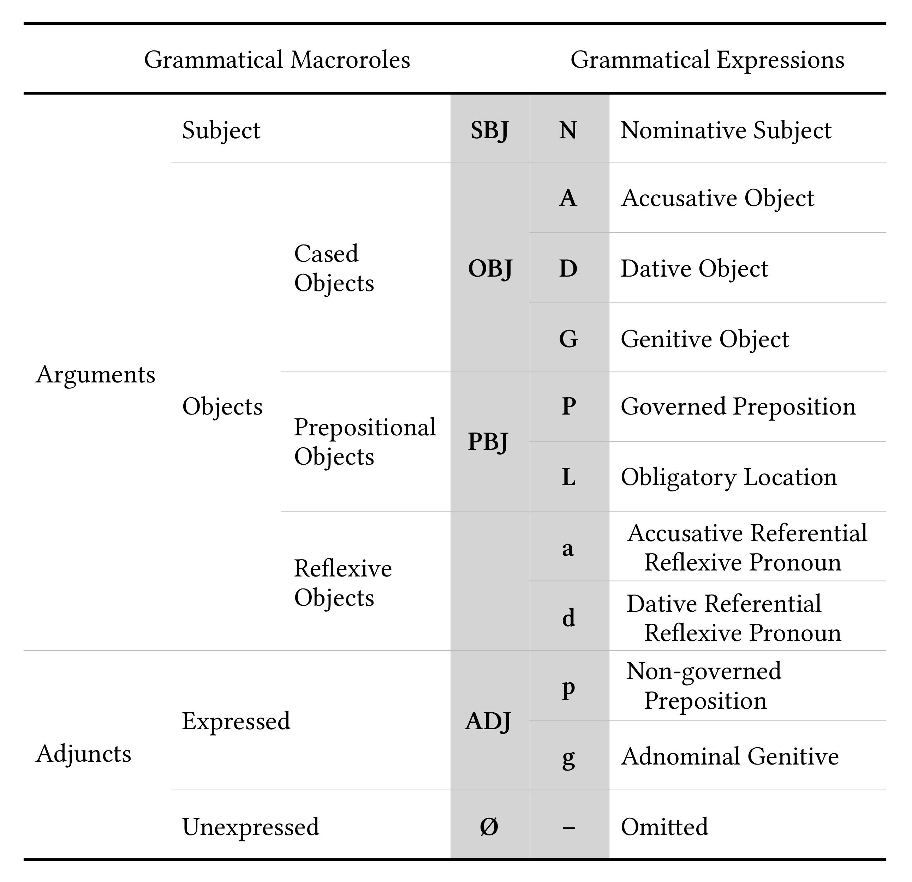
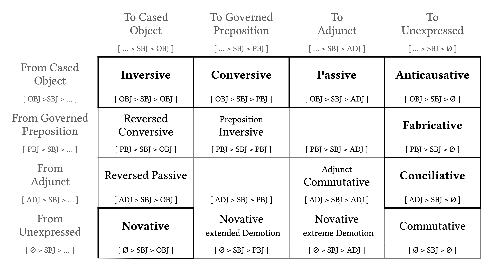
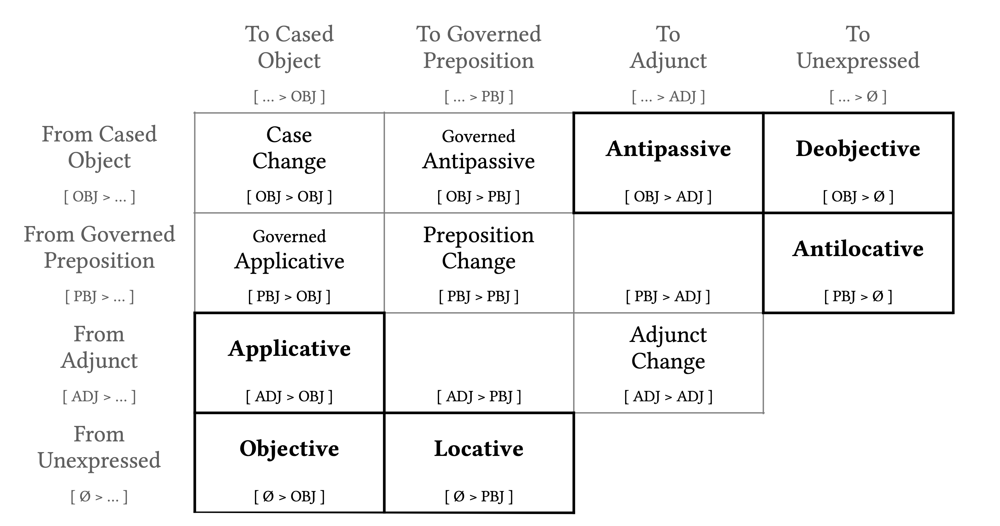
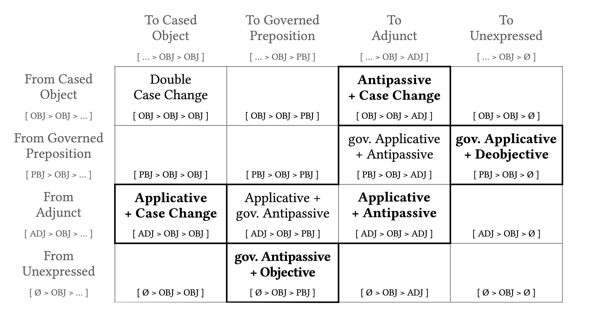

# Setting the scene {#sec:intro}

## The daunting diversity of diathesis

The quintessential example of German diathesis, found in virtually every grammatical descriptions of German, is the *werden + Partizip* passive construction [@next a]. A central characteristic of this construction is that the state-of-affairs as described by this passive is fundamentally the same as in the corresponding active [@next b], though the sentence structure of course differs between the two expressions.

::: ex
a. Das Gemälde wird (von einem Künstler) gemalt.
b. Der Künstler malt ein Gemälde.
:::

This approach to diathesis, viz. different grammatical sentence structures that express approximately the same state-of-affairs, is applicable to a large number of grammatical phenomena in German. For example, some verbs allow for passive-like constructions without any *werden* auxiliary, often called 'anticausative' [@next a]. Other verbs allow for an alternation between a case-marked accusative and a prepositional phrase, often called 'antipassive' [@next b]. Further, there exist many different kinds of diathesis marked by a reflexive pronoun *sich* [@next c] or marked by preverbs like *ent-* [@next d]. Many auxiliary-like construction beyond the *werden + Infinitiv* passive also show diathesis, e.g. *sein + zu + Infinitiv* [@next e].^[Many examples in this book contain masculine nouns, not because of laziness on my behalf, but because their definite articles overtly show the different German cases (*der, des, dem, den*). Notwithstanding this grammatical preference, I will try to use examples with as much diversity as possible throughout this book.]

::: ex
a. Der Doktor heilt den Schmerz. \
   Der Schmerz heilt (durch den Doktor).
b. Der Jäger schießt den Bären. \
   Der Jäger schießt auf den Bären.
c. Der Lehrer beklagt den Lärm. \
   Der Lehrer beklagt sich über den Lärm.
d. Der Kandidat stammt aus einem Adelsgeschlecht. \
   Der Kandidat entstammt einem Adelsgeschlecht
e. Der Ermittler löst den Fall. \
   Der Fall ist (für den Ermittler) leicht zu lösen.
:::

All in all, there are about 250 different German diatheses described in this book, some highly productive, some only attested for a handful of verbs. The main goal of this book is to present this wealth of grammatical possibility in a unified manner, while at the same time attempting to classify and organise this diversity. I will make no attempt to fit all these constructional possibilities of the German language into any specific grammatical framework, although the collection of diatheses presented here might be taken as a modelling-challenge for your favourite grammatical theory.

It might come as a surprise that there are so many different diatheses in German, but my impression is that German is no exception among the world's languages in this respect. I expect that all languages have a wealth of different ways in which to construe a sentence around a lexical predicate. In a sense, diatheses allow for the expression of different perspectives on the event described, something that is arguably a common desire of any language user.

This first chapter summarises the basic definitional properties of diathesis. The next Chapter [-@sec:structure] describes in detail how diatheses are analysed and classified. Chapter [-@sec:summary] presents a summary of the 70+ major German diatheses and proposes German names for those structures. Chapters [-@sec:case] to [-@sec:zuminfinitive] are the main, almost database-like, chapters discussing each sentence structure separately. Finally, Chapters [-@sec:adj] to [-@sec:subordination] discuss additional phenomena that are related to diathesis.

In this book, each diathesis has its own sub-subsection with an unique section header that can be used as a name to refer to the diathesis (e.g. [@sec:participles-werden-passive] on the "*werden + Partizip* passive"). Many of these unique names are quite boring, but hopefully descriptively useful for future reference. Individual verbs (often with concrete examples) are listed with each diathesis to show the extend of its applicability. Neither these lists of verbs nor the examples are intended to be exhaustive in any way. They should be seen as a first step towards more in-depth research into individual diatheses or into the different constructional possibilities that exist for individual verbs.

The current attempt to present an all-encompassing survey of German diatheses builds on a rich scholarly tradition (with many scholarly precursors to be cited in appropriate places throughout this work). A comparable and highly influential survey of diathesis for English is Levin [-@levin1993], followed by a similar attempt for German by Sauerland [-@sauerland1994]. A recent cross-linguistic survey of valency and diathesis in this tradition is edited by Malchukov & Comrie [-@malchukov2015a], which also includes data on German [@haspelmath2013a]. Independent of Levin's work, there is a long tradition in the German grammatical literature to investigate diathesis, e.g. as '*Konversenverhältnis der Aktanten*' [@eroms1980: 24; cf. @heringer1968]. An early attempt at a survey of various diatheses is presented by Höhle [-@hohle1978]. Basic summaries of german diathesis in the context of valency can be found in Eroms [-@eroms2000: Ch. 10] or Ágel [-@agel2000: Ch. 6]. There also are a few monographs about specific German diatheses [e.g. @leirbukt1997; @holl2010; @jager2013] and recently some corpus studies into the effect of specific diatheses on individual verbs have appeared [@devaere2018; @imo2018; @dux2020: Ch. 6].

Diathesis is of course closely linked to the concept of valency, so the groundbreaking valency dictionary for German by Helbig and Schenkel [-@helbig1991] deserves mentioning. They identify the problem that certain verbs can be used in different constructions, but diatheses are not investigated consistently in their dictionary. Another highly influential valency dictionary for German, edited by Schumacher [-@schumacher1986; also the precursor @engel1978], discusses passive diatheses for all verb. I see the current survey of German diatheses as a first step in extending such valency dictionaries into even more all-encompassing dictionaries that discuss all possible clause constructions for each verb.

## Defining diathesis {#sec:intro-basic-definition}

A diathesis is defined here as special kind of alternation between two different clause constructions. To properly define the notion 'diathesis', I will first define 'alternation' in general. Next, the definition of 'clause alternation' will be built on that basis. Finally, a diathesis will then be defined as special kind of clause alternation. A few crucial concepts that are used in the following definitions will be discussed in more detail in subsequent sections.

#### Alternation {.unnumbered}

An ~~alternation~~ (or simply 'grammatical marking') is defined as follows:

- An alternation consist of two different linguistic constructions, i.e. there are two alternants.
- The lexical root (or possibly larger linguistic entity) does not change in the alternation, i.e. there is some fundamental linguistic material in both alternants that remains the same.
- Typically, the difference between these alternants is overtly indicated by the presence of some grammatical linguistic elements.
- Typically, the overt marking introduces a direction into the alternation, i.e. one alternant consists of less/shorter/zero linguistic elements ('less marked') and one consists of more/longer/overt linguistic material ('more marked'). In some cases, the direction of the alternation remains undecidable, i.e. the alternation is equipollent.
- The set of roots (or possibly larger linguistic entities) to which the alternation applies form an empirical linguistic class. Such an empirical class often has a semantic/functional interpretation, but not necessarily so.

Alternations are the basis of all grammatical analysis.^[There is an interesting, almost philosophical, issue here that I will not delve into, namely whether the basis of grammatical analysis are the constructions themselves (cf. construction grammar) or the alternations between constructions. The statement in the main text should indeed be taken as a proposal that alternations are the more crucial entities. An alternation is the equivalent in morphosyntax of a phonological minimal pair. Alternation are also useful in the practice of grammatical description. For example, the meaning/function of a construction is often hard to describe in full, while the meaning/function of an alternation can simply be described by the difference in meaning between the alternants. Only the crucial aspect that is added by an alternation needs to be captured – a task which is already difficult enough though. Similar intuitions about the importance of alternations have lead to the development of transformations [@harris1957].] They include for example:

i. morphological oppositions, like singular *Haus* 'house' vs. plural *Häuser* 'houses'.
ii. oppositions of grammatical forms, like synthetic present *er schläft* 'he sleeps' vs. analytic perfect *er hat geschlafen* 'he has slept' 
iii. different sentence constructions attested with specific verbs, like transitive *Ich verkaufe das Buch* 'I sell the book' vs. reflexive anticausative with obligatory adverbial *Das Buch verkauft sich gut* 'the book is selling well' (see [@sec:adverbial-reflexive-transitive-anticausative]).

#### Clause alternation {.unnumbered}

Based on the definition of an alternation, a ~~clause alternation~~ is defined as follows:

- In a clause alternation both alternants are monoclausal, i.e. both alternants contain a single main predicate. For German, the definitional property of monoclausality will be a phenomenon called 'coherence' (see [@sec:intro-coherence]).
- In both alternants, the main predicate consists of the same lexeme, i.e both contain the same verb and the meaning of the lexical verb does not (substantially) change between the alternants (see [@sec:intro-lexical-meanings]).
- The lexical roles of the verb do not change between the alternants. Lexical roles are an inherent part of the meaning of a verb and alternations do not change them. Note, however, that there might be new roles introduced or some roles might be left unexpressed (see [@sec:intro-lexical-roles]).
- The meaning/function of the whole clause changes between the alternants. This functional difference is the whole point of having a clause alternation in the first place (see [@sec:intro-functional-analysis]).
- A specific clause alternation is only applicable to a restricted set of verbs. The list of applicable verbs constitutes the domain of application of the alternation. Any semantic/syntactic characterisation of these applicable verbs should be seen as a summary of the domain of application, not its definition (see [@sec:intro-domain-of-application]).

Clause alternations are widespread when auxiliaries are introduced, like modal *müssen* 'have to' [@next a], see [@sec:infinitive-modals]. However, clause alternations are attested with many more different kinds of marking, like the verb particle *auf* marking completeness of the action [@next b], see [@sec:prepositions-accusative-antipassive], or the somewhat mysterious 'free' reflexive *sich* with verbs like *ansehen* 'look at' [@next c], see [@sec:reflexive-free-dative-sich-accusative]. Arguably, the special word order in German subordinate clauses (viz. the finite verb occurs clause-final) can also be considered to be a clause alternation [@next d].

::: ex
a. Er erledigt seine Hausaufgaben. \
   Er muss seine Hausaufgaben erledigen.
b. Ich esse den Apfel. \
   Ich esse den Apfel auf.
c. Er hat das Haus angesehen. \
   Er hat sich das Haus angesehen.
d. Er erledigt seine Hausaufgaben. \
   Ich hoffe, dass er seine Hausaufgaben erledigt.
:::

#### Diathesis {.unnumbered}

Based on the notion of a clause alternation, a ~~diathesis~~ (sometimes also known as 'valency alternation') is defined as follows:

- A diathesis is a clause alternation in which at least one of the lexical roles is overtly marked differently between the clausal alternants, i.e. at least one of the roles is remapped to a different grammatical expression. In other words, a diathesis is a clause alternation with a co-occurring role-marking alternation (see [@sec:intro-diathetical-operations]).
- Remapped roles do not substantially change their meaning, i.e. 'who does what to whom' does not change. However, the details of the relation between the main predicate and the remapped roles can (and normally will) change. There will be slight changes in meaning, e.g. aspects like the role's influence on the action, or its affectedness by the predicate, might change. As an extreme case, the remapping of a role can consist in the addition of a completely new role or in the complete removal of an existing role (see [@sec:intro-valency]).
- As is true for all alternations, a diathesis has a direction from a formally 'less marked' to a 'more marked' alternant. However, in some special instances a diathesis can show no other overt marking than the change in marking of the reframed roles itself. This will be called a covert (or equipollent, or bare) diathesis. The different forms of marking of diatheses are the basic organisational structure of this book (see [@sec:intro-voice]).
- As a practical restriction, I will only consider diatheses in which one alternant is a basic clause with a single finite verb. In principle, when there is a diathesis between a basic clause and structure A, and another diathesis between a basic clause and Structure B, then there is also a diathesis between structures A and B. However, such diatheses are not included here. It is a major goal of this book to present a precise description of the mappings between basic clauses and all attested diatheses (see [@sec:intro-naming]).

The prototypical example of a diathesis is the *werden + Partizip* passive [@next a], see [@sec:participles-werden-passive]. In both clause alternants the same state of affairs is described, but the marking of the participants is different. However, the diversity of diatheses in German is enormous as this book attempts to show. There are, for example, covert diatheses (i.e. diatheses without any marking on the verb) like the infamous anticausative in [@next b], see [@sec:case-haben-anticausative], or antipassives marked with a reflexive pronoun as shown in [@next c], see [@sec:reflexive-accusative-antipassive].

::: ex
a. Der Schreiner lackiert den Tisch. \
   Der Tisch wurde von dem Schreiner lackiert.
b. Ich koche den Kaffee. \
   Der Kaffee kocht.
c. Der Fahrradfahrer fürchtet den Anstieg. \
   Der Fahrradfahrer fürchtet sich vor dem Anstieg.
:::

Hidden in these succinct definitions there are various intricate grammatical concepts that need some more discussion in subsequent sections. The most general notions are discussed directly below, while the specific discussion of the analysis and classification of different kinds of diathesis is postponed for the next chapter.

## Definitional details

### Monoclausality and coherence {#sec:intro-coherence}

Diatheses are defined here as alternations between single clauses with the same main verb. However, a single clause in German can sometimes consist of multiple verb forms. It is crucial to strictly distinguish between situations in which a multi-verb construction is monoclausal and when it is not. The basis of the definition of monoclausality in German is a concept called ~~coherence~~.

All diatheses listed in this book are monoclausal. Besides trying to list all German diatheses, I will also list all non-diathetical clause alternation, i.e monoclausal alternations without any change in role-marking (these are always listed in the .4 section of each data chapter). This book can thus also be read as a listing of all German monoclausal constructions, with or without role remapping. Somewhat unexpectedly, the number of alternations without any role remapping (i.e. the alternations without diathesis) is much smaller than the number of monoclausal alternations with changes in role marking (i.e. the diatheses).

To define monoclausality, the crucial characteristic of German syntax is that the finite verb is moved to the end of the sentence in a subordinate clauses. I will use the dummy main sentence *Es ist bekannt, dass…* 'it is known that' to force a subordinate construction. The position of the finite verb in the subordinate clause can be used the identify the boundary of the clause: everything that can occur before the finite verb belongs within the clause; everything that has to come after the finite verb belongs to a different clause. For example, the simple sentence [@next a] will turn into [@next b] as a subordinate clause, with the finite verb at the end; [@next c] with constituents after the finite verb is not possible. So the whole sentence in [@next a] is a single clause. Constructions with such a pattern will be called ~~coherent~~, following Bech [-@bech1955]; see also Kiss [-@kiss1995] for a more in-depth and more extensive discussion of the concept 'coherence'. Coherent constructions are considered to be ~~monoclausal~~.

::: ex
a. Ich gehe morgen nach Hause.
b. Es ist bekannt, dass ich morgen nach Hause gehe.
c. ^* Es ist bekannt, dass ich gehe morgen nach Hause.
:::

Exactly the same coherence is attested in auxiliary constructions with participles [@next] and infinitives [@nnext]. Such constructions are also monoclausal.

::: ex
a. Ich habe gestern ein Haus gekauft.
b. Es ist bekannt, dass ich gestern ein Haus gekauft habe.
c. ^* Es ist bekannt, dass ich gestern gekauft habe ein Haus.
:::

::: ex
a. Ich will morgen ein Haus kaufen.
b. Es ist bekannt, dass ich morgen ein Haus kaufen will.
c. ^* Es ist bekannt, dass ich morgen kaufen will ein Haus.
:::

Constructions with *zu* and infinitive are sometimes coherent, e.g. [@next] with the finite verb *geben* 'to give', and sometimes non-coherent, e.g. [@nnext] with the finite verb *behaupten* 'to claim'. The coherent construction in [@next a] is thus monoclausal, while the non-coherent construction in [@nnext a] consists of two clauses.

::: ex
a. Der Protest gibt ihr zu denken.
b. Es ist bekannt, dass der Protest ihr zu denken gibt.
c. ^* Es ist bekannt, dass der Protest gibt ihr zu denken.
:::

::: ex
a. Der Sportler behauptet den Wettkampf zu gewinnen.
b. ^* Es ist bekannt, dass der Sportler den Wettkampf zu gewinnen behauptet.
c. Es ist bekannt, dass der Sportler behauptet den Wettkampf zu gewinnen.
:::

In some intermediate cases both orders are possible, as shown with the finite verb *helfen* 'to help' in [@next].

::: ex
a. Ich helfe dir den Koffer zu tragen.
b. Es ist bekannt, dass ich dir helfe den Koffer zu tragen.
c. Es ist bekannt, dass ich dir den Koffer zu tragen helfe.
:::

Maybe surprisingly, when the above definition of monoclausality is strictly followed, then there appear to be dozens of verbs that can be used as the finite 'auxiliary' in a coherent multi-verb construction. When used as finite auxiliaries, these verbs are more or less strongly grammaticalised, i.e. they shed much of their lexical meaning when used in multi-verb constructions. Such grammaticalised verbs are classified into different groups and referred to by many different names in the German grammatical literature, e.g. *Hilfsverb*, *Kopulaverb*, *Modalverb*, *Modalitätsverb*, *Halbmodalverb* [@eisenberg2006a], *Funktionsverb* [Polenz 1963 cited in @kamber2008: 34], *Strukturverb* [@weber2005], or *Stützverb* [Seelbach 1991 cited in @kamber2008: 34]. I will not pursue the question here how to classify these verbs into different kinds. I will simply refer to the whole group of these 'auxiliary' verbs as ~~light verbs~~. All light verbs that will be discussed in later chapters are shown here in alphabetical order in [@next], though note that not all of them are involved in diathesis. A few of the verbs listed below are only attested in monoclausal alternation without diathesis.

::: ex
German verbs that can be used as light verbs 

*anfangen, aufhören, aussehen, beginnen, bekommen, bleiben, brauchen, bringen, drohen, dürfen, erscheinen, fahren, finden, fühlen, geben, gehen, gehören, gelten, glauben, haben, halten, heißen, helfen, hören, kommen, kriegen, können, lassen, legen, lehren, liegen, machen, möchten, mögen, müssen, nehmen, pflegen, riechen, scheinen, schicken, sehen, sein, setzen, sollen, spüren, stehen, tun, versprechen, werden, wirken, wissen, wollen*
:::

### Grammaticalisation of lexical meaning {#sec:intro-lexical-meanings}

A difficult problem is the question whether it is really the same verb that is used in two alternating constructions of a diathesis. For example, the verb *trinken* 'to drink' is a regular transitive verb, but when used intransitively, *er trinkt* 'he drinks', it has a clear implication that his drinking includes too much alcohol, so it might be better translated as 'he is an alcoholic'. In this case, this intransitive interpretation is probably best analysed as a conventional implicature, because the alcoholism aspect of the meaning can be suppressed given the right context.

In general, when the same lexical verb is used in different alternating constructions, then there is (of course) a difference in meaning between the two occurrences. However, ideally this difference is completely induced by the respective constructions and not by the lexical verb itself. Yet, it is extremely common for the combination of a lexical verb with the surrounding construction to grammaticalise into a new meaning. For example, the verb *auftreten* means something like 'to act' as an intransitive, but *to kick open* as a transitive. Both meanings originate from the meaning 'to step on something (by foot)'. Likewise, historical processes can lead to current homophony of two different lexemes. This appears to be the case for example with the verb *abhauen*, which is a transitive verb meaning 'cut of' (e.g. *Er hat den Ast abgehauen*). However, it has attained another usage during the course of the 20th century as an intransitive verb meaning 'run away' (e.g. *Er ist abgehauen*), probably based on a southern German dialectal meaning of *hauen* 'to go, to walk' [@pfeiffer1993: "hauen", accessed 12.12.2018].

In between those extremes (i.e. conventional implicature and different lexicalisation) there exist various intermediate phenomena. For example, the verb *hängen* 'to hang' can be used as a regular intransitive verb with a location, like *Er hängt an einem Seil* 'He dangles to a rope', but the specific combination with the preposition *an* can also have a special reading of 'being emotionally attached to something', like in *Er hängt an seinem Teddy* 'He is (emotionally) attached to his Teddy'. In this case it seems most appropriate to interpret the combination *hängen an* as a separate lexicalisation, though the path of the conventional implicature can still be intuitively grasped.

As with all grammaticalisation processes, it is often difficult to decide where to draw the line on the continuum between conventional implicature, metaphorical extension (*trinken*) and contextual lexicalisation (*hängen an*) or completely different lexicalisation (*auftreten*, *abhauen*). I tend to be rather lenient in allowing slightly different meanings to be included as the 'same' verb, but will exclude clear examples of the latter two types on the continuum as separate lexicalisations of homophonous elements.

### Lexeme-specific lexical roles {#sec:intro-lexical-roles}

A crucial aspect of diathesis is that the lexical roles do not change, only the grammatical encoding of the roles changes. For example, the verb *füllen* 'to fill' occurs in various monoclausal constructions [@next], but the roles of (i) 'filler', (ii) 'filled container' and (iii) 'filling substance' are always the same. The different grammatical forms that are used to express these roles are added as subscripts to each sentence in the examples below.

::: ex
a. Ich~i:\ NOM~ fülle den Topf~ii:\ ACC~ (mit Reis~iii:\ PREP~).
b. Ich~i:\ NOM~ fülle den Reis~iii:\ ACC~ in den Topf~ii:\ PREP~.
c. Der Reis~iii:\ NOM~ füllt (mir~i:\ DAT~) den Magen~ii:\ ACC~.
d. Der Blumentopf~ii:\ NOM~ füllt sich (mit Wurzeln~iii:\ PREP~).
:::

Already from this example it becomes clear that it is often really difficult, if not impossible, to attach a specific valency to a verb. Given that most (and possibly all) German lexemes show some kind of diathesis, I reject the traditional notion of a fixed valency belonging to a specific verb (see [@sec:intro-valency] for a more extensive discussion). Alternatively, I propose that it is possibly to list all ~~lexeme-specific roles~~ (or equivalently ~~lexical roles~~) as a fixed characteristic of each lexical verb. The following criteria will be used to determine the lexical roles of a verb:

First, each role that is case-marked in at least one clause-alternant is a lexeme-specific role. In the example of *füllen* in [@last], each of the three roles is marked as nominative, accusative or dative in at least one of the alternants, so all three roles are lexeme-specific. Various exceptions and stipulations to this criterion are discussed in [@sec:case-delimiting-arguments].

Second, all obligatory prepositional phrases are lexeme-specific roles. Such prepositional phrases, that cannot be left out, are not very widespread in German and mostly designate a location. Some verbs always expect such a location-role [@next a,b], see e.g. [@sec:prepositions-obligatory-local, @sec:reflexive-obligatory-local], but more widespread are resultative diatheses that introduce an obligatory local role [@next c,d], see e.g. [@sec:prepositions-action-result].

::: ex
a. Der Stuhl befindet sich im Wohnzimmer
b. ^* Der Stuhl befindet sich.
c. Ich breche ein Loch in den Felsen.
d. ^* Ich breche ein Loch.
:::

Third, there is a large class of lexeme-specific prepositional phrases that I will call ~~governed prepositions~~, like *arbeiten an* 'to work on' [@next a]. These prepositional phrases are not obligatorily present [@next b]. The intuition behind governed prepositions is that these prepositions are lexically determined by the verb and often strongly grammaticalised both semantically and structurally. Semantically, the preposition *an* with the verb *arbeiten* 'to work' [@next a] is strongly bleached with none of its local 'touching' meaning remaining. Syntactically, the prepositional phrase in *arbeiten an* can be filled with a complement clause of the form *daran, dass …* [@next c]. This syntactic criterion will be used as the main characteristic to identify governed prepositions. Various exceptions and stipulations to this criterion are discussed in [@sec:prepositions-delimiting-governed-prepositional-phrases]. 

::: ex
a. Ich arbeite an meinem Buch.
b. Ich arbeite hart.
c. Ich arbeite daran, dass das Buch fertig wird.
:::

Under this approach, there are a few lexical roles that appear to be very widespread, up to the point of seemingly being universally applicable to all verbs. If that would be the case, then it would defeat the idea of lexeme-specific roles. However, on closer inspection my impression is that there are no roles that apply to all verbs. The closest contender is, arguably, the role of causer, which can be introduced to almost any German verb by using the *lassen + Infinitiv* diathesis [@next], see [@sec:infinitive-lassen-causative]. However, there is a small group of verbs that do not allow for this diathesis, like *gefallen* 'to like' [@nnext]. This shows that even virtually universal roles are still lexically determined.

::: ex
a. Der Student arbeitet an einer Aufgabe.
b. Der Professor lässt den Student an einer Aufgabe arbeiten.
:::

::: ex
a. Dein Haarschnitt gefällt mir.
b. ^* Er lässt mir seinen Haarschnitt gefallen.
:::

Such lexeme-specific roles are called 'verb-specific semantic roles' in Van Valin [-@van-valin2004] and 'microroles' in Hartmann et al. [-@hartmann2014]. The obvious next step (as discussed in both these papers) is to cluster such microroles into clusters of semantic/thematic mesoroles, i.e. widespread roles like 'agent', 'patiens', 'experiencer' etc. Such semantic roles are used constantly in contemporary linguistics, but they are surprisingly ill-defined. For example, given a random German verb like *füllen* as exemplified at the start of this section: what should be its semantic roles, and what criteria should be used to determine this? Hartmann et al. [-@hartmann2014] and Cysouw [-@cysouw2014a] use cross-linguistic data to approach this question. However, such an approach does not allow for language-specific definitions, which is the problem in the current example of German.

My proposal for a language-specific determination of semantic mesoroles is to use the applicability of diatheses as a criterion. For example, a 'German Patiens' might be defined as those lexical roles that are changed from accusative to nominative in the *werden* passive diathesis. Or more general: a semantic role can be defined by a combination of applicable diatheses. The research project to determine suitable combinations of diatheses will not be pursued here, but left for a follow-up investigation.

### Domain of application and verb classes {#sec:intro-domain-of-application}

A widespread assumption in linguistic analysis is that most alternations (including diatheses) have a sensible domain of application. This is the idea that there is some rationale, often a kind of semantic characterisation, explaining which roots allow for a specific kind of linguistic marking (e.g. only transitive verbs allow for a *werden* passive).^[For example, compare the infamous sentence on the first page of Levin [-@levin1993: 1] "the behavior of a verb, particularly with respect to the expression and interpretation of its arguments, is to a large extent determined by its meaning." However, Levin's work in practice uses form to establish classes, not meaning. This approach is followed here.] Although I also believe that many alternations, including diatheses, mostly behave sensibly, I would also warn not to expect too much regular (semantic) generalisations hidden in grammatical structure. Many grammatical regularities have unexpected exceptions, be it because of haphazard diachronic changes or through partial analogical extension. Even stronger, some grammatical marking appears to be almost completely without (semantic) rationale, like the assignment of plural allomorphy in German. If that can happen in morphology, it can also happen in syntax.

As a practical approach to the domain of application of a specific alternation (say, which verbs allow for the *werden* passive, or for the reflexive anticausative, etc.), I propose to always first enumerate as much examples as possible. In other words, first inductively establish an empirical verb class of those verbs that happen to be attested. In this book, I will not be satisfied with four or five cases that suggest a neat semantic coherence for a specific diathesis, but list as many as possible further examples, idiosyncratic as they may be. Only after such a formal listing of the domain of application (which ideally needs much more corpus research as I have been able to perform here) is it possible to investigate the presence of any (semantic) rationale. In many cases there might be a partial rationale, but it is just as likely (and just as interestingly) to have to conclude that there apparently is none.

Taking this principle one step further, I propose to *define* the domain of application as the concrete listing of all examples. Any (semantic) characterisation is then always a post-hoc generalisation, not a definition. This radically lexicalist interpretation is the approach that I will follow in this book. For each diathesis I will list as many as possible example verbs that take part in the diatheses (for some I will reverse the approach and list verbs that are not part of the domain of application). These lexical lists (i.e. the empirical verb classes) are the definition of the domain of application. For some diatheses, I will speculate about semantic generalisations, but I consider these generalisations always to be secondary to the concrete listing of examples.

This principle of the definition by listing even holds for questions of productivity. For example, when somebody would propose a nonce-verb like *flurchten* to be a new verb for the German language in an experimental setting, then its meaning is partially defined by stating what kind of diatheses it can take part in. Depending on how such a new verb is contextualised, the following construction might or might not be judged grammatical. The choices that will be made influence the meaning of the verb.

::: ex
a. Ich flurchte den X.
b. Ich flurchte an den X.
c. Ich flurchte mich vor den X.
d. Der X flurchtet.
e. Der X flurchtet sich.
:::

### Functional analysis {#sec:intro-functional-analysis}

Intimately connected to the domain of application (i.e. which verbs allow for which diathesis) is the question as to the meaning/function of a specific diathesis. In essence, this question asks for a description of the difference between the meaning of the two alternants of a diathesis. For example, what is the difference between the transitive [@next a] and the corresponding reflexive anticausative [@next b], see [@sec:reflexive-anticausative].

::: ex
a. Ich schließe die Tür.
b. Die Tür schließt sich. 
:::

In general, it turns out to be extremely difficult to give a concise description of such differences, and I will mostly refrain from trying to provide such descriptions. Each diathesis is actually its own research project, preferably investigated using predictive corpus analysis [cf. the large literature on the English dative alternation, for German see e.g. @devaere2018]. The actual lists of verbs that allow for a specific diatheses (i.e. the domain of application, see above) also seems to be an important datapoint to investigate the function of a diathesis.

The problem of a functional description for a diathesis becomes even more difficult with the realisation that there are dozens of diatheses, often highly similar to each other. For example, it is really difficult [cf. @schafer2007; @kurogo2016] to characterise the difference between the reflexive anticausative above in [@last] and the unmarked anticausative in [@next], see [@sec:case-haben-anticausative].

::: ex
a. Ich koche den Kaffee.
b. Der Kaffee kocht.
:::

An important side-note in this respect are those alternations that have similar formal characteristics as diatheses, but which do not have any role-remapping. Such sentence alternations are not considered to be diatheses here (they will be called 'epithesis'), but they are still discussed in the .4 sections of each chapter. An example is the phenomenon of 'free' reflexives [@next], see [@sec:reflexive-free-dative-sich-accusative]. Although there is no role-remapping in this alternation (and thus no diathesis), it turns out to be really difficult to describe the difference between [@next a] and [@next b]. All sentence alternations, with or without role-remapping, are in need of a functional analysis, and most such analyses will involve substantial research.

::: ex
a. Ich habe das Haus angesehen.
b. Ich habe mir das Haus angesehen.
:::

## Method

Methodologically, I see the approach in this book as an attempt to unify grammatical research with lexicographic research, two aspects of linguistics that are often considered to be separate inquiries. In contrast to such a separation, I would like to propose a view of linguistics that might be called ~~grammar of the lexicon~~ [cf. @levin1993: 2-4, but one might just as well include all of construction grammar here]. In this approach, each grammatical phenomenon should always be linked to individual occurrences, either types (lexicon) or tokens (corpus). It is my experience from compiling the current compendium of diatheses that identifying and characterising a specific structure is really just 'step one' of grammatical research. Only by trying to find more examples, with different lexemes and in different contexts, it becomes clear how prominent and varying a grammatical structure really is.

As as rule-of-thumb, I propose the ~~10-examples-in-15-minutes-rule~~ as step two of grammatical research. If you think that a particular construction is widespread, or maybe typical for a specific class of words (e.g. typical for 'intransitives'), then take 15 minutes to search for examples, either in your own intuitions or in one of the many online databases or corpora. Resources like the *Digitales Wörterbuch der deutschen Sprache* ([DWDS](https://www.dwds.de)), the various online offerings of the *Institut für Deutsche Sprache* ([IDS](https://www1.ids-mannheim.de/onlineangebote)), or just a Google 'exact search' are really just a click away and completely rejuvenate linguistic research. If you are not able to list 10 examples in 15 minutes, then go back to the drawing board and reconsider your intuitions.

Such a quick-and-dirty 15-minute survey of course still only represents a preliminary step. It is this level of detail that I have aimed for in this book. Each sub-subsection about an individual diathesis lists lexemes that can be used in this diathesis, and includes examples of the diathesis, either from my own intuitions or from any of the above mentioned databases. I plan to fine-tune these lists in future revisions of this book, but the real research is only yet to come. Next steps would be the in-depth investigation of individual diathesis by sampling examples in corpora and formulating predictive parameters to explain their usage. For example, De Vaere *et al.* [-@devaere2018] investigate the dative antipassive (see [@sec:prepositions-dative-antipassive-accusative]) for just a single lexeme *geben*. As there are hundreds of diatheses and hundreds of verbs listed in this book, this shows that there are tens of thousands of research projects just waiting to be tackled.

# The structure of a diathesis {#sec:structure}

## Terminology {#sec:intro-terminology}

In their cross-linguistic survey of diathesis, Zuñiga & Kittilä [-@zuniga2019] distinguish between the terms 'diathesis', 'diathetical operation', 'grammatical voice' and 'transitivity'. I completely subscribe to these conceptual distinctions. However, throughout this book I have decided to simplify the terminology and basically use the term 'diathesis' for all four concepts. Still, the concepts ~~valency~~ ([@sec:intro-valency]), ~~voice~~ ([@sec:intro-voice]), and ~~diathetical operation~~ ([@sec:intro-diathetical-operations]) are central in the analysis of the structure of a diathesis and will be discussed extensively in this chapter. Two new concepts are introduced as well, namely ~~stacking~~ ([@sec:intro-stacking]) and ~~chaining~~ ([@sec:intro-chaining]). Finally, I will present an extensive discussion about ~~naming~~ diatheses ([@sec:intro-naming]).

A diathesis (as defined here) is an alternation between two clausal construction. To be more precise, this is what is called a 'diathetical operation' in Zuñiga & Kittilä [-@zuniga2019: 4], see [@sec:intro-diathetical-operations]. Each of the alternants show a different mapping of (grammatical) expressions onto (semantic) roles. Individually, each such mapping between expressions and roles is called a 'diathesis' in Zuñiga & Kittilä [-@zuniga2019: 4]. However, because I will only consider diathetical operations between an 'unmarked' basic clause and a 'marked' alternant, I have decided to simplify the terminology in this book. Both the alternation itself (Zuñiga & Kittilä's 'diathetical operation', e.g. 'causativisation') and the derived alternant (Zuñiga & Kittilä's 'diathesis', e.g. 'causative') will be referred to here simply as ~~diathesis~~. 

A side-effect of this approach is that 'active' is not a diathesis, but simply the unmarked counterpart of a diathetical operation. Even stronger, I will refrain from using the term 'active' because it immediately conjures up 'passive' as its antithesis. This opposition is too much of an oversimplification as 'passive' is just one of the hundreds of possible diatheses. Also, the 'active' does not necessarily describes an action, so content-wise this term is likewise ill-fitting. As an alternative, I will use the term ~~basic clause~~ as the unmarked base of comparison for all clause alternations. A basic clause is a clause with a single (finite) verb from, either in the German *Präsens* or *Imperfekt* tense.^[Strictly speaking, a basic clause can also be a clause with a single finite verb form in the *Konjunktiv I* or *Konjunktiv II*. However, because these are rather rare nowadays I have hidden this option in this footnote.] All other verb forms, including the *Perfekt* and the other traditional German tense-aspect distinctions, are all ~~derived clauses~~, i.e. the result of some kind of clause alternations. A clause alternation without diathesis will be called ~~epithesis~~, from Greek *ἐπίθεσις* 'placement upon, imposition'. Epithesis is grammatical marking 'on top of' a basic clause.^[There appears to be a rare alternative usage to the term 'epithesis' in linguistics to indicate the addition of a sound to the end of the word, i.e. a special kind of epenthesis, see for example <http://www.websters1913.com/words/Epithesis>.] A clause alternation with diathesis is simple referred to as ~~diathesis~~, from Greek *διάθεσις* 'placement in order, (re)arrangement'.

The actual linguistic marking of the diathesis (for example by verbal morphology or auxiliaries) is called 'grammatical voice' in Zuñiga & Kittilä [-@zuniga2019: 4]. In this book, each diathesis is defined as a combination of a (re-)mapping of roles and a specific kind of linguistic marking of the main predicate. So again, this extra terminological distinction is not necessary. The formal expression ('grammatical voice') is simply a definitional part of each diathesis here. Still, the different kinds of grammatical voice in German are used in this book as a major organisational characteristic for the separation of the data chapters (see [@sec:intro-voice]).

The term 'transitivity' [@zuniga2019: 3; following @hopper1980] describes a (recurrent) connection between a diathetical operation and semantic effects on the meaning of the clause. For example, when an accusative argument is remapped onto a prepositional phrase, this often implies less involvement of the argument. The details of such semantic effects of each of the diatheses in this book is a fascinating topic, for which I unfortunately can only offer limited insights throughout. In practice, I assume that each diathesis as described here has some kind of semantic effect, but the details of these effect need much more detailed research that has to be provided by subsequent work.

Finally, I prefer to use the term 'diathesis' over the frequently attested term 'valency alternation', because there are many diatheses in which the valency does not change between the alternants. For example, in [@next]  both sentences have the same valency with a nominative, accusative and prepositional phrase. However, there is a clear diathesis, though arguably there is no change in (basic) valency. Strictly speaking, valency alternations are a subset of all diatheses.

::: ex
a. Ich schmiere Salbe auf die Wunde.
b. Ich beschmiere die Wunde mit Salbe.
:::

## Valency {#sec:intro-valency}

### Utterance valency and lexical roles

Valency is traditionally interpreted as a fixed constructional characteristic of a lexical verb, e.g. the verb *geben* 'to give' is said to be ditransitive.^[I will consider predicative adjectives also as verbs, e.g *bewusst sein* 'to be aware', *einig sein* 'to agree' or *ähnlich sein* 'to resemble'. In German, predicative adjectives use the copula *sein*, so in many other grammatical analyses such predicates have a special status. In contrast, they will simply be treated as a single (though multiword) verb here.] A central thesis of this book is that this conception of valency is misguided. Individual verbs can (and normally will) be used in many different constructions with different valency (i.e. most verbs show some kind of diathesis). Consider for example the verb *wehen* 'to blow'. Such 'weather' verbs are often considered to have zero valency, which in German is characterised by an obligatory *es* pronoun [@next a]. However, the same verb can just as well be used as an intransitive [@next b,c], as a transitive with an accusative object [@next d], or even as a ditransitive with a dative and accusative object [@next e]. Note that the prepositional phrase in [@next c,d,e] cannot be left out, and its obligatory presence might be used to argue for argument-status of these prepositional phrases. The example in [@next e] then will be an example of the verb *wehen* with a valency of four.

::: ex
a. Heute weht es.
b. Gestern wehte kein Lüftchen.
c. Der Rosenduft weht ins Zimmer.
d. Der Sturm weht den Schnee von den Dächern.
e. Der Fahrtwind weht mir die Mütze vom Kopf.
:::

There is a recurrent tendency in the literature to try and reduce such variation to a single valency per verb (viz. its 'real' or 'underlying' valency), and various strategies are employed to arrive at such a prototypical valency [see e.g. @welke2011: Ch. 9 for a survey]. That will not be the approach taken here. Instead, valency is proposed to be a characteristic of a specific utterance, not of a specific verb. So, the examples in [@last] can simple be assigned an ~~utterance valency~~ from zero [@last a] to four [@last e] even though they all use the same lexeme *wehen* as their main verb. 

As a replacement of the traditional lexeme-specific notion of valency (e.g. *geben* is ditransitive), I propose to use the notion of lexeme-specific ~~lexical roles~~ (e.g. *geben* has lexical roles 'giver', 'givee', 'given object', etc.). Lexical roles are participants that are treated as an argument of utterance valency in at least one of the possible diatheses of a verb (see the next section for the complete definition of such arguments). Looking back at the examples in [@last e], the following lexical roles of *wehen* 'to blow' can be established:

i. ~~blower~~: the blowing air, *Fahrtwind* 'headwind'.
ii. ~~blowee~~: Object moved by the blowing air, *Mütze* 'cap'.
iii. ~~blowing direction~~: Direction of movement induced by the blowing air, *vom Kopf* 'off the head'.
iv. ~~blowing location possessor~~: Possessor of the locational object, in [@last e] the dative *mir* 'my'. This role is necessarily the possessor of the location *Kopf* 'head' where the blowing is taking place.

Additionally, it is of course possible to define a notion of ~~lexeme valency~~, but this has to be a much more complex construct. For example, lexeme valency can be defined as the collection of all attested utterance valencies for a specific lexeme. To be precise, this lexeme valency also has to include an indexation of the lexical roles across all arguments. This addition is important to distinguish between, for example, the lexical valency of *kochen* 'to cook' [@next] and *essen* 'to eat' [@nnext]. Both can occur with a transitive and intransitive utterance valency, but the lexical roles that can be used in the intransitive differ. Specifically, the patient-role 'eaten object' of *essen* cannot be used as nominative subject in the intransitive [@nnext c], which is different from *kochen* [@next c]. In effect, these verbs have a different lexeme valency.

::: ex
a. Der Chef kocht den Fond.
b. Der Chef kocht immer noch.
c. Der Fond kocht immer noch.
:::

::: ex
a. Der Chef isst den Fond.
b. Der Chef isst immer noch.
c. ^* Der Fond isst immer noch.
:::

### Arguments of utterance valency {#sec:intro-arguments-utterance-valency}

The lexical roles of a specific verb are defined as those participants that are treated as an argument in at least one of the possible utterance valencies of this verb. So, to identify lexical roles, a strict definition of the arguments of utterance valency is needed. The following kinds of arguments are identified. First, all case marked noun phrase constituents are arguments, with a few exceptions that will be discussed in [@sec:case-delimiting-arguments]. Basically, case marked arguments [@next a] can be questioned by question pronouns *wer* or *was*, including their case forms *wem*, *wen* and *wessen* [@next b,c]. Further, they can be pronominalised by personal pronouns [@next d] or indefinite pronouns *(irgend)jemand* or *(irgend)etwas* [@next e].

::: ex
a. Der Löwe sieht einen Vogel.
b. Wer sieht einen Vogel?
c. Was sieht der Löwe?
d. Er sieht ihn.
e. Jemand sieht etwas.
:::

Second, prepositional phrases [@next a] are arguments of an utterance when they can be replaced by a complement clause of the form *da(r)+preposition, dass ...* [@next b]. All details of the difficult question when to treat such governed prepositional phrases as arguments are discussed in [@sec:prepositions-delimiting-governed-prepositional-phrases].

::: ex
a. Der Weltreisende wartet auf einen Zug.
b. Der Weltreisende wartet darauf, dass ein Zug kommt.
:::

Third, there exist obligatory prepositional phrases, though they are not very widespread in German and mostly designate a location. Some verbs always expect such a location-role, like *sich befinden* 'to be located somewhere' [@next a,b], see e.g. [@sec:prepositions-obligatory-local, @sec:reflexive-obligatory-local], but more widespread are resultative diatheses that introduce an obligatory local role, like with *brechen* 'to break' [@next c,d], see e.g. [@sec:prepositions-action-result]. The example in [@next c] crucially shows that arguments should be determined as part of the clause structure, not the lexeme structure. It is perfectly possible to use the verb *brechen* without a prepositional phrase [@next e], but then there needs to be a different lexical role in the accusative.

::: ex
a. Der Stuhl befindet sich im Wohnzimmer
b. ^* Der Stuhl befindet sich.
c. Ich breche ein Loch in den Felsen.
d. ^* Ich breche ein Loch.
e. Ich breche den Felsen.
:::

Finally, all complement clauses are arguments [@next a,b], see Chapter [-@sec:subordination]. Complement clauses can be questioned by *was* [@next c] and pronominalised by a definite pronoun *es* [@next d] or an indefinite pronoun *(irgend)etwas* [@next e]. Complement clauses are thus syntactically highly similar to case marked noun phrases. Caution should be taken when interpreting pronominalised examples like [@next d,e], because it is not immediately obvious whether the pronouns are replacing a case-marked noun phrase or a complement clause. For example, with the verb *hoffen* [@next e] it is not possible to replace the pronoun *es* with a noun phrase, though a governed prepositional phrase with *auf* is possible [@next f].

::: ex
a. Er hofft, dass er rechtzeitig kommt.
b. Er hofft rechtzeitig zu kommen.
c. Was hofft er?
d. Er hofft es.
e. ^* Er hofft eine gute Note.
f. Er hofft auf eine gute Note.
:::

### *es* Arguments {#sec:intro-es}

A further kind of utterance-valency argument can be instantiated by *es*, the 3rd person nominative/accusative pronoun in the neuter gender. There are various uses of this pronoun that have to be distinguished. The most obvious use the pronouns *es* is for anaphoric reference (~~phoric~~ *es*). However, the next two uses not have argument-status (viz. ~~correlative~~ and ~~position-simulating~~ *es*). Most interestingly in the current context, the fourth usage of *es* does not have anaphoric reference, but will still be counted as an argument (viz. ~~valency-simulating~~ *es*). 

First, *es* can be used for anaphoric reference to neuter nouns, as shown in [@next]. There are various other variants of such ~~phoric~~ usage, for example it also occurs without direct gender agreement [@czicza2014: Ch. 2]. 

::: ex
Das Mädchen weint. Ich tröste es.
:::

Second, another kind of referential *es* occurs with some non-finite complement clauses. By definition, a complement clause replaces an argument [@next a], but in some cases a pronoun *es* remains in place of the original argument, side by side with the complement clause [@next b]. This is known as a ~~correlative~~ *es* [@czicza2014: 79ff.].

::: ex
a. Ich vergesse [meine Aufgaben]. Ich vergesse [schnell zu laufen].
b. Ich hasse [meine Aufgaben]. Ich hasse es [schnell zu laufen].
:::

Third, the pronoun *es* is also used to fill the first sentence position in front of the finite verb ('Vorfeld' in German grammatical terminology), because there is a strong regularity in German that this position cannot be left empty (except in imperatives and in yes/no questions). Word order is rather flexible in German, and it is often possible to have no lexical content in the Vorfeld. In such sentences, the pronoun *es* has to be used to fill the Vorfeld, as shown in [@next b]. This is known as a ~~position-simulating~~ *es* [@czicza2014: 115].

::: ex
a. Es weint ein Mädchen.
b. Ein Mädchen weint. 
:::

Finally, there are also constructions that obligatorily include the pronoun *es* in the sentence as part of the valency of the utterance. The main reason for such an *es* is that there is a strong regularity in German that a nominative subject has to be present in each sentence (with very few exceptions, see below). Note that 'subject' is defined here for German as the nominative noun phrase that shows agreement with the finite verb. When there is no subject available, then the pronoun *es* is used to fill this gap. This is known as a ~~valency-simulating~~ *es* [@czicza2014: 115]. In the analysis of diatheses in this book, such valency-simulating *es* is not alway explicitly noted. Any clause without an nominative argument induces a valency-simulating *es* (with very few exceptions, as noted below).

In constructions with a valency-simulating *es*, as exemplified in [@next a,b], the pronoun *es* can occur in the Vorfeld [@next a], seemingly parallel to the position-simulating usage [@last a]. However, when another constituent is placed in the Vorfeld, this obligatory *es* in [@next a] cannot be removed, but has to occur elsewhere in the sentence, typically immediately after the finite verb [@next b]. 

::: ex
a. Es stinkt hier sehr.
b. Hier stinkt es sehr.
:::

In a very limited set of constructions, a valency-simulating *es* is left out, resulting in sentences without any formal nominative subject [@next]. Most of these cases are historical idiosyncrasies, except for the impersonal passive [@next d], see [@sec:participles-werden-impersonal-passive].

::: ex
a. Heute ist mir kalt.
b. Dem Arzt graut vor Blut.
c. Mir liegt viel an deiner Anwesenheit.
d. Jetzt wird geschlafen!
:::

There are also a few rare cases in which there is a valency-simulating *es* in what appears to be an accusative case [@next].

::: ex
a. Ich habe es auf ihn abgesehen. (see [@sec:prepositions-nominative-es-preposition])
b. Wir haben es gut. (see [@sec:adverbials-accusative-es])
:::

### Adjuncts

Adjuncts, the counterparts of arguments, are phrases that are not specifically induced by the main verb of a clause. Typically, such adjuncts are adverbial prepositional phrases, see [@sec:prepositions-definition-non-governed]. Just like with arguments, adjunct status should not be linked to a lexical verb itself, but to the clause construction in which it is used. For example, the verb *tanzen* 'to dance' is typically considered to be an intransitive verb with optional (adjunct) locational prepositional phrases [@next a,b]. However, there is a crucial difference between the two locations in these two examples, see [@sec:prepositions-manner-of-movement]. The static location *im Saal* 'in the hall' [@next a] remains optional in the perfect (with auxiliary *haben*), see [@next c,d], while the dynamic location *in den Saal* 'into the hall' becomes obligatory in the perfect (with auxiliary *sein*), see [@next e,f]. So, the obligatory location in [@next e] is an utterance argument (and as a consequence, the role of 'path' is a lexical role of such verbs of movement like *tanzen*).

::: ex
a. Ich tanze (im Saal).
b. Ich tanze (durch den Saal).
c. Ich habe im Saal getanzt.
d. Ich habe getanzt.
e. Ich bin durch den Saal getanzt.
f. ^* Ich bin getanzt.
:::

Adjuncts are, by definition, optionally present, so there is a natural connection to zero expression. A central problem here is whether there is a crucial distinction between constructions in which a participant is obligatorily absent (i.e. impossible to express) vs. optionally absent (i.e. possibly not expressed). In most diatheses that involve absence, the whole point is that there is an alternation between absence and presence of a lexical role (e.g. in all drop and addition diatheses). The problematic cases are differences like passive vs. anticausative, which by definition are distinguished by possibility vs. impossibility for the agent to be expressed. This difference is highly volatile (i.e. it often differs from lexeme to lexeme whether it is possible or just dispreferred for an agent to be expressed).

## Voice {#sec:intro-voice}

The formal linguistic marking of a diathesis, for example by verbal morphology or auxiliaries, is called ~~grammatical voice~~ [following @zuniga2019: 4]. The different kinds of grammatical voice in German are the basic organisational framework of this book. Each chapter discusses a specific kind of grammatical voice, listing all diatheses using that marking. The nine main chapters can be grouped into four kinds of grammatical voices:

- zero-marked 'covert' diatheses (Chapters [-@sec:case; -@sec:prepositions])
- diatheses marked by reflexive pronouns (Chapter [-@sec:reflexive])
- diatheses marked by adverbials or preverbs (Chapters [-@sec:preverbs; -@sec:adverbials])
- diatheses marked by light-verb constructions (Chapters [-@sec:participle; -@sec:infinitive; -@sec:zuinfinitive; -@sec:zuminfinitive])

The first two chapters deal with diatheses that are not overtly marked as such, i.e. they deal with 'covert' diatheses. Because there is no marking on either of the two alternants, it is often difficult to discern a direction in such equipollent alternations. In Chapter [-@sec:case] I will discuss diatheses that only differ in the marking of case, for example unmarked anticausatives like [@next]. Chapter [-@sec:prepositions] deals with unmarked diatheses in which at least on of the alternants is a prepositional phrase, for example unmarked antipassive like [@nnext].

::: ex
a. Er verbrennt den Tisch.
b. Der Tisch verbrennt.
:::

::: ex
a. Ich schlürfe meinen Tee.
b. Ich schlürfe an meinem Tee.
:::

The contribution of reflexive pronouns for the marking of diathesis is discussed in Chapter [-@sec:reflexive]. A central claim in this chapter is that 'self inflicting' reflexive reference [@next] does not count as diathesis in German. In contrast, there are various constructions in German that use reflexive pronouns without such 'self inflicting' reflexive reference, like the antipassive in [@nnext]. In such diatheses the presence of a reflexive pronoun is the actual marking of the diathesis, it is not signalling that subject and object are the same participant. An important generalisation about diatheses with reflexive pronouns is that they are always demotions.

::: ex
a. Ich wasche das Auto.
b. Ich wasche mich.
:::

::: ex
a. Ich fürchte den Tod.
b. Ich fürchte mich vor den Tod.
:::

In Chapter [-@sec:preverbs] I will turn to preverbs, i.e. verbal prefixes that in German grammar are known as *Verbpräfixe* and *Verbpartikeln*. Grammatically, these are different kinds of prefixes, but from the perspective of diathesis they appear to function rather similar. The most widespread diathesis marked by such preverbs is an applicative, like with *be-* in [@next]. Because of the bound morphological structure, these diathesis show a strong tendency to grammaticalise into a large variety of different kinds of diatheses. A central generalisation of the diatheses discussed in this chapter is that the resulting sentence structures after diathesis are mostly transitive (esp. nominative + accusative).

::: ex
a. Ich steige auf den Berg.
b. Ich besteige den Berg.
:::

Closely related to preverbs are resultative adverbials that induce diathesis, like the applicative with *leer* in [@next]. Also using adverbials, but of a completely different kind, are diatheses with depictive adverbials, like the anticausative with *gut* in [@nnext]. Although these two kinds of adverbials occur in rather different kinds of diathesis, both phenomena are combined into the same chapter on adverbially marked diatheses in Chapter [-@sec:adverbials].

::: ex
a. Ich habe in den Teich gefischt.
b. Ich habe den Teich leergefischt.
:::

::: ex
a. Ich fahre den Lastwagen.
b. Der Lastwagen fährt sich gut.
:::

A large group of diatheses uses light verbs in combination with a non-finite form of the lexical verb. A somewhat surprising insight resulting is that light-verb diatheses always involve a role-change of the nominative subject. I distinguish four different kinds of light verb constructions, to be discussed in four different chapters. Chapter [-@sec:participle] discusses light verb construction with participles, like the infamous *werden* passive [@next].

::: ex
a. Ich habe einen Brief geschrieben.
b. Der Brief wurde geschrieben.
:::

The next three chapters describe different combinations of light verbs with lexical verbs in the infinitive. Chapter [-@sec:infinitive] discusses light verbs with straight infinitives, like the *lassen* causative [@next]. 

::: ex
a. Ich wasche meine Kleider.
b. Sie lässt mich meine Kleider waschen.
:::

Chapter [-@sec:zuinfinitive] investigates light verbs with *zu* plus infinitive, like the *sein* anticausative [@next]. And finally, Chapter [-@sec:zuminfinitive] looks at the combinations with *zum* plus infinitive, like the *bringen* causative [@nnext].

::: ex
a. Ich führe einen Hund an der Leine.
b. Ein Hund ist an der Leine zu führen.
:::

::: ex
a. Ich weine. 
b. Sie bringt mich zum Weinen. 
:::

## Diathetical operations {#sec:intro-diathetical-operations}

### Abbreviations used

A diathetical operation is change that happens in the marking of the participants in a diathesis. One of the central definitional properties of a diathesis is that the coding of at least one of the participants has to change, for example a participant erstwhile coded with an accusative turns into a prepositional phrase. Because the role of the participant remains the same (again, by definition), such a change amounts to the mapping of a role onto a different grammatical form. I will call this process ~~role-remapping~~.

In the analysis of diathetical operations in this book I will use the following abbreviations, as summarised in [@fig:abbreviations]. First, ~~grammatical expressions~~, i.e. actual grammatical forms as identified in traditional German grammar, are abbreviated with single letters, shown at the right side of the figure. For case-marked noun phrases I will use the easily recognizable capital letters 'NADG' for nominative, accusative, dative and genitive respectively. As argued earlier (see [@sec:intro-arguments-utterance-valency]) there are also prepositional phrases that express lexically-determined roles. These will also be abbreviated with capital letters: 'L' for obligatory locations and 'P' for governed prepositional phrases.

{#fig:abbreviations}

Lower-cased letters are used for non-argument participants in the clause: 'p' for non-governed prepositional phrases and 'g' for adnominal genitives. Adnominal genitives become relevant because in some diatheses a newly introduced participant is inherently the possessor of another participant (see [@par:possraising]). Absence of a specific role will be indicated by a '–' dash. Lower-cased 'a' and 'd' are only used in [@sec:reflexive-no-diathesis] to indicate accusative and dative reflexive pronouns in referential usage. As described in much detail in that chapter, it is important to distinguish between reflexive pronouns in German that refer to a lexical role (i.e. 'referential' or 'real' reflexive constructions) and reflexive pronouns that mark a diathesis without referring to a separate role themselves. Those latter reflexive pronouns, that are not marking any role, are not abbreviated by lowercased 'a' or 'd'.

Besides single-letter abbreviations I will also use capitalised three-letter abbreviations for a more abstract level of analysis. As summarised at the left side of [@fig:abbreviations], the grammatical expressions are grouped into sets of ~~grammatical macroroles~~, mostly along familiar lines. This grouping is not necessarily the best or most optimal grouping, but this grouping has emerged to be useful to organise the large diversity of diatheses in this book. The notion ~~subject (SBJ)~~ is used for governed nominative phrases that show agreement with the finite verb.^[There are various other nominatively-marked phrases in German grammar which are not included under this heading, e.g. the nominative in nominal or equational predication like *der Täter* in *Er ist der Täter*.] The other case-marked governed phrases are combined as ~~cased objects (OBJ)~~. The cased objects together with the ~~prepositional objects (PBJ)~~ form a superclass of objects. Non-governed phrases are separated in ~~overtly expressed adjuncts (ADJ)~~ and unexpressed roles ~~zero (Ø)~~. Although I will use this five-way distinction throughout this book ~~(SBJ, OBJ, PBJ, ADJ, Ø)~~, the five steps are not equidistant. The macro-roles ~~OBJ~~ and ~~PBJ~~ are rather closely related, and likewise are ~~ADJ~~ and ~~Ø~~ intimately linked. Collapsing these pairs results in the traditional subject-object-adjunct distinction.

{#par:corecase} There are some indications that the group of cased objects ~~(OBJ)~~ might be fruitfully separated into ~~core~~ (accusative) and ~~non-core~~ (dative/genitive). This would simplify the analysis of, for example, case change in object chains ([@sec:intro-object-chains]), the antipassive hierarchy ([@sec:prepositions-demotion-of-object]) and the case-marking of the reflexive pronoun ([@sec:reflexive-deponent]). However, in the majority of diatheses all three cases seem to behave as a uniform group, so I did not consistently pursue this separation.

It is imperative to realise that the macroroles are defined in a language-specific way for German grammar as groupings of language-specific German expressions (e.g. ~~ADJ~~ is defined as being either a non-governed prepositional phrase or an adnominal genitive). The names that are used (e.g. 'object' or 'adjunct') deliberately conjure up general cross-linguistic associations, but it remains to be seen whether similar definitions as used here are also useful for other languages. I will refrain from any cross-linguistic speculation in this context here.

### Remapping of roles {#sec:intro-remapping}

Using the abbreviations as summarised in [@fig:abbreviations] I will organise and categorise the role-remapping of all diatheses in various levels of abstraction. These different categorisations inform the practical organisation of each chapter.

~~Level 1: diathesis~~. Each diathesis is summarised in its own sub-subsection. The establishment of an individual diathesis is not always obvious, and each diathesis in this book is already an conscious categorisation (which could be wrong). It has actually been a voyage of discovery in the preparation of this book to decide when to consider a set of examples to be a single diathesis. Very often erstwhile single diatheses turned out to be better analysed by a split into various different diatheses. Although I am rather confident in the quality of the current decisions, I expect that further refinements are necessary in the future.

~~Level 2: remapping pattern~~. The role-remapping of each diathesis is analysed using the single-letter abbreviations (NADGPLpgad–) from [@fig:abbreviations]. A remapping is specified as an ordered listing of grammatical expressions for roles, both before and after the diathesis. For example, ~~[NA | –N]~~ is a diathesis that involves two roles that are marked 'NA' before the diathesis and '–N' after the diathesis. Because there are many diatheses with this same pattern, this characterisation is already an (implicit) classification.

~~Level 3: local group~~. Groups of diatheses with similar semantics within each chapter are grouped together as a local group. These groups are rather ad-hoc and mainly represent a convenience-summary to streamline the presentation. Local groups are unnumbered subsections, indicated graphically with dashes around the name of the local group.

~~Level 4: macrorole pattern~~. The remapping of each local group is structurally analysed in terms of the three-letter macroroles ~~(SBJ, OBJ, PBJ, ADJ, Ø)~~ from [@fig:abbreviations]. For example, the remapping from above ~~[NA | –N]~~ includes both a change from N to zero (i.e. ~~SBJ › Ø~~) and a change from A to N (i.e. ~~OBJ › SBJ~~). These two macrorole changes can be combined into a single macrorole patter ~~[OBJ › SBJ › Ø]~~.

~~Level 5: promotion/demotion~~. On the most abstract level, all diatheses are separated into chapter-subsections of either demotion or promotion (with only very few diatheses being symmetrical exchanges). Basically, each remapping is evaluated on the macrorole hierarchy [@next] with role-remapping upwards being promotion and role-remapping downward being demotion. Note that there is a crucial additional criterion necessary, because the majority of diatheses consist of chains of two coinciding remappings (see [@sec:intro-chaining] on the notion of 'chains'). In such remappings, the largest jump on the macrorole hierarchy defines a diathesis as being demotion or promotion. When both jumps are equally large, then the diathesis is ~~symmetrical~~.

::: {#ex:macrorolehierarchy .ex}
Macrorole Hierarchy

~~SBJ » OBJ » PBJ » ADJ » Ø~~
:::

For example, the diathesis in [@next] will be analysed as a ~~remapping pattern [NA | –N]~~, see [@sec:reflexive-anticausative]. This should be read as follows: there is an alternation between a clause with 'NA' arguments (nominative, accusative) and a clause with only 'N' marking (nominative). The relative order of these letters is crucial, as the order of the roles remains fixed in this notation, e.g. the second letter on the left 'A' (accusative) corresponds to the second letter on the right 'N' (nominative). The '–' dash on the right indicates that the corresponding 'N' on the left is not expressed. Note that the actual linear arrangement of the letters is flexible, as long as both sides of the alternation remain in the same order, i.e. ~~[AN | N–]~~ would be the same remapping pattern as ~~[NA | –N]~~. The pattern ~~[NA | –N]~~ is an implicit categorisation, because there are many other diatheses that have exactly the same pattern (see e.g. [@sec:case-haben-anticausative; @sec:adverbial-reflexive-transitive-anticausative; @sec:participles-sein-zustandspassiv]).

::: ex
a. Ich schließe die Tür.
b. Die Tür schließt sich. 
:::

Although there is a reflexive pronoun in [@last b], this pronoun is not included with a lower-cased 'a' in the remapping pattern ~~[NA | –N]~~, because this reflexive pronoun does not refer to a separate role. The verb *schließen* 'to close' implies at least two different roles, the 'closer' and the 'closed object', expressed as nominative and accusative in [@last a], respectively. In [@last b] only the role of 'closed object' is expressed as nominative. The reflexive pronoun does not refer to any other role.

I interpret the reflexive pronoun in [@last] as a marker of the diathesis itself (see Chapter [-@sec:reflexive] for an extensive discussion), so there is an overt direction in the markedness from [@last a] to [@last b]. The vertical bar ' | ' in the middle of the remapping pattern ~~[NA | –N]~~ implies this direction in markedness, i.e. left side describes the unmarked alternant and the right the marked alternant. Reordering the remapping pattern would result in a completely reversed diathesis ~~[–N | NA]~~.

The diathesis in [@last] is one of various examples of a ~~local group~~ called 'reflexive antipassive'. Other diatheses in this group include examples like [@next] with an additional governed preposition, analysed with the remapping pattern ~~[NAP | –NP]~~, see [@sec:reflexive-anticausative-governed-preposition]. All diatheses in this local group have the same ~~macrorole pattern~~, namely ~~[OBJ › SBJ › Ø]~~, i.e a cased object is turned into nominative subject, which is turned into zero (i.e. unexpressed).

This diathesis is a combination of two different remappings ~~[OBJ › SBJ]~~ and ~~[SBJ › Ø]~~, with the first being a promotion on the macrorole hierarchy and the second a demotion. However, because the second remapping ~~[SBJ › Ø]~~ is a larger jump on the hierarchy, the complete combination is categorised as a ~~demotion~~.

::: ex
a. Das Lied erinnert den Mann an den Krieg.
b. Der Mann erinnert sich an den Krieg.
:::

So, in summary, the role-remapping in the diathesis [@last] is categorised as:

1. ~~Diathesis~~: reflexive antipassive + governed preposition
2. ~~Remapping Pattern~~: ~~[NAP | –NP]~~
3. ~~Local Group~~: reflexive antipassive
4. ~~Macrorole Pattern~~: ~~[OBJ › SBJ › Ø]~~
5. ~~Promotion/Demotion~~: demotion

## Stacking {#sec:intro-stacking}

### Combining diatheses

Different diatheses can be applied one after the other, forming ~~stacks~~ of diatheses. The term 'stacking' is introduced here explicitly in opposition to 'subordinating'. Subordination (see Chapter [-@sec:subordination]) leads to non-coherent multi-clause constructions, while stacks always remain coherent and thus monoclausal.

Stacked diatheses can lead to convoluted role-remappings. A beautiful example of such stacking of diatheses is given by Dixon [-@dixon2014: 252] for the Amazonian language Paumarí. Here, the root *noki-* 'to see' is transparently related to the meaning 'to show' through a series of derivational diatheses, viz. *noki-* 'to see', *noki-a-* 'to be visible', *na-noki-a-* 'to become visible', and finally *na-noki-a-hi-* 'to make become visible' i.e. 'to show'. 

German does not have that many morphologically bound mechanisms for diathesis, though there are incidental examples that come close. For example, the verb *liegen* 'to lie' changes with ablaut to *legen* 'to lay' (see [@sec:case-umlaut-causative]), which in turn can take a preverb to form *be-legen* 'to cover' (see [@sec:preverb-applicative-antipassive]). However, when the perspective is broadened beyond bound morphology and all different kinds of German diatheses are considered, then it turns out that stacking of diatheses is extremely widespread.

In many cases, the different steps in a stack can be easily disentangled by carefully observing the formal marking of the diathesis. For example, the construction in [@next c] includes both a preverb *be-* and a reflexive pronoun *sich* and it turns out that these are applied in turn to make a stack of two diatheses. Starting with the verb *antworten* 'to answer' with a governed preposition *auf* [@next a], the applicative preverb *be-* changes the prepositional phrase to an accusative [@next b], see [@sec:preverb-applicative]. Subsequently, the reflexive anticausative turns the accusative into a nominative and drops the nominative agent [@next c], see [@sec:reflexive-anticausative].

::: ex
a. Der Lehrer antwortet auf deine Frage.
b. Der Lehrer beantwortet deine Frage.
c. Deine Frage beantwortet sich von selbst.
:::

Diatheses are applied one after the other, i.e. the order of the diatheses in a stack is of crucial importance. Basically, a stack is just a list of clause altenations applied one after the other. Semantically this means that each subsequent clause alternation has scope over the previous one. This can for example be written down using a symbol like +> to indicate the additive (+) and sequential (>) nature of the combination. The stack above can then be analysed as: [@last c] = [@last a] +> *be-* applicative +> reflexive anticausative. This notation leads to concise analyses, as for example shown in [@next] for the difference between [@next a] and [@next b]. 

::: ex
a. Der Lehrer hat die Aufgabe lösen wollen. \
   = Der Lehrer löst die Aufgabe \
   +> *wollen* modal (see [@sec:infinitive-modals]) \
   +> *haben* perfect (see [@sec:participles-haben-perfect])
b. Der Lehrer will die Aufgabe gelöst haben. \
   = Irgendjemand löst die Aufgabe für den Lehrer. \
   +> benefactive dative (see [@sec:prepositions-benefactive-dative]) \
   +> *haben* dative passive (see [@sec:participles-haben-passive]) \
   +> *wollen* modal (see [@sec:infinitive-modals])
:::

With unmarked ('covert') diatheses such stacks can sometimes be tricky to tease apart. As an example, consider the arguably somewhat artificially constructed example in [@next] using the verb *schneiden* 'to cut'. It starts off in [@next a] as a basic transitive construction with a nominative and accusative argument. Yet, after various twists and turns it ends up on [@next g] with a nominative, two accusatives, a dative and an obligatory locational prepositional phrase.

::: ex
a. Der Arzt schneidet den Nagel des Patienten.
b. Der Arzt schneidet in den Nagel des Patienten.
c. Der Arzt schneidet dem Patienten in den Nagel.
d. Der Arzt schneidet dem Patienten einen Schlitz in den Nagel.
e. Der Arzt schneidet dem Patienten einen Schlitz in den Nagel mit dem Fräser.
f. Der Fräser schneidet dem Patienten einen Schlitz in den Nagel.
g. Der Assistent lässt den Fräser dem Patienten einen Schlitz in den Nagel schneiden.
:::

Teasing this stack apart, there are six different diatheses, concurrently showing that the verb *schneiden* has at least six different lexeme-specific roles. As defined in [@sec:intro-lexical-roles], each role that appears as a case-marked constituent in at least one diathesis is a lexeme-specific role, and all of the following participants are case-marked in the stack of diatheses [@last]:

- the cutter *Arzt* 'physician'
- the cut object *Nagel* 'nail'
- the possessor of the cut object *Patient* 'patient'
- the result of the cutting *Schlitz* 'groove, slit'
- the instrument doing the cutting *Fräser* 'milling cutter'
- the causer of cutting action *Assistent* 'assistant'

The six diatheses (and the corresponding role-remappings) are the following:

- [@last b], *in* antipassive: changing the cut object *Nagel* from accusative to prepositional object, see [@sec:prepositions-in-antipassive].
- [@last c], possessor raising: changing the possessor of the cut object *Patient* from adnominal genitive into dative, see [@sec:prepositions-possessor-of-location-to-dative-experiencer].
- [@last d], resultative: adding a new accusative object *Schlitz* as the result of the cutting, see [@sec:prepositions-action-result].
- [@last e], adjunct addition: adding an optional instrument *Fräser*, see [@sec:prepositions-comitative-intrumental].
- [@last f], instrument anticausative: turning the instrument *Fräser* from prepositional phrase to nominative, see [@sec:prepositions-transitive-conciliative].
- [@last g], *lassen + Infinitiv* causative: adding a new causer *Assistent* and demoting the nominative *Fräser* to accusative, see [@sec:infinitive-lassen-causative].

### Fixed stacks

There are a few examples of diatheses that look like stacks of two diatheses, but on closer inspection it turns out that the intermediate construction does not exist. A few major examples of such ~~fixed stacks~~ are exemplified below.

There is an infamous anticausative diathesis that needs a reflexive pronoun, which is attested for a large, but restricted group of verbs like *schließen* 'to close' [@next a,b], see [@sec:reflexive-anticausative]. A completely different group of verbs also has an anticausative diathesis with a reflexive pronoun, but only with an additional evaluative adverbial. This is for example attested with *verkaufen* 'to sell' [@next c,d], see [@sec:adverbial-reflexive-transitive-anticausative]. In this case, the diathesis is marked by both the reflexive pronoun and the presence of an adverbial, and neither is possible without the other. Such a combination of two obligatorily co-occurring formal marking strategies is called a ~~fixed stack~~.

::: ex
a. Ich schließe die Tür.
b. Die Tür schließt sich.
c. Ich verkaufe das Buch.
d. Das Buch verkauft sich gut.
:::

Various diatheses between a bare verb, like *fassen* 'to grasp' [@next a], and a preverb-alternant, like *befassen* 'to be concerned with' [@next b], additionally need a reflexive pronoun, see [@sec:preverb-reflexive-antipassive]. So here we have a fixed stack of a reflexive pronoun and a preverb together that mark the diathesis.

::: ex
a. Ich fasse einen Entschluss. 
b. Ich befasse mich mit dem Entschluss.
:::

Also some light verb alternations show fixed stacks. For example, there is a very widespread causative diathesis using the light verb *lassen* with an infinitive [@next b], see [@sec:infinitive-lassen-causative]. Additionally, the combination of *lassen + Infinitiv* and a reflexive pronoun leads to an anticausative alternation [@next c], which does not make sense as being derived from the causative [@next b]. It seems better to consider the combination of *lassen + Infinitiv + Reflexiv* as a fixed stack, see [@sec:infinitive-lassen-reflexive-anticausative].

::: ex
a. Der Schüler löst die Aufgabe.
b. Der Lehrer lässt den Schüler die Aufgabe lösen.
c. Diese Aufgabe lässt sich lösen.
:::

Similarly, the alternation using the light verb *gehen + zu + Infinitiv* necessarily needs an additional evaluative adverb or negation [@next], see [@sec:zuinfinitive-gehen-adverb]. The light verb construction does not seem possible without the adverbial [@next c].

::: ex
a. Ich lösche die Dateien.
b. Die Dateien gehen leicht/schwer/nicht zu löschen.
c. ^^?^ Die Dateien gehen zu löschen.
:::

## Chaining {#sec:intro-chaining}

### Isolated diatheses

Many diatheses just remap a single role. Such sole diatheses are called ~~isolated diatheses~~ here. However, there are also many diatheses in which more than one role is remapped. I distinguish the following kinds of role-remappings, of which only the first two are frequently attested.

- ~~Isolated Diathesis~~: Only one role changes its formal marking.
- ~~Chained Diathesis~~: Two roles change their formal marking, forming a chain in which one role changes its form from X to Y, while the other role changes its form from Y to Z. This results in a chain ~~[X › Y › Z]~~.
- ~~Multi-chained Diathesis~~: More than two roles change their formal marking, forming a longer chain of connected changes.
- ~~Disjunct Diathesis~~: Two (or more) roles change their formal marking, with no overlap between marking.

### Chained diatheses

When two roles are remapped by a single diathesis it is surprisingly frequent for them to be chained. In a ~~chained diathesis~~ the resulting form of one remapping is the start of the second. This can be conceptualised as a 'push' chain in which one remapping induces another because German grammar strongly disprefers multiple constituents of the same kind (e.g. two accusatives) in the same clause.

Chained diatheses typically occur when the nominative subject is involved in the diathesis. There can only be a single nominative subject in a German clause, and it is highly unusual to have a sentence without a nominative subject. This implies that any diathesis involving the nominative subject typically includes two remappings, namely one from something else to nominative and a second remapping of the erstwhile nominative to something else.

A prototypical example of a chained diathesis involving the nominative subject is the *werden* passive [@next]. Here, the erstwhile accusative *Kuchen* 'cake' is turned into a nominative, while the erstwhile nominative *Lehrling* 'apprentice' is removed (or optionally retained as a *von* prepositional phrase). So, we have a chain consisting of the role-remappings ~~[OBJ › SBJ]~~ and ~~[SBJ › ADJ]~~.

::: ex
~~[OBJ › SBJ › ADJ]~~

a. Der Lehrling backt den Kuchen.
b. Der Kuchen wird gebacken (von den Lehrling).
:::

Diatheses without involvement of the nominative subject are more flexible, in that both isolated and chained diatheses are common. A typical example of a chained diathesis is a full applicative induces by the preverb *be-* [@next]. In this example, a prepositional phrase *für ihre Freundin* 'for her friend' is remapped to an accusative ~~[ADJ › OBJ]~~ while the erstwhile accusative *Essen* 'food' is turned into a prepositional phrase ~~[OBJ › ADJ]~~.

::: ex
~~[ADJ › OBJ › ADJ]~~

a. Sie kochte kubanisches Essen für ihre Freundin.
b. Sie bekocht ihre Freundin mit kubanischem Essen.
:::

Among chained diatheses there is a group of frequently recurring remapping patterns. Because of their frequency, it is highly useful to give them specific names. Such names are widespread in the literature, e.g. anticausative for ~~[OBJ › SBJ › Ø]~~ or passive for ~~[OBJ › SBJ › ADJ]~~. A survey of the various names used in this book will be pursued in [@sec:intro-naming].

### Multi-chained diatheses

~~multi-chained diatheses~~ consist of combinations of more than two role-remappings that occur in a sequence. This occurs frequently as the result of a stack of multiple diatheses, but only very rarely in a single diathesis. As an example arising from a stack of multiple diatheses consider taking a verb like *lesen* 'to read' [@next a] and applying a stack of two diatheses [@next b,c]. This leads to a chain of three role-remappings. First, the preverb diathesis with *vor-* [@next b] leads to the addition of a dative argument *dem Jungen*, i.e. a role-remapping ~~[Ø › OBJ]~~, see [@sec:preverb-dative-addition-accusative]. On top of that, the *bekommen* dative passive [@next c] promotes this dative to subject and removes the original subject, i.e. a role-remapping ~~[OBJ › SBJ › Ø]~~, see [@sec:participles-bekommen-passive]. Combined, these two diatheses lead to a role-remapping ~~[Ø › OBJ › SBJ › Ø]~~.

::: ex
~~[Ø › OBJ › SBJ › Ø]~~

a. Der Vater hat ein Buch gelesen.
b. Der Vater hat dem Jungen ein Buch vorgelesene.
c. Der Junge bekommt ein Buch vorgelesen.
:::

Such multi-chained diatheses resulting from diathesis-stacking are widespread. However, I know of only two diatheses with a multi-chain that cannot be decomposed into a stack of separate diatheses. Both these 'fixed' multi-chain diatheses appear to occur with just a few idiosyncratic verbs, so this phenomenon really seems to be dispreferred in German.

First, the preverb diathesis from *erben* 'to inherit' to *enterben* 'to disinherit' [@next], see [@sec:preverb-inverted-passive-accusative-loss], contains three linked role-remappings for (i) the originator of the inheritance *Vater* 'father' ~~[ADJ › SBJ]~~, (ii) the receiver of the inheritance *Junge* 'boy' ~~[SBJ › OBJ]~~ and (iii) the inheritance *Schreibtisch* 'desk' ~~[OBJ › Ø]~~.

::: ex
~~[ADJ › SBJ › OBJ › Ø]~~

a. Der Junge erbt den Schreibtisch von seinem Vater.
b. Sein Vater enterbt den Jungen.
:::

Second, the verb *schmecken* 'to taste' [@next], see [@sec:prepositions-ingredient-anticausative], allows for two different constructions with three linked role-remappings for (i) the tasted substance *Pfefferminze* 'peppermint' ~~[OBJ › ADJ]~~, (ii) the tasted dish *Suppe* 'soup' ~~[ADJ › SBJ]~~ and (iii) the taster *Koch* 'cook' ~~[SBJ › Ø]~~.

::: ex
~~[OBJ › ADJ › SBJ › Ø]~~

a. Der Koch schmeckt die Pfefferminze in der Suppe.
b. Die Suppe schmeckt nach Pfefferminze
:::

### Disjunct diatheses

~~disjunct diatheses~~ consist of a combination of multiple role-remappings that are not linked to each other. Just as with the multi-chained diatheses from the previous section, disjunct diatheses regularly occur as the result of stacking of diatheses. In contrast, they are very rare in individual diatheses.

When multiple diatheses are stacked, i.e. whey they are applied sequentially on top of each other, they are often structurally independent. For example, the verb *waschen* 'to wash' [@next a] can be used in a resultative construction [@next b] in which the role of washee *Hemd* 'shirt' is turned from an accusative into a location ~~[OBJ › PBJ]~~ and a new accusative object is introduced for the role of the result *Fleck* 'stain' ~~[Ø › OBJ]~~, see [@sec:prepositions-action-result]. Independent of this chained diathesis, the possessor of the object *Nachbar* 'neighbour' can be raised to genitive [@next c], see [@sec:prepositions-possessor-of-location-to-dative-experiencer-accusative].

::: ex
~~[Ø › OBJ › PBJ; ADJ › OBJ]~~

a. Ich wasche das Hemd des Nachbarn.
b. Ich wasche den Fleck aus dem Hemd des Nachbarn.
c. Ich wasche dem Nachbarn den Fleck aus dem Hemd.
:::

There are only a few incidental examples of such disjunct diatheses without stacking. The following four examples all only occur with a very limited number of verbs. First, the verb *deuten* can be used both the mean 'interpret' [@next a] and 'forebode' [@next b] with a rather transparent connection between the two. However, the role-remappings are quite complex, see [@sec:prepositions-anticausative-preposition-addition].

::: ex
~~[Ø › PBJ; OBJ › SBJ › Ø]~~

a. Ich deute den Traum. 
b. Der Traum deutet auf nichts Gutes. 
:::

Second, some preverbs lead to disjunct diatheses, like with *schweigen* 'to remain silent' and *verschweigen* 'to conceal' [@next], see [@sec:preverb-double-applicative].

::: ex
~~[ADJ › OBJ; PBJ › OBJ]~~

a. Ich schweige zu dir über meinen Besuch.
b. Ich verschweige dir meinen Besuch.
:::

Further examples are resultatives for a few verbs of naming like *schimpfen* 'to scold' [@next], see [@sec:prepositions-naming-result]. The disjunct diathesis in [@nnext] is less clear, as it might be better analysed as a stack, see [@sec:prepositions-nominative-demotion-dative-addition].

::: ex
~~[Ø › OBJ; ADJ › OBJ]~~

a. Sie schimpft auf mich.
b. Sie schimpft mich einen Narren
:::

::: ex
~~[Ø › OBJ; SBJ › ADJ]~~

a. Der Sommer ist kalt.
b. Mir ist kalt im Sommer.
:::

The only somewhat more widespread disjunct diathesis is the resultative construction that can arise with some apparently intransitive verbs like *schwitzen* 'to sweat' [@next]. This diathesis introduces two roles at once: a result *Fleck* 'stain' and an obligatory location *Hemd* 'shirt', see [@sec:prepositions-intransitive-location-as-result].

::: ex
~~[Ø › OBJ; Ø › PBJ]~~

a. Ich schwitze.
b. Ich schwitze einen Fleck in meinem Hemd.
:::

## Naming {#sec:intro-naming}

### Names for macrorole patterns

Throughout the introductory chapters, I have used various names for diatheses, like passive, antipassive, applicative or causative. These names have a long history in the typological grammatical literature [cf. @melcuk1993; @wunderlich1993; @wunderlich2015; @dixon2000a; @dixon2014; @haspelmath2004c; @kulikov2011; @malchukov2015: 96ff.; @zuniga2019]. Although I have been using these terms as if their meaning is clear, this is often far from the case. Many different terms and definitions have been proposed in the literature, and different terms have at times been used for the same phenomena. For example, the original proposal for the term 'antipassive' is already 50 years old [@silverstein1972: 395], but the same phenomenon is also known as deaccusative [@geniusiene1987: 94] or antiapplicative [@haspelmath2004c: 1132; @scheibl2006: 371]. Reversely, antipassive is also attested referring to a slightly different phenomenon of the drop of an object [@scheibl2006: 372-373]. 

In this section I will describe in more detail how these names are used and defined in the current book about German diatheses. The names for diatheses will here always refer to a macrorole pattern, i.e. to the highly abstract classification of a diathesis in terms of ~~SBJ~~, ~~OBJ~~, etc. as defined in [@sec:intro-remapping]. For example, the term 'anticausative' will be used as a name for the macrorole pattern ~~[OBJ › SBJ › Ø]~~. Such macrorole patterns are strictly defined here in a language-specific way for German, so care should be taken when applying the same names to different languages.

One widespread term that I will avoid is the term 'middle' (and likewise the Latinate equivalent term 'medium'). This term for a diathesis is already attested as *μεσότης* in the oldest known Greek grammatical text, the *τέχνη γραμματική* of Dionysius Thrax, and it has become a mainstay in the grammatical literature ever since.^[Thrax writes: *διαθέσεις εἰσὶ τρεῖς, ἐνέργεια, πάθος, μεσότης* "there are three diatheses, active, passive and middle" [@uhlig1883: 48].] The phenomena that are called 'middle' in the literature are highly variable, and there is no consensus about what kind of diathesis this term is supposed to designate, other than something that is neither active nor passive [see @zuniga2019: 168-177 for a thorough summary of the complex philological history of the term middle/medium]. Such a broad and ill-defined term is not useful for a detailed analysis of the large variety of attested role-remappings in German.

The discussion about the different names for macrorole patterns will be split into four parts. First, the following two sections will present names for diatheses involving the nominative subject. Subsequent sections will discuss diatheses not involving the subject. In both discussions, a central distinction will be made between isolated diatheses and chained diatheses (see [@sec:intro-chaining]).

### Isolated subject diatheses {#sec:intro-isolated-subject-diathesis}

Isolated diatheses that involve a nominative subject are not widespread in German. The only clearly attested kind is the drop of the subject ~~[SBJ › Ø]~~, i.e. the complete removal of the role marked as nominative subject without any further accompanying role-remapping or reintroduction of a new subject. This is typically attested with intransitive verbs: after removing the single available role, there is no other role introduced to fill the structural subject position. Semantically, such diatheses put the focus on the activity as described by the verb itself, so I propose to call them ~~verbative~~ diatheses. Note that there is a strong tendency for every German sentence to formally have a nominative subject with verb agreement. Consequently, such verbative diatheses almost always result in the presence of a valency-simulating nominative pronoun *es* (see [@sec:intro-es]). 

A ~~verbative~~ diathesis is attested with verbs like *stinken* 'to stink' [@next], see [@sec:case-nominative-drop]. In a sentence like *es stinkt* the pronoun *es* can of course simply be an anaphor, like in [@next b]. In such a sentence, the role of 'stinker' is still present and there is no diathesis at all. However, in other contexts [@next c] the verb *stinken* is used without implied subject. This is typically attested in contexts in which some odour is attested, but the originator is not known.

::: ex
~~Verbative [SBJ › Ø]~~

a. Der Müll stinkt.
b. Das schmutzige Tuch, es stinkt!
c. Hier stinkt es.
:::

Another example of a verbative diathesis is illustrated with the verb *leben* 'to live' [@next]. Many sich intransitive verbs can be used without a subject in a habitual sense, but this is only possible with an obligatory adverbial qualification like *gut* [@next b,c], see [@sec:adverbial-reflexive-drop].

::: ex
~~Verbative [SBJ › Ø]~~

a. Ich lebe in diesem Haus.
b. In diesem Haus lebt es sich gut.
c. ^* In diesem Haus lebt es sich.
:::

Also the so-called impersonal passive consisting of *werden + Partizip* [@next] is an example of a verbative diathesis, in this case even without any valency-simulating *es*, see [@sec:participles-werden-impersonal-passive].

::: ex
~~Verbative [SBJ › Ø]~~

a. Die Jungs tanzen hier.
b. Hier wird getanzt.
c. ^* Hier wird es getanzt.
:::

A different kind of isolated subject diathesis is ~~subject demotion~~ of the nominative subject to a prepositional phrase. An example is the *geben + zu + Infinitiv* [@next], see [@sec:zuinfinitive-geben-demotion]. In this diathesis, the subject is demoted to an optional non-governed prepositional phrase ~~[SBJ › ADJ]~~.

::: ex
~~Subject demotion [SBJ › ADJ]~~

a. Wir gewinnen einen Preis. 
b. es gibt (für uns) einen Preis zu gewinnen.
:::

Most isolated diatheses are only attested in incidental examples in German, like a subject demotion to a governed preposition ~~[SBJ › PBJ]~~ with *fehlen* shown in [@next], see [@sec:prepositions-nominative-demotion].

::: ex
~~Subject demotion [SBJ › PBJ]~~

a. Das Geld fehlt ihm.
b. Ihm fehlt es an Geld.
:::

Isolated ~~subject addition [Ø › SBJ]~~ is very rare in German, partly because it would need an unmarked construction without any subject to start off with. A possible example is the addition of a subject that seems possible with some weather verbs like *donnern* 'to thunder' [@next], see [@sec:case-nominative-addition].

::: ex
~~Subject addition [Ø › SBJ]~~

a. Es donnert. 
b. Die Motoren donnerten.
:::

### Chained subject diatheses

Chained diatheses that involve the nominative subject are widespread in German (in contrast to the infrequent occurrence of isolated diatheses as discussed previously). [@fig:subjectchains] presents an overview of the different terms that I will use for these diatheses. The bold-faced terms are used for widely attested diatheses, while the other kinds of diatheses are only incidentally found. There is currently no evidence in German for the remappings that are left empty in the figure. There appears to be a preference for various kinds of demotion (i.e. the upper right corner of the figure), which fits nicely with the known typological preference of German for anticausative constructions [@haspelmath1993a: 101; @nichols2004: 189].

{#fig:subjectchains}

The upper right triangle of [@fig:subjectchains] are demotions, the lower left triangle are promotions, and the diagonal are examples of symmetrical diatheses. I will discuss all types in this order.

#### Demotions {.unnumbered}

The most extreme kind of demotion is an ~~anticausative [OBJ › SBJ › Ø]~~. The typical characteristic of an anticausative is the complete removal of the nominative subject that is the causer of the action/state of the clause. Filling the syntactic gap, a case-marked argument (typically the accusative) is promoted to subject. This is a widespread kind of diathesis. An example is the reflexive anticausative with verb like *schliessen* 'to close' [@next], see [@sec:reflexive-anticausative].

::: ex
~~Anticausative [OBJ › SBJ › Ø]~~

a. Ich schließe die Tür.
b. Die Tür schließt sich (von alleine). 
:::

Very similar an anticausative is the ~~passive [OBJ › SBJ › ADJ]~~. The main difference between the two (a distinction which is often difficult to delimit) is that for a passive the original subject is still implied and can optionally be overtly expressed [@next]. In contrast, for an anticausative the original subject is completely removed and a phrase like "by itself" can typically be added. As an example of a passive diathesis in [@next] is the *bekommen Rezipientenpassiv* in which a dative is promoted to subject [@sec:participles-bekommen-passive]

::: ex
~~Passive [OBJ › SBJ › ADJ]~~

a. Ihr Freund kocht ihr eine Suppe.
b. Sie bekommt von ihrem Freund eine Suppe gekocht.
:::

A ~~conversive [OBJ › SBJ › PBJ]~~ looks similar to a passive, except that the prepositional phrase is a lexically governed preposition, so it has a more object-like grammatical status. An example is the verb *empören* 'to appall' [@next a] with the reflexive diathesis *sich empören über* 'to be outraged about' [@next b,c], see [@sec:reflexive-preposition-passive]. The term conversive is adapted from Kulikov [-@kulikov2011: 380].

::: ex
~~Conversive [OBJ › SBJ › PBJ]~~

a. Der Preis empört den Kunden.
b. Der Kunde empört sich über den Preis.
c. Der Kunde empört sich darüber, dass der Preis schon wieder gestiegen ist.
:::

For the next diathesis, I propose the term ~~fabricative [PBJ › SBJ › Ø]~~ based on Lat. *fabrica* 'plan, trick, workmanship'. This term is used for a diathesis in German in which a fabricated product can be expressed either as a governed prepositional phrase or as a nominative subject. This diathesis occurs for example with various verbs of emotional interactions like *überraschen* 'to surprise' [@next a], see [@sec:prepositions-fabricative-accusative]. To understand this diathesis, a distinction is needed between the role of the 'fabricator' (here: *Lehrer*, 'teacher') and the role of the 'fabricated product', which induces the emotion (here: *Aufgabe*, 'assignment'). The *mit* prepositional phrase that expresses the fabricated product in [@next a] is a governed preposition [@next c]. The diathesis promotes this fabricated product to nominative subject and the fabricator is removed from the expression [@next b]. The experiencer in the accusative *mich* remains unchanged.

::: ex
~~Fabricative [PBJ › SBJ › Ø]~~

a. Der Lehrer überraschst mich mit seiner Aufgabe.
b. Die Aufgabe überrascht mich.
c. Der Lehrer überrascht mich damit, dass er die Aufgabe schon korrigiert hat.
:::

A similar kind of diathesis is called here a ~~conciliative [ADJ › SBJ › Ø]~~ based on Lat. *conciliator* 'intermediary, mediator'. In a conciliative an external object (typically an instrument) is promoted to subject [@next], see [@sec:prepositions-transitive-conciliative]. The conciliative and fabricative in German both regularly use a prepositional phrase with *mit*, but the grammatical status is clearly different. The *mit* phrase in a conciliative is an optional adjunct [@next], while the *mit* phrase in a fabricative is a governed preposition [@last]. This grammatical difference is paralleled by a functional difference in the role that is promoted to subject: a conciliative concerns a (typically tangible) instrument that is used by an agent, while a fabricative promotes a (typically intangible) creation that is produced by the agent.

::: ex
~~Conciliative [ADJ › SBJ › Ø]~~

a. Der Doktor heilt die Wunde mit einer Salbe.
b. Die Salbe heilt die Wunde.
:::

#### Promotions {.unnumbered}

{#par:novative} The most widespread promotion to subject attested in German is the diathesis with role-remapping ~~[Ø › SBJ › OBJ]~~, called ~~novative~~ here (based on Lat. *novare* 'renew, refresh, change'). This role-remapping is best known as 'causative', but this semantic characterisation does not hold for all examples of this diathesis. Various other novative diatheses exist in which the new nominative is not a causer but an experiencer, opionator or a permission giver. 

Semantically, the most widespread kind of novative adds a new causer to the construction, like with the diatheses between *brennen* 'to burn (intransitive)' and *verbrennen* 'to burn (transitive)' [@next], see [@sec:preverb-causative]. Such a diathesis is aptly called a ~~causative~~.

::: ex
~~Causative novative [Ø › SBJ › OBJ]~~

a. Der Tisch brennt.
b. Ich verbrenne den Tisch.
:::

The *sehen + Infinitiv* diathesis [@next], see [@sec:infinitive-sehen], adds a new nominative subject and the old nominative is turned into an accusative. This diathesis is thus structurally an example of a novative ~~[Ø › SBJ › OBJ]~~. However, the newly added nominative is not a causer. The new role is better described as an experiencer, so this diathesis can semantically be called an ~~experientive~~. Similarly constructions are also attested with light-verbs *hören*, *fühlen*, and *spüren*.

::: ex
~~Experientive novative [Ø › SBJ › OBJ]~~

a. Der Junge putzt den Tisch.
b. Ich sehe den Jungen den Tisch putzen.
:::

{#para:opiniative} The *glauben + Partizip* diathesis [@next], see [@sec:participles-glauben-opinionator] similarly adds a new nominative subject while the old nominative is turned into an accusative. The role of the new nominative is best characterised as somebody having an opinion, so this diathesis can semantically be called an ~~opiniative~~. The main verb is typically a patientive intransitive predicate like *einschlafen*, 'to fall asleep', see [@sec:participles-restrictions]. Similar constructions also exist with light-verbs *wissen*, *sehen* and *finden*.

::: ex
~~Opiniative novative [Ø › SBJ › OBJ]~~

a. Der Junge schläft ein.
b. Ich glaube den Jungen eingeschlafen.
:::

Likewise, the *lassen + Infinitiv* diathesis [@next], see [@sec:infinitive-lassen-causative] is also structurally a novative ~~[Ø › SBJ › OBJ]~~. This diathesis has multiple possible interpretations, among them also a causative reading [@next]. However, in the example in [@nnext] the newly added nominative is allowing the action to happen, not causing it, so this diathesis can semantically be called a ~~permissive~~. This second interpretation typically happens with agentive intransitive predicates like *schlafen* 'to sleep', see [@sec:participles-restrictions].

::: ex
~~Causative novative [Ø › SBJ › OBJ]~~

a. Der Junge schläft ein.
b. Ich lasse den Jungen einschlafen. \
   (= Ich sorge dafür, dass der Junge einschläft.)
:::

::: ex
~~Permissive novative [Ø › SBJ › OBJ]~~

a. Der Junge schläft.
b. Ich lasse den Jungen schlafen. \
   (= Ich erlaube, das der Junge weiter schläft.)
:::

Finally, the *lehren/helfen + Infinitiv* diathesis [@next], see [@sec:infinitive-lehren], is a novative in which the role of the new subject is more of an assistant than a real causative. Therefor it is called here an ~~assistive~~ novative. Note that both *lehren* and *helfen* can also be used with *zu + Infinitiv*, but then the constructions are not coherent, so those constructions are not included among the diatheses.

::: ex
~~Assistive novative [Ø › SBJ › OBJ]~~

a. Der Sohn faltet die Wäsche.
b. Der Vater lehrt seinen Sohn die Wäsche falten.
:::

All other promotions are rare. A ~~reversed passive [ADJ › SBJ › OBJ]~~ demotes the subject to object and at the same time promotes a new subject from an erstwhile adjunct role. An example in German is the diathesis from *erben* 'to inherit' to *enterben* 'to disinherit' [@next a,b], see [@sec:preverb-inverted-passive-accusative-loss]. This is semantically very close to a causative ~~[Ø › SBJ › OBJ]~~, in which the newly introduced causer can sometimes be expressed as an adjunct [@next c,d]. This affinity between a reversed passive and a causative is reminiscent of the affinity between a passive and an anticausative. In both pairs, the difference amounts to a switch between the closely related macro-role of an optional adjunct ~~(ADJ)~~ and being completely unexpressed ~~(Ø)~~.

::: ex
~~Reversed passive [ADJ › SBJ › OBJ]~~

a. Ich erbe den Schreibtisch von meinem Vater.
b. Mein Vater enterbt mich.
c. Der Wettkampf endet (durch den Gong).
d. Der Gong beendet den Wettkampf.
:::

A ~~reversed conversive [PBJ › SBJ › OBJ]~~ differs from a reversed passive in that the prepositional phrase is a lexically governed preposition, as can be identified by a possible  *da+preposition, dass ...* paraphrase. This is for example attested for the diatheses between *staunen über* 'to marvel' and *erstaunen* 'to amaze' [@next], see [@sec:preverb-inverted-passives].

::: ex
~~Reversed conversive [PBJ › SBJ › OBJ]~~

a. Ich staune über deine Arbeit.
b. Deine Arbeit erstaunt mich.
c. Ich staune darüber, dass du schon fertig bist.
:::

The ~~novative with extended demotion [Ø › SBJ › PBJ]~~ is extremely rare in German. The name is adapted from Kulikov [-@kulikov2011: 388]. The diathesis between *freuen* 'to be pleased' and *erfreuen* 'to please' [@next] might be an example, see [@sec:preverb-reversed-fabricative].

::: ex
~~Novative with extended demotion [Ø › SBJ › PBJ]~~

a. Das Geschenk freut mich.
b. Er erfreut mich mit einem Geschenk.
:::

Finally, a ~~novative with extreme demotion [Ø › SBJ › ADJ]~~ almost completely removes the erstwhile subject. This is attested in an interesting group of constructions using light verbs like *finden* with a participle and a transitive main verb like *aufheben* 'to preserve' [@next], see [@sec:participle-finden-transitive-opiniative]. With this diathesis, there is a new opiniator introduced, just like with the opiniative above (see [@para:opiniative]). However, the erstwhile nominative subject is now demoted to an optional prepositional phrase.

::: ex
~~Novative with extreme demotion [Ø › SBJ › ADJ]~~

a. Das Archiv hebt den Nachlass auf.
b. Ich finde den Nachlass (im Archiv) gut aufgehoben.
:::

#### Symmetrical subject diatheses {.unnumbered}

Completely symmetrical diatheses involving the subject are rare in German. An ~~inversive [OBJ › SBJ › OBJ]~~ is a diathesis that switches subject and object. This term is proposed by Malchukov [-@malchukov2015: 99-100] in reminiscence of the so-called 'inverse' marking found in Algonquian languages. An inversive diathesis is designated as a "symmetric conversive" by Kulikov [-@kulikov2011: 380]. An example of an inversive is the diathesis between *wundern* 'to puzzle' and *bewundern* 'to admire' [@next], see [@sec:preverb-accusative-inversive].

::: ex
~~Inversive [OBJ › SBJ › OBJ]~~

a. Dein Verhalten wundert mich.
b. Ich bewundere dein Verhalten.
:::

Much more widespread in German are diatheses in which a nominative/accusative construction is inverted into a dative/nominative construction. This is for example attested for the *bleiben + zu + Infinitiv* diathesis [@next], see [@sec:zuinfinitive-bleiben]. Because dative and accusative are both classified here as ~~OBJ~~, this counts as an inversive diathesis. However, when a separation between core (accusative) and non-core (dative/genitive) case would be pursued (see [@par:corecase]), then this diathesis would be an example of demotion. There are two remappings, namely down from ~~SBJ~~ to ~~non-core OBJ~~ and up from ~~core OBJ~~ to ~~SBJ~~. When non-core is taken as being lower on the macrorole hierarchy [@ex:macrorolehierarchy] then the biggest jump is the jump down, which is the definition of demotion (see [@sec:intro-remapping]). Instead of adding a completely new set of categories I propose to simply split ~~inversive~~ and call this phenomenon ~~demoted inversive~~. 

::: ex
~~Demoted inversive [OBJ › SBJ › OBJ]~~

a. Ich räume den letzten Schrank ein.
b. Dieser letzte Schrank bleibt mir noch einzuräumen.
:::

The opposite ~~promoted inversive~~ promotes a dative/genitive into a nominative subject, and demotes the erstwhile nominative to an accusative. This is illustrated with the *haben + Infinitiv* diathesis in [@next], see [@sec:infinitive-haben].

::: ex
~~Promoted inversive [OBJ › SBJ › OBJ]~~

a. Ein Tropfen hängt ihm an der Nase.
b. Er hat einen Tropfen an der Nase hängen.
:::

At the other extreme, a ~~commutative [Ø › SBJ › Ø]~~ complete removes the old subject and introduces a completely new role as subject. I propose this term on the basis of Lat. *commutare* 'exchange, replace'. A German example of such a diathesis is the *geben + Partizip* construction [@next], see [@sec:participles-geben-commutative]

::: ex
~~Commutative [Ø › SBJ › Ø]~~

a. Irgendjemand verliert den Ring.
b. Ich gebe den Ring verloren.
:::

The two other symmetrical diatheses in between the two extremes are even rarer. A ~~preposition inversive [PBJ › SBJ › PBJ]~~ is similar to an inversive, but the exchange is with a governed preposition. This is arguably attested in the diathesis between *strahlen* 'to shine' and *erstrahlen* 'to gleam' [@next], see [@sec:preverb-location-inversive].

::: ex
~~Preposition inversive [PBJ › SBJ › PBJ]~~

a. Die Sonne strahlt auf das Haus.
b. Das Haus erstrahlt in der Sonne.
:::

Finally, an example of an ~~adjunct commutative [ADJ › SBJ › ADJ]~~ is possibly attested with the verb *wimmeln* 'to swarm' [@next], see [@sec:prepositions-subject-switch].

::: ex
~~Adjunct commutative [ADJ › SBJ › ADJ]~~

a. Die Kinder wimmeln auf den Platz.
b. Der Platz wimmelt von Kindern. 
:::

### Isolated object diatheses

The situation with object diatheses is reversed from the previously discussed subject diatheses. With object diatheses, isolated diatheses are much more widespread and they occur with a wide variety of role-remappings, see [@fig:objectdiatheses]. In contrast, chained diatheses are less widespread and can mostly be analysed as a combination of multiple isolated diatheses.

The top left diatheses in [@fig:objectdiatheses] are demotions, while the bottom left ones are promotions.
The bottom right is completely empty because these remappings are not diatheses anymore, but simply optional marking. There is a strong tendency for object demotions to be either unmarked or marked by reflexive pronouns in German, while the object promotions are typically marked by preverbs or obligatory adverbs. The exception to this generalisation are the so-called locative and delocative diatheses. With those, promotions (locatives) are formally unmarked, while demotions (delocatives) are marked by preverbs or obligatory adverbs. I have currently no explanation for this rather clear markedness pattern.

{#fig:objectdiatheses}

I will discuss the different role-remappings from [@fig:objectdiatheses] in four subsections. First, I will look at the various kinds of applicatives and antipassives (mid left and mid top), then at the objectives and deobjectives (top right and left bottom), followed by locative and delocative diatheses (mid bottom and mid right), and finally at the symmetrical exchanges (on the diagonal).

#### Applicatives & antipassives {.unnumbered}

Applicatives and antipassives are very similar, though reversed. ~~applicatives [ADJ › OBJ]~~ change a prepositional phrase into a case-marked phrase, while ~~antipassives [OBJ › ADJ]~~ convert a case-marked phrase into a prepositional phrase. Given this affinity, instead of 'antipassive' it might be better to call such remappings 'antiapplicative' [e.g. @haspelmath2004c: 1132]. However, because the name 'antipassive' is already strongly entrenched in the grammatical literature, I decided not to add to the naming-confusion any more.

Applicatives occur frequently with the addition of a preverb, like in the alternation between *steigen auf* 'to climb' and *besteigen* 'to mount' [@next], see [@sec:preverb-applicative].

::: ex
~~Applicative [ADJ › OBJ]~~

a. Sie steigt auf den Berg.
b. Sie besteigt den Berg.
:::

Antipassives in German are often unmarked (see further below), but an example of an antipassive with a clear direction is the alternation between *treffen* 'to meet' and reflexive *sich treffen mit* 'to meet with [@next], see [@sec:reflexive-mit-antipassive].

::: ex
~~Antipassive [OBJ › ADJ]~~

a. Ich treffe dich.
b. Ich treffe mich mit dir.
:::

The object of applicatives and antipassives is typically an accusative, but datives are also attested. An example of a dative applicative is the alternation between *stammen aus* 'to hail from' and *entstammen* 'to be descended from' [@next], see [@sec:preverb-dative-applicative]. An example of a dative antipassive is the covert alternation of *berichten* 'to report' [@nnext], see  [@sec:prepositions-dative-antipassive-accusative].

::: ex
~~Dative applicative [ADJ › OBJ]~~

a. Ich stamme aus einem Adelsgeschlecht.
b. Ich entstamme einem Adelsgeschlecht
:::

::: ex
~~Dative antipassive [OBJ › ADJ]~~

a. Er berichtet dem Vorstand alles.
b. Er berichtet alles an den Vorstand.
:::

In the discussion of diatheses in this book I consistently distinguish ~~governed applicatives [PBJ › OBJ]~~ and ~~governed antipassives [OBJ › PBJ]~~ when the prepositional phrase is a governed preposition. An example of a governed applicative is the diathesis between *arbeiten an* 'to work on' (with a governed preposition *an*) and *bearbeiten* 'to edit, adapt' [@next], see [@sec:preverb-governed-applicative]. An example of a governed antipassive is the diathesis between *beklagen* 'to lament' and *sich beklagen* 'to complain' (with a governed preposition *über*) [@nnext], see [@sec:reflexive-accusative-antipassive]. However, the differentiation between the governed and non-governed applicative/antipassive does not currently allow for any promising semantic of structural generalisations, so this differentiation might grammatically be unnecessary. I have indicated this close affinity graphically in [@fig:objectdiatheses] by surrounding thick lines.

::: ex
~~Governed applicative [PBJ › OBJ]~~ 

a. Ich arbeite an dem Text. \
   Ich arbeite daran, dass der Text fertig wird.
b. Ich bearbeite den Text.
:::

::: ex
~~Governed antipassives [OBJ › PBJ]~~

a. Ich beklage den Lärm. \
   Ich beklage mich über den Lärm.
b. Ich beklage mich darüber, dass es so laut ist.
:::

There are a many diatheses with a role-remapping between adjunct and object that do not have any overt indication of a direction. Without explicit marking it is difficult to decide whether such diatheses are cases of (applicative) promotion ~~[ADJ › OBJ]~~ or (antipassive) demotion ~~[OBJ › ADJ]~~. For the sake of organisation in this book I classify such covert alternations on the basis of (debatable) semantic intuitions.

Most covert diatheses with an alternation between prepositional phrases and case-marked arguments are classified here as ~~antipassive~~, like in the alternation between *schießen auf* 'to aim at' and *schießen* 'to shoot' [@next a], see [@sec:prepositions-accusative-antipassive]. This is also widespread with datives [@next b], see [@sec:prepositions-dative-antipassive-accusative]. In such examples, I judge the case-marking to be more basic than the prepositional phrase. In contrast, there is a widespread alternation between datives and *für* prepositional phrases [@next], that I classify as an ~~applicative~~, see [@sec:prepositions-benefactive-dative]. In this example the dative seems to be the derived construction.

::: ex
~~Covert antipassive [OBJ › ADJ]~~

a. Ich schieße den Bären. \
   Ich schieße auf den Bären.
b. Ich schreibe dir einen Brief. \
   Ich schreibe einen Brief an dich.
:::

::: ex
~~Covert applicative (benefactor raising) [ADJ › OBJ]~~

a. Er kocht eine Suppe für mich.
b. Er kocht mir eine Suppe.
:::

{#par:possraising} There is a further kind of covert diathesis with a dative object, conventionally called ~~possessor raising~~. In such diatheses there is an alternation between a possessor (typically expressed as an adnominal genitive) and a dative [@next]. The dative can alternate with the possessor of a nominative subject (see [@sec:case-possessor-of-nominative-to-dative-experiencer]), an accusative object (see [@sec:case-possessor-accusative-to-dative]) or a location (see [@sec:prepositions-possessor-of-location-to-dative-experiencer]). Following convention, I classify these diatheses as promotion ~~[ADJ › OBJ]~~

::: ex
~~Covert applicative (possessor raising) [ADJ › OBJ]~~

a. Er schneidet meine Haare.
b. Er schneidet mir die Haare.
:::

These two covert kinds of dative applicative are semantically and structurally clearly distinct. The datives that show a possessive alternation [@last] are semantically experiencers. In contrast, datives that alternate with *für* prepositional phrases [@llast] are semantically benefactors. In especially crafted context it is possible to evoke either reading for the same sentence, [@next].

::: ex
a. ^^?^ Ich schneide dir (zuliebe) in den (meinen) Finger. \
    (= Ich schneide für dich in meinen Finger.)
b. Ich schneide dir in den (deinen) Finger. \
    (= Ich schneide in deinen Finger.)
:::

#### Objectives & deobjectives {.unnumbered}

A ~~deobjective diathesis [OBJ › Ø]~~ is a diathesis that drops an object, i.e. a role cannot be expressed anymore [the term is taken from @haspelmath2004c: 1131]. A deobjective drop is illustrated in [@next] with an alternation from *kaufen* 'to buy' to *einkaufen* 'to shop', see [@sec:preverb-accusative-drop] for an extensive discussion.

::: ex
~~Deobjective [OBJ › Ø]~~

a. Ich habe gestern ein Buch gekauft.
b. Ich habe gestern eingekauft.
:::

A special variant of a deobjective occurs with verbs that apply to the body, like *verbrennen* 'to burn' [@next]. In such constructions, a reflexive pronoun is necessary. This diathesis is called ~~endoreflexive~~ [@haspelmath1987: 27-28], see [@sec:reflexive-accusative-drop] for an extensive discussion.

::: ex
~~Deobjective (endoreflexive) [OBJ › Ø]~~

a. Er verbrennt das Buch.
b. Er verbrennt sich.
:::

An ~~objective diathesis [Ø › OBJ]~~ is a diathesis that adds a new object, i.e. a completely new role is introduced in the form of an object. An example of an overtly marked object addition is the alternation from *zaubern* 'to perform magic' to  *verzaubern* 'to enchant' [@next]. Additions are frequently attested with preverbs like *ver-*, see [@sec:preverb-accusative-addition].

::: ex
~~Objective [Ø › OBJ]~~

a. Sie zaubert.
b. Sie verzaubert mich.
:::

A semantically special subgroup of object additions are ~~resultatives~~. A resultative diatheses adds an object that is the result of performing the predicate.^[Confusingly, the term "resultative" is also used in the literature with an aspectual meaning, namely to indicate a special kind of state induced as the result of performing the predicate [e.g. @nedjalkov1988a].] An overtly marked resultative is illustrated in [@next] with the diathesis between *arbeiten* 'to work' and the inherent reflexive *sich etwas erarbeiten* 'to acquire something through work', see [@sec:preverb-reflexive-resultative]. The result of the work is added as an object in [@next b].

::: ex
~~Objective (resultative) [Ø › OBJ]~~

a. Ich arbeite.
b. Ich erarbeite mir ein Vermögen. \
   (= Ich arbeite, und dadurch habe ich ein Vermögen.)
:::

Objectives and deobjectives are frequently attested without any overt marking (cf. ambitransitive/labile verbs), and in such 'covert' diatheses it is difficult to establish a direction. As already noted in the previous section, for the sake of organisation in this book I classify such covert alternations on the basis of (often debatable) semantic intuitions. For example, the verb *stören* 'to disturb' [@next] can be used both with and without an accusative object, see [@sec:case-accusative-drop]. This is classified here as a deobjective diathesis. Such unmarked object drops are also attested with datives, see [@sec:case-dative-drop], and with governed prepositions, see [@sec:prepositions-demotion-of-object]. The dropping of an object is also often possible to put the focus on the action itself, but then it is typically used with an adverbial, see [@sec:adverbial-action-focus] for an extensive discussion.

::: ex
~~Covert deobjective [OBJ › Ø]~~

a. Du störst die Veranstaltung.
b. Du störst.
:::

In contrast, the verb *stottern* 'to stutter' is classified here as an example of object addition [@next], although there is no formal differentiation from the previous example with object drop [@last]. The intuition is that *stottern* is basically intransitive (and any object is thus added), while *stören* is basically transitive (and any missing object is thus dropped). Correlated with this proposed difference is the fact that covert object addition with *stottern* has a resultative interpretation [@next b]. However, it remains to be seen whether there is really a difference between these two kinds of verbs (see [@sec:case-accusative-addition] for an extensive discussion).

::: ex
~~Covert objective (resultative) [Ø › OBJ]~~

a. Er stotterte.
b. Er stotterte eine Entschuldigung. \
   (= Er stotterte, und das Resultat ist eine Entschuldigung.)
:::

#### Locatives & delocatives {.unnumbered}

A ~~Locative diathesis [Ø › PBJ]~~ is a diatheses that adds an obligatory locational propositional phrase ~~PBJ~~ to the clause.^[There is no connection between a locative diathesis and a locative case. Both terms simply use the word *locative* to describe the fact that the marking of location is concerned.]  For example, the transitive *befehlen* 'to order' marks the ordered person as an accusative [@next a]. With an (directional) locative phrase *an die Front* 'to the frontline' the sentence gets a caused-motion or resultative reading [@next b], see [@sec:prepositions-transitive-location-as-result].

::: ex
~~Locative (caused motion) [Ø › PBJ]~~

a. Ich befehle eine Armee.
b. Ich befehle die Armee an die Front. \
   (= Ich befehle, und dadurch geht die Armee an die Front.)
:::

Even more noteworthy, such a locative diathesis is also possible with many intransitive verbs like *schwitzen* 'to sweat' [@next a]. With such verbs, a locative diathesis not only adds a location, like *in meinem Hemd* 'in my shirt', but also an resultative accusative object, like *einen Fleck* 'a stain' [@next b], see [@sec:prepositions-intransitive-location-as-result].

::: ex
~~Locative (resultative) [Ø › PBJ, Ø › OBJ]~~

a. Ich schwitze.
b. Ich schwitze einen Fleck in meinem Hemd. \
   (= Ich schwitze, und dadurch ist ein Fleck in meinem Hemd.)
:::

The reversal of a locative diathesis is a ~~delocative diathesis [PBJ › Ø]~~. In such a diathesis an obligatory location loses its obligatory status. An example of such a diathesis is shown in [@next] with the alternation between *stecken* 'to put into' and *verstecken* 'to hide'. The verb *stecken* needs an obligatory location [@next a,b]. Such an obligatory location is classified here as a prepositional object ~~PBJ~~ (see [@sec:intro-arguments-utterance-valency]). The situation is different with the verb *verstecken*. With this verb the location is an optional adjunct and can be left out (see [@sec:preverb-transitive-antiresultative] for an extensive discussion).

::: ex
~~Delocative [PBJ › Ø]~~

a. Ich stecke das Geschenk in den Schrank.
b. ^* Ich stecke das Geschenk.
c. Ich verstecke das Geschenk in dem Schrank.
d. Ich verstecke das Geschenk.
:::

#### Symmetrical object diatheses {.unnumbered}

Symmetrical object diatheses are rare in German. A ~~case change [OBJ › OBJ]~~ is illustrated in [@next] by the alternation between *folgen* 'to follow' (with dative) and *verfolgen* 'to chase' (with accusative), see [@sec:preverb-dative-accusative].

::: ex
~~Case change [OBJ › OBJ]~~

a. Ich folge dem Auto.
b. Ich verfolge das Auto.
:::

A ~~governed preposition change [PBJ › PBJ]~~ occurs in a special kind of construction with a reflexive pronouns that induces a change in lexical specific prepositions, like *arbeiten an* 'to work on' changing into *sich arbeiten durch* 'to work through' [@next], see [@sec:reflexive-resultative].

::: ex
~~Governed preposition change [PBJ › PBJ]~~

a. Er arbeitet an den Daten. 
b. Er arbeitet sich durch die Daten.
:::

An ~~adjunct change [ADJ › ADJ]~~ is, according to the definitions, not a diathesis at all, as adjuncts are not lexically specific. However, the change between a possessor and a prepositional phrase as shown in [@next] can be seen as as a borderline examples, see [@sec:prepositions-possessor-to-preposition].

::: ex
~~Adjunct change [ADJ › ADJ]~~

a. Ich bewundere seine Ehrlichkeit.
b. Ich bewundere die Ehrlichkeit bei ihm.
:::

### Chained object diathesis {#sec:intro-object-chains}

Chains of object diatheses (i.e. chains with the object in the middle of the chain) can always be interpreted as a combination of two isolated ('single') diatheses from the previous section. However, not all theoretically possible combinations are attested (see [@fig:objectchains]). The pattern of which chains are attested is clearly not-random, though I do not have an insightful rationale for the distribution as shown in the figure.

{#fig:objectchains}

#### Full applicatives {.unnumbered}

The patterns in the center of the figure are the most frequent chains with an object, called collectively ~~full applicative [ADJ › OBJ › ADJ]~~. These diatheses are combinations of an applicative promotion ~~[ADJ › OBJ]~~ and an antipassive demotion ~~[OBJ › ADJ]~~. A typical example is the diathesis between *werfen* 'to throw' and *bewerfen* 'to throw at' [@next], see [@sec:preverb-applicative-antipassive]. In such examples a prepositional phrase turns into an accusative, and the erstwhile accusative into a prepositional phrase.

::: ex
~~Applicative + antipassive [ADJ › OBJ › ADJ]~~

a. Ich werfe Dreck auf dich.
b. Ich bewerfe dich mit Dreck.
:::

The prepositional phrase of the applicative is in some examples a governed preposition, e.g. with *zwingen* 'to force' [@nnext a,b]. This chain is thus a remapping of the form ~~[PBJ › OBJ › ADJ]~~, but I will still call this a full applicative (see [@sec:preverb-applicative-von-antipassive]).

::: ex
~~Governed applicative + antipassive [PBJ › OBJ › ADJ]~~

a. Er zwingt ihn zu einem Geständnis.
b. Er zwingt ihn dazu, ein Geständnis abzulegen.
b. Er erzwingt ein Geständnis von ihm.
:::

A special case of a full applicative is illustrated here with the verb *bewundern* 'to admire' [@next], see [@sec:perpositions-possessor-applicative]. This verb (and others like it) show a combination of a possessor raising applicative ~~[ADJ › OBJ]~~ and a governed antipassive ~~[OBJ › PBJ]~~ leading to a full applicative chain ~~[ADJ › OBJ › PBJ]~~.

::: ex
~~Applicative (possessor raising) + governed antipassive [ADJ › OBJ › PBJ]~~

a. Ich bewundere seine Ehrlichkeit.
b. Ich bewundere ihn für seine Ehrlichkeit.
c. Ich bewundere ihn dafür, dass er ehrlich ist.
:::

#### Objectives & deobjectives {.unnumbered}

At the right and at the bottom of [@fig:objectchains] are chains that involve the addition or drop of a lexical role. An objective ~~[Ø › OBJ]~~ is typically chained with an antipassive ~~[OBJ › PBJ/ADJ]~~, resulting in a chain ~~[Ø › OBJ › PBJ]~~. This is attested in the resultative object addition with the verb *schneiden* to cut [@next], see [@sec:prepositions-action-result]. A new object, that is the result of the cutting, is introduced, while the old object is turned into a prepositional phrase [@next a,b]. This prepositional phrase cannot be left out [@next c], so it classified here as an obligatory location (~~PBJ~~).

::: ex
~~Antipassive + objective (resultative) [Ø › OBJ › PBJ]~~

a. Ich schneide das Brot.
b. Ich schneide ein Loch in das Brot.
c. ^^?^ Ich schneide ein Loch
:::

The reversed chain ~~[PBJ › OBJ › Ø]~~ is illustrated in [@next] with the diathesis between the verb *pressen* 'to squeeze' and *auspressen* 'to squeeze', see [@sec:preverb-location-antiresultative]. The verb *pressen* takes an accusative that expressed the result of the squeezing (*Saft*), and the squeezee (*Zitrone*) is expressed as an obligatory prepositional phrase [@next a,b]. The antiresultative *auspressen* [@next c] drops the result (*Saft*) and promotes the squeezee (*Zitrone*) to accusative.

::: ex
~~Applicative + deobjective (antiresultative) [PBJ › OBJ › Ø]~~

a. Ich presse den Saft aus der Zitrone.
b. ^^?^ Ich presse den Saft.
c. Ich presse die Zitrone aus.
:::

#### Case changes {.unnumbered}

Finally, there are a few chains involving a change of case at the top and the left of [@fig:objectchains]. Note that when a case-change dative/genitive-to-accusative is seen as a promotion, and the reverse as a demotion (cf. [@par:corecase]), than the following diatheses can be interpreted as further examples of full applicatives. 

Example [@next] shows a combination of a dative-to-accusative case change with an antipassive, resulting in a chain ~~[OBJ › OBJ › ADJ]~~. The verb *schenken* 'to gift' takes a recipient in the dative and a patient in the accusative, while the derived *beschenken* 'to gift' turns the accusative into a prepositional phrase (i.e. antipassive) and changes the dative *dir* into an accusative *dich* (see [@sec:preverb-antipassive-dative-accusative]).

::: ex
~~Antipassive + case change [OBJ › OBJ › ADJ]~~

a. Ich schenke dir ein Buch.
b. Ich beschenke dich mit einem Buch.
:::

The reverse situation, i.e. a chain ~~[ADJ › OBJ › OBJ]~~, is attested with the diathesis between *drängen* 'to urge' and the marked *aufdrängen* 'to impose' [@next], see [@sec:preverb-applicative-accusative-to-dative]. In this example a prepositional phrase changes into an accusative (i.e. applicative), while the accusative *dich* changes to dative *dir*.

::: ex
~~Applicative + case change [ADJ › OBJ › OBJ]~~

a. Ich dränge dich zu einem Abo.
b. Ich dränge dir ein Abo auf.
:::

Finally, an incidental diathesis is attested with the verb *rauben* 'to rob' [@next], see [@sec:preverb-dative-accusative-genitive]. When this verb is changed to *berauben* 'to rob' then two case changes happen simultaneously: first a dative-to-accusative change (*dich* becomes *dir*) and second an accusative-to-genitive change (*das Buch* becomes *des Buches*). This is thus an example of a remapping pattern ~~[OBJ › OBJ › OBJ]~~. However, note that the chain dative-to-accusative-to-genitive suggests a combination of promotion and demotion, alike to a full applicative.

::: ex
~~Double case change [OBJ › OBJ › OBJ]~~

a. Ich raube dir das Buch.
b. Ich beraube dich des Buches.
:::

# Summary of major diatheses {#sec:summary}

## German names for German grammar

Among all the diatheses that are distinguished in this survey there are many that only occur in very specific situations or might otherwise be considered to be exceptions or incidental instances. However, there are also very many diatheses that are highly frequent and can be used with very many different verbs. Those major diatheses, that are of central importance to the grammatical structure of German, will be summarised in this chapter. Such a summary would normally be presented at the end of a book, but because of the often long-winding data-driven details of the subsequent descriptive chapters I decided to present this summary here at the end of the introductory deliberations. Take it as a quick appetiser of things to come, with ample links to the actual discussion in later chapters.

To reiterate the basic premise of this book: in the subsequent chapters [-@sec:case] to [-@sec:zuminfinitive] I aim to present a complete list of all coherent, and thus monoclausal, clause structures in German (cf. [@sec:intro-coherence] on defining monoclausality). All in all, in those chapters there are 250+ separate sub-subsections that describe (often minor) variations of monoclausal structures. This diversity is condensed into 90+ major clause alternations as summarised in this chapter. Of those, about 70 are diatheses (i.e. clause alternations with role-remapping), while about 20 are epitheses (i.e. clause alternations without any change in role marking). All these counts should be taken with some leeway, because a lot depends on individual decisions about splitting or lumping structures into groups (e.g. how many *lassen + infinitive* constructions are counted separately, cf [@sec:infinitive-guises-of-lassen]). Although the analysis of German clause alternations might look cleaner when lumping structures into larger groups, the diversity is actually not reduced, only hidden at the cost of larger within-group complexity.

Besides a basic summary I also propose German names for all 90+ major derived monoclausal sentence structures. Using suitable names is a central aspect of (scientific) communication. In grammar, names are like instruments that allow us to abstract away from individual details and manipulate classes of utterances that show a specific abstract structure. However, naming is hard and can also lead to miscommunication. When re-using available terminology, the terms are easily recognised and remembered, but they carry the weight of history. Even when detailed definitions are given (as I have tried to do throughout this book), unintended interpretations of previous usage inevitably seep through. In contrast, inventing new names introduces more precision, but the downside are often cumbersome terms that are difficult to remember. 

In naming diatheses in this book I have tried to strike a balance between precise naming and good readability. For the English names in the detailed discussions in the coming chapters, I have decided in favour or precision. Each phenomenon is newly named with often long descriptive and unique names. In contrast, for the German names in this chapter I try to reuse available terminology as much as possible. When necessary, I propose new names that attempt to evoke a functional description like *Reziprokativ* or *Erlebnispassiv*. However, the semantic characterisation has not been the main focus of this book, so it might become necessary to rename diatheses in the future once more detailed investigations have been performed. In some cases I have not been able to find a suitable semantic characterisation. For those diatheses I have resorted to using formal characteristics in the name, always written as separate words, like *Reflexiv Erlebnispassiv*

In this chapter, the diatheses are organised in sections according to the macro-role remapping patterns as introduced in [@sec:intro-naming]. The different diatheses in each section are thus functionally highly similar, but they are structurally different. Inversely, there are various diatheses that structurally highly similar, but are nonetheless repeated in separate sections under different names. This is necessary because superficially identical diathesis can have rather different structural repercussions depending on the verb to which it is applied. This happens for examples with the *sein + Partizip* or the *lassen + sich + Infinitiv* constructions.

Before diving into the daunting diversity of German diathesis, a short note on German names for different clause types is in order (see [@tbl:clause-types]). The distinction between sentence (German: ~~Satz~~) and clause (German: ~~Teilsatz~~) is customary made in the German grammatical literature when a precise description is needed. However, the term *Satz* is often used as a shorthand for both. Subdividing clauses, there is of course a basic distinction between main clause (German: ~~Hauptsatz~~, more precise would be ~~Selbständiger Teilsatz~~) and subordinate clause (German: ~~Nebensatz~~ or alternatively ~~Untergeordneter Teilsatz~~). 

Yet, a central thesis of this book is that there is a further subdivision for both main and subordinate clauses into three different kinds of clauses (see [@sec:intro-terminology]). First, a 'basic clause' is a clause with a single (finite) verb form in the *Präsens* or *Imperfekt*. For German I propose the term ~~Basissatz~~, or, to be more precise, ~~Grundlegender Teilsatz~~. Second, an 'epithesis' is a clause alternant without role-remapping. For German I propose either the German neologism ~~Übersatz~~ or the Greek-inspired ~~Epithese~~, or, to be more precise, ~~Erweiterter Teilsatz~~. Finally, a diathesis is a clause with role-remapping. For German I propose the German neologism ~~Wechselsatz~~ or the Greek-inspired ~~Diathese~~, or, to be more precise, ~~Umgestellter Teilsatz~~.

|    English Term    |        German Term         |    Short German Term     |
| :----------------: | :------------------------: | :----------------------: |
|    Main clause     |  *Selbständiger Teilsatz*  |       *Hauptsatz*        |
| Subordinate clause | *Untergeordneter Teilsatz* |       *Nebensatz*        |
|    Basic clause    |  *Grundlegender Teilsatz*  |       *Basissatz*        |
|     Epithesis      |   *Erweiterter Teilsatz*   |  *Übersatz (Epithese)*   |
|     Diathesis      |  *Umgestellter Teilsatz*   | *Wechselsatz (Diathese)* |

Table: German terminology for clause types {#tbl:clause-types}

## --- Diatheses remapping the subject --- {.unnnumbered}

## Verbative diatheses ~~[SBJ › Ø]~~

### *Verbativ* {#sec:summary-verbativ}

The unmarked ~~Verbativ~~ (full discussion in [@sec:case-nominative-drop] and subsequent sections) is typically found with dispersion verbs like *stinken* 'to stink', *klingeln* 'to ring' or *krachen* 'to crunch' [@next a]. These verbs allow for an construction without explicit nominative subject describing a general situation with unknown cause. To replace the nominative subject a valency-simulating pronoun *es* is used [@next b]. Additionally, various verbs that allow for impersonal constructions like *es gibt* 'there exist' or *es wimmelt von* 'to swarm' belong to this category of diatheses.

::: ex
a. Der Müll stinkt.
b. Hier stinkt es aber.
:::

### *Wertungsverbativ* {#sec:summary-wertungsverbativ}

The ~~Wertungsverbativ~~ (full discussion in [@sec:adverbial-reflexive-drop]) similarly replaces the nominative subject by a valency-simulating *es*. Additionally, this diathesis obligatorily needs a reflexive pronoun and an adverbial phrase describing an evaluation, like *gut* 'fine' or *angenehm* 'pleasantly'. The *Wertungsverbativ* is typically used with agentive intransitive verbs like *leben* 'to live' or *tanzen* 'to dance' and describes a habitual situation. This diathesis is arguably closely related to the ~~Wertungsantikausativ~~ (see [@sec:summary-wertungsantikausativ]).

::: ex
a. Wir leben in diesem Haus.
b. Hier lebt es sich gut.
:::

### *Unpersönlicher Vorgangspassiv* (*werden + Partizip*) {#sec:summary-unpersonlicher-vorgangspassiv}

The ~~Unpersönlicher Vorgangspassiv~~ is a construction consisting of the light verb *werden* with a participle of an intransitive verb (full discussion in [@sec:participles-werden-impersonal-passive]). Only ~~agentive~~ ('unergative') intransitive verbs like *tanzen* 'to dance' [@next] or *schlafen* 'to sleep' allow for this construction without any nominative subject (not even a valency-simulating *es* is needed). The name 'passive' is rather unfitting for this diathesis, but it is retained here because of widespread usage. This construction is arguably closely related to the ~~Vorgangspassiv~~ for transitive verbs (see [@sec:summary-vorgangspassiv]).

::: ex
a. Die Jungs tanzen.
b. Jetzt wird getanzt!
:::

### *Unpersönlicher Möglichkeitspassiv* (*lassen + sich + Infinitiv*) {#sec:summary-unpersonlicher-moglichkeitspassiv}

The ~~Unpersönlicher Möglichkeitspassiv~~ consists of the light verb *lassen* with the infinitive of an intransitive verb (full discussion in [@sec:infinitive-lassen-reflexive-intransitive]). This construction obligatory includes a reflexive pronoun and an evaluating adverbial expression like *gut* 'fine'. A valency-simulating pronoun *es* appears to be optional. Similar to the previous diathesis, this diathesis also seems to be restricted to agentive intransitive verbs like *arbeiten* 'to work' [@next]. Likewise, the name 'passive' is ill-fitting here, but it is used because of the parallelism to the previous diathesis. This construction is arguably closely related to the ~~Möglichkeitspassiv~~ for transitive verbs (see [@sec:summary-moglichkeitspassiv]).

::: ex
a. Ich arbeite zuhause.
b. Zuhause lässt (es) sich gut arbeiten.
:::

### *Unpersönlicher Modalpassiv* (*sein + zu + Infinitiv*) {#sec:summary-unpersonlicher-modalpassiv}

The ~~Unpersönlicher Modalpassiv~~ (full discussion in [@sec:zuinfinitive-sein-impersonal] and subsequent sections) consists of a light verb *sein* with *zu* and an infinitive. It is found with incidental intransitive verbs, but more typically with verbs with a dative argument (but no accusative) like *helfen* 'to help' or *trauen* 'to trust' [@next]. In this diathesis the nominative subject is dropped and cannot be retained in any other form. There is also no valency-simulating *es* present. The name 'passive' is actually besides the point for this diathesis, but it is used here because this construction is closely related to the ~~Modalpassiv~~ (see [@sec:summary-modalpassiv]).

::: ex
a. Ich traue ihm nicht.
b. Ihm ist nicht zu trauen.
:::

## Demoted subject diatheses ~~[SBJ › ADJ]~~

### *Auftragsherabstufung* (*geben/gelten + zu + Infinitiv*) {#sec:summary-austragsherabstufung}

The ~~Auftragsherabstufung~~ (full discussion in [@sec:zuinfinitive-geben-demotion] and subsequent sections) uses a subjectless light verbs *gelten* [@next a] or *geben* [@next b] with *zu* and an infinitive. The removed nominative subject is replaced by a valency-simulating pronoun *es*, so the light verbs are always in the third person singular, resulting in fixed expressions *es gibt* or *es gilt*. Any other argument is simply preserved, like the accusative *den Koffer* 'the suitcase' in the examples below. The removed subject can optionally be retained with a *für* prepositional phrase. These constructions semantically invoke some kind of assignment. Additionally, the *geben* diatheses (but not *gelten*) typically is used with some kind of quantification [@next b]. The *geben* diathesis is related to the *Auftragskausativ* (see [@sec:summary-auftragskausativ]).

::: ex
a. Wir verlieren den Koffer nicht. \
   jetzt gilt es (für uns) den Koffer nicht zu verlieren.
b. Wir packen den Koffer ein. \
   Es gibt (für uns) noch viele Koffer einzupacken.
:::

## Conciliative diatheses ~~[ADJ › SBJ › Ø]~~

### *Instrumentsubjektivierung* {#sec:summary-instrumentsubjektivierung}

The ~~Instrumentsubjektivierung~~ (full discussion in [@sec:prepositions-intransitive-preposition-anticausative] and subsequent sections) promotes an instrument to nominative subject. For example, the instrument *Schlüssel* 'key' of the verb *öffnen* 'to open' is expressed with a *mit* prepositional phrase in [@next a]. Alternatively, it can be expressed with a nominative as in [@next b]. In that construction, the original agent cannot be expressed anymore. This diathesis looks very similar to the *Kreationsubjektivierung* (see [@sec:summary-kreationsubjektivierung]), but there are crucial semantic and structural differences (discussed below). 

::: ex
a. Ich öffne die Tür mit dem Schlüssel.
b. Der Schlüssel öffnet die Tür.
:::

## Fabricative diatheses ~~[PBJ › SBJ › Ø]~~

### *Kreationsubjektivierung* {#sec:summary-kreationsubjektivierung}

The ~~Kreationssubjektivierung~~ (full discussion in [@sec:prepositions-fabricative-accusative]) on first notice looks very similar to the previous *Instrumentsubjektivierung*. In both diatheses a *mit* prepositional phrase is promoted to nominative subject. However, with verb like *überraschen* 'to surprise' [@next] the prepositional phrase does not represent an instrument, but a creation of the subject *Lehrer* 'teacher'. This semantic difference is paralleled by a structural difference, namely that the *mit* prepositional phrase is a governed preposition [@next c]. The verbs that allow for a *Kreationsubjektivierung* show a substantial overlap with the verbs that allow for the ~~Reflexiv Erlebnispassiv~~ (see [@sec:summary-reflexiv-erlebnispassiv]), though the two groups are not identical.

::: ex
a. Der Lehrer überraschst mich mit der Aufgabe.
b. Die Aufgabe überrascht mich.
c. Der Lehrer überrascht mich damit, dass er die Aufgabe schon korrigiert hat.
:::

## Anticausative diatheses ~~[OBJ › SBJ › Ø]~~

### *Antikausativ* {#sec:summary-antikausativ}

The unmarked ~~Antikausativ~~ (full discussion in [@sec:case-haben-anticausative] and subsequent sections) is attested with verbs like *öffnen* 'to open' or *kochen* 'to cook'. These verbs occur both as transitive [@next a] and intransitive [@next b] without any further grammatical marking. Crucially, the object of the transitive is the subject of the intransitive. Because this diathesis is unmarked, there is no formal indication of a direction. So, this diathesis could just as well be interpreted as a causative. However, there is a formal difference between verbs that in the intransitive allow for both a *haben* and *sein* perfect [@next c,d] and those that only allow for a *sein* perfect. There seems to be an interesting semantic correlate to this formal difference in that the verbs that allow for both *haben* and *sein* seem primarily transitiv. Consequentially this first group is called ~~Antikausativ~~, while the second group with only *sein* is called ~~Kausativ~~ (see [@sec:summary-kausativ]).

::: ex
a. Der Mitarbeiter öffnet den Laden.
b. Der Laden öffnet gleich.
c. Der Laden hat geöffnet.
d. Der Laden ist geöffnet.
:::

### *Ortsantikausativ* {#sec:summary-ortsantikausativ}

The ~~Ortsantikausativ~~ (full discussion in [@sec:prepositions-haben-caused-location]) is similar to the previous unmarked ~~Antikausativ~~. Verbs like *kleben* 'to glue, to stick' or *klappen* 'to fold' occur both as transitive and intransitive [@next a,b] with the object of the transitive being the subject of the intransitive. Also the intransitive is possible with both *haben* and *sein* in the perfect [@next c,d]. The only difference is the obligatory presence of a location. Note that there is also a parallel ~~Ortskausativ~~ (see [@sec:summary-ortskausativ]).

::: ex
a. Ich habe den Teller an den Tisch geklebt.
b. Der Teller klebt am Tisch.
b. Der Teller hat am Tisch geklebt.
c. Der Teller ist am Tisch geklebt.
:::

### *Reflexiv Antikausativ* {#sec:summary-reflexiv-antikausativ}

The ~~Reflexiv Antikausativ~~ (full discussion in [@sec:reflexive-anticausative] and subsequent sections) is attested with verbs like *entscheiden* 'to decide' or *beschränken* 'to limit'. Again, these verbs occur both as transitive and intransitive with the transitive object being the subject of the intransitive [@next a,b]. However, with these verbs the intransitive needs an obligatory reflexive pronoun [@next b]. The intransitive with reflexive pronoun typically takes *haben* in the perfect [@next c]. The intransitive perfect with *sein* [@next d] can now clearly be identified as a ~~Zustandspassiv~~ of the transitive (see [@sec:summary-zustandspassiv]).

::: ex
a. Der Richter entscheidet den Fall.
b. Der Fall entscheidet sich.
c. Der Fall hat sich entschieden.
d. Der Fall ist entschieden.
:::

### *Wertungsantikausativ* {#sec:summary-wertungsantikausativ}

The ~~Wertungsantikausativ~~ (full discussion in [@sec:adverbial-reflexive-transitive-anticausative] and subsequent sections) is possible with many straightforward transitive verbs, like with *verkaufen* 'to sell' or *lesen* 'to read' [@next a]. The anticausative intransitive obligatorily needs a reflexive pronoun, and additionally an obligatory manner adverbial is needed [@next b]. Just like the previous anticausatives, the intransitive occurs both with *haben* and *sein* in the perfect. However, *haben* is clearly used with the reflexive anticausative construction with obligatory adverbial [@next c], while *sein* is used with the ~~Zustandspassiv~~ (see [@sec:summary-zustandspassiv]) of the original transitive, without reflexive pronoun or obligatory adverbial evaluation [@next d].

::: ex
a. Ich verkaufe das Buch.
b. Das Buch verkauft sich gut.
c. Das Buch hat sich gut verkauft.
d. Das Buch ist verkauft.
:::

### *Kontinuativantikausativ* (*bleiben + Partizip*) {#sec:summary-kontinuativantikausativ}

The ~~Kontinuativantikausativ~~ (full discussion in [@sec:participles-bleiben-transitive]) is closely related to the *sein Zustandspassiv* (see [@sec:summary-zustandspassiv]), but now the light verb *bleiben* is used with a participle [@next]. Both *sein* and *bleiben* are known as auxiliaries (~~Kopulaverben~~) in German grammar, so this parallel construction is not unexpected. However, not all verbs can be equally used in both constructions. For example, verbs like *schreiben* 'to write' or *waschen* 'to wash' are fine with the *sein-Zustandspassiv* but not with the *bleiben-Kontinuativpassiv*. Also the retention of the original agent as a prepositional phrase seems to be impossible here, so this diathesis is classified as an anticausative [@next b]. This anticausative is only attested with transitive verbs. The same *bleiben + Partizip* construction can be used with intransitive verbs, but then it does not induce a diathesis and will consequently be called ~~Kontinuativperfekt~~ (see [@sec:summary-intransitiv-kontinuativperfekt]).

::: ex
a. Der Pförtner schließt die Tür.
b. Die Tür bleibt geschlossen \*(von den Pförtner).
:::

### *Apparitivantikausativ* (*aussehen/(er)scheinen/wirken + Partizip*) {#sec:summary-apparitivantikausativ}

The ~~Apparitivantikausativ~~ (full discussion in [@sec:participles-aussehen-anticausative] and subsequent sections) is constructed with one of the light verbs *aussehen*, *scheinen*, *erscheinen* and *wirken* with a participle of a transitive verb. The retention of the original agent as a prepositional phrase seems to be mostly not possible, so this diathesis is classified as an anticausative here. With intransitive verbs this construction does not show any diathesis, called ~~Apparativperfekt~~ (see [@sec:summary-apparitivperfekt]).

::: ex
a. Der Pförtner schließt die Tür.
b. Die Tür sieht geschlossen aus \*(von den Pförtner).
:::

### *Präsentativantikausativ* (*geben/zeigen + sich + Partizip*) {#sec:summary-prasentativantikausativ}

The ~~Präsentativantikausativ~~ (full discussion in [@sec:participles-geben-reflexive-anticausative]) uses the light verb *geben* with a participle and an obligatory reflexive pronoun to express a conscious performance of verb by the erstwhile accusative. The original nominative cannot be retained. The light verb *zeigen* can be used alternatively to *geben*. Any difference between these two light verbs needs more investigation.

::: ex
a. Die Stille entspannt ihn.
b. Er gibt sich entspannt \*(durch die Stille).
:::

### *Kognitionsantikausativ* (*stehen + zu + Infinitiv*) {#sec:summary-kognitionsantikausativ}

The ~~Kognitionsantikausativ~~ (full discussion in [@sec:zuinfinitive-stehen-anticausative]) uses a light verb *stehen* with *zu* and infinitive. The original accusative object is promoted to subject and the erstwhile nominative subject cannot be retained, so this clearly is an anticausative diathesis. However, examples with an explicitly accusative noun phrase as in [@next a] are actually rare. Typically, this diatheses is found with cognitive predicates, like *befürchten* 'to fear', with a *dass* complement clause [@next b]. Functionally, this complement clause has the same status as an accusative object. Note that complement clauses typically come towards the end of the sentence in German, and then the first position of the sentence often has to be filled with a position-simulating pronoun *es* (which is removed when the first position is filled otherwise).

::: ex
a. Ich befürchte einen weiteren Beschäftigungsabbau. \
   Ein weiterer Beschäftigungsabbau steht zu befürchten.
b. Ich befürchte, dass er zu spät kommen wird. \
   Es steht zu befürchten, dass er zu spät kommen wird.
:::

## Passive diatheses ~~[OBJ › SBJ › ADJ]~~ 

### *Vorgangspassiv* (*werden + Partizip*) {#sec:summary-vorgangspassiv}

The ~~Vorgangspassiv~~ (full discussion in [@sec:participles-werden-passive]) is the infamous diathesis consisting of a light verb *werden* with a participle. Passives are very similar to anticausatives in that the transitive object is turned into the intransitive subject [@next]. The special characteristic of a passive is that the transitive subject can be optionally retained as a prepositional *von* or *durch* phrase. However, note that this prepositional phrase is normally not used. The same *werden + Partizip* construction leads to a different diathesis with intransitive verbs, namely the *Unpersönlicher Passiv* (see [@sec:summary-unpersonlicher-vorgangspassiv]).

::: ex
a. Ich verkaufe den Schrank.
b. Der Schrank wird verkauft (von mir).
:::

### *Möglichkeitspassiv* (*lassen + sich + Infinitiv*) {#sec:summary-moglichkeitspassiv}

The ~~Möglichkeitspassiv~~ (full discussion in [@sec:infinitive-lassen-reflexive-anticausative]) consists of the light verb *lassen* with infinitive and an obligatory reflexive pronoun [@next]. The agent can be retained as a *von* prepositional phrase, so this diathesis is a passive. The same construction applied to intransitive verbs leads to a different diathesis, namely the *Unpersönlicher Möglichkeitspassiv* (see [@sec:summary-unpersonlicher-moglichkeitspassiv]).

::: ex
a. Der Pförtner schließt die Tür.
b. Die Tür lässt sich schließen (von dem Pförtner).
:::

### *Modalpassiv* (*sein + zu + infinitive*) {#sec:summary-modalpassiv}

The ~~Modalpassiv~~ (full discussion in [@sec:zuinfinitiv-sein-passive]) is constructed using the light verb *sein* with *zu* and an infinitive. When applied to transitive verbs like *führen* 'to lead' [@next a] or *lösen* 'to solve' [@next b] this diathesis promotes the accusative to nominative subject. The erstwhile nominative subject can be retained as a prepositional phrase. This diathesis has two different interpretations. It can indicate either an deontic modality ('must') as in [@next a] or an ability ('can') as in [@next b]. Note that the subject retention with the preposition *für* is only possible in the ability-interpretation. The closely related *Unpersönlicher Modalpassiv* is used with intransitives and only allows for the deontic interpretation (see [@sec:summary-unpersonlicher-modalpassiv]).

::: ex
a. Der Besitzer führt den Hund an der Leine. \
   Hunde sind an der Leine zu führen (von ihren Besitzern).
b. Die Schüler lösen die Aufgabe. \
   Die Aufgabe ist (für die Schüler) leicht zu lösen.
:::

### *Zustandspassiv* (*sein + Partizip*) {#sec:summary-zustandspassiv}

The ~~Zustandspassiv~~ (full discussion in [@sec:participles-sein-zustandspassiv]) consists of a light verb *sein* with a participle [@next]. Although this diathesis is traditionally called 'passive' in German grammar, the status of the retained agent is problematic [@next b]. It might thus be better to consider this diathesis to be an anticausative. However, because of the long tradition I hold on to the term *Zustandspassiv*. The closely-related *sein + Partizip* ~~Erlebnispassiv~~ (see [@sec:summary-erlebnispassiv]) retains the subject with a governed preposition. Also the *sein + Partizip* ~~Perfekt~~ as found with some intransitive verbs (see [@sec:summary-sein-perfekt]) is arguably also the same construction, though applied to different verbs.

::: ex
a. Ich verkaufe den Schrank.
b. Der Schrank ist verkauft ^?^(von mir).
:::

### *Normpassiv* (*gehören + Partizip*) {#sec:summary-normpassiv}

The ~~Normpassiv~~ (full discussion in [@sec:participles-gehoren-anticausative]) consists of the light verb *gehören* with a participle. It is only attested with verbs with accusative objects, like *bestrafen* 'to punish' [@next]. The diathesis expresses that the main verb ought to be applied to the object. The original subject an optionally be retained as a prepositional phrase. 

::: ex
a. Der Schiedsrichter bestraft den Spieler.
b. Der Spieler gehört bestraft (durch den Schiedsrichter)
:::

### *Rezipientenpassiv* (*bekommen/kriegen/erhalten + Partizip*) {#sec:summary-rezipientenpassiv}

The ~~Rezipientenpassiv~~ (full discussion in [@sec:participles-bekommen-passive]) has become a mainstay in the German grammatical literature. It consists of the light verb *bekommen* with a participle (alternatively, the light verbs *kriegen* or *erhalten* can be used). With this diathesis, a dative recipient is turned into the nominative subject. Again, the erstwhile nominative can be retained as a prepositional phrase, though it mostly is not used (as with all passives).

::: ex
a. Der Friseur schneidet mir die Haare.
b. Ich bekomme die Haare geschnitten (vom Friseur).
:::

### *Pertinenzpassiv* (*haben + Partizip*) {#sec:summary-pertinenzpassiv}

The ~~Pertinenzpassiv~~ (full discussion in [@sec:participles-haben-passive]) is a special construction because it looks identical to the *haben Perfekt* (see [@sec:summary-haben-perfekt]), often even being ambiguous among the two interpretations. However, the *Pertinenzpassiv* is functionally much closer to the *Rezipientenpassiv*. The new nominative subject *der Minister* 'the minister' [@next b] is the (dative) experiencer/benefactor of the cutting [@next a]. The original agent of the cutting *Friseur* 'barber' can only be retained with difficulty, so this diathesis looks closer to an anticausative. However, there is a well-known effect that this *Pertinenzpassiv* becomes much more common when stacked with a modal auxiliary like *wollen* 'to want' [@next c]. In such a stack, the original agent can clearly be retained.

The designation *pertinenz* refers to the fact that the new subject is necessarily the possessor of the accusative object *Haare*, 'hair'. Such inherent possessors turn up in various diatheses, and all instances will be designated with the qualifier *pertinenz*. The most famous one is the ~~pertinenzdativ~~ (see [@sec:summary-pertinenzdativ]), but there are various others, like the ~~pertinenzinversiv~~ (see [@sec:summary-pertinenzinversiv]) and the ~~ortspertinenzinversiv~~ (see [@sec:summary-ortspertinenzinversiv]).

::: ex
a. Der Friseur schneidet dem Minister die Haare.
b. Der Minister hat die Haare geschnitten ^?^(durch den Friseur).
c. Der Minister will die Haare vom Friseur geschnitten haben.
:::

### *Permissivpassiv* (*lassen + sich + Infinitiv*) {#sec:summary-permissivpassiv}

The ~~Permissivpassiv~~ (full discussion in [@sec:infinitive-lassen-dative-reflexive-anticausative]) is constructed with the light verb *lassen* with an infinitive and an obligatory reflexive pronoun. Similar to the *Rezipientenpassiv*, when applied to a ditransitive clause with an accusative and a dative the original dative is turned into a new nominative subject (but now with a dative reflexive pronoun), like with *schenken* 'to gift' [@next]. Semantically, there is a permissive modality introduced. This is a rather different from diatheses with *lassen + sich + Infinitive* discussed earlier (see [@sec:summary-unpersonlicher-moglichkeitspassiv] and [-@sec:summary-moglichkeitspassiv]). However, there is a close link to the ~~Permissivinversiv~~ with transitive verbs (see [@sec:summary-permissivinversiv]). The permissive reading is also reminiscent of the *lassen + Infinitiv* ~~Permissivkausativ~~ (see [@sec:summary-permissivkausativ]).

::: ex
a. Der Verkäufer schenkt mir den Rechner.
b. Ich lasse mir den Rechner schenken (von dem Verkäufer).
:::

## Conversive diatheses ~~[OBJ › SBJ › PBJ]~~

### *Erlebnispassiv* (*sein + Partizip*) {#sec:summary-erlebnispassiv}

The ~~Erlebnispassiv~~ (full discussion in [@sec:participles-sein-conversive]) is constructed with the light verb *sein* and a participle. The form of this diathesis is identical to the *Zustandspassiv* (see [@sec:summary-zustandspassiv]), but there is a crucial difference in the remapping of the original nominative. Verbs that take a *Zustandspassiv*, like *öffnen* 'to open' only allow for the retention of the nominative with a *von* prepositional phrase, and only in special circumstances. In contrast, the verbs that take the *Erlebnispassiv* can regularly retain the agent with a governed preposition. For example, *verärgern* 'to displease' can express the original nominative with an *über* prepositional phrase [@next b], which is a governed preposition [@next c]. Verbs that take the *Erlebnispassiv* are typically verbs the express an experience.

::: ex
a. Die Nachricht verärgert mich.
b. Ich bin verärgert über die Nachricht.
c. Ich bin verärgert darüber, dass die Nachricht verbreitet wurde.
d. ^* Ich verärgere mich über die Nachricht.
:::

### *Reflexiv Erlebnispassiv* {#sec:summary-reflexiv-erlebnispassiv}

The ~~Reflexiv Erlebnispassiv~~ (full discussion in [@sec:reflexive-preposition-passive]) is a diathesis in which a verb, like *empören* 'to appall' [@next a], can be used both with and without a reflexive pronoun. The effect of adding the reflexive pronoun is a remapping of the accusative to nominative and demoting the erstwhile nominative to a prepositional phrase [@next b]. The prepositional phrase is a governed preposition [@next c]. The verbs that allow this diathesis are typically verbs that express an experience. This diathesis is functionally rather similar to the previous *Erlebnispassiv* (see [@sec:summary-erlebnispassiv]) and there are even many verbs that allow for both diatheses, like *empören* [@next d]. However, not all verbs allow for both diatheses, like *verärgern* [@last d].

::: ex
a. Der Preis empört den Kunden.
b. Der Kunde empört sich über den Preis.
c. Der Kunde empört sich darüber, dass der Preis schon wieder gestiegen ist.
d. Der Kunde ist empört über den Preis.
:::

## Inversive diatheses ~~[OBJ › SBJ › OBJ]~~

### *Restinversiv* (*bleiben + zu + Infinitiv*) {#sec:summary-restinversiv}

The ~~Restinversive~~ (full discussion in [@sec:zuinfinitive-bleiben]) uses the light verb *bleiben* with *zu* and an infinitive. This diathesis reverses the expression of the roles in that the accusative is promoted to a nominative, while the original nominative is demoted to an (optional) dative. Because the demotion is 'larger' than the promotion this would be called a ~~demoted inversive~~. Semantically, this diatheses expresses that (some part of) the patient is still left over to be applied to the verb.

::: ex
a. Ich räume den letzten Schrank ein.
b. Dieser letzte Schrank bleibt (mir) noch einzuräumen.
:::

### *Pertinenzinversiv* (*haben + am + Infinitiv*) {#sec:summary-pertinenzinversiv}

The ~~Pertinenzinversiv~~ (full discussion in [@sec:zuminfinitive-haben-am]), using the light verb *haben* with *am* and an infinitive, reverses the expression of the roles, though in the different direction from the previous *Restinversiv* (see [@sec:summary-restinversiv]). In this diathesis the dative is promoted to nominative, while the nominative is demoted to accusative [@next]. Further, the dative *dem Mieter* 'tenant' is necessarily the possessor (*pertinenz*) of the nominative *die Wohnung* 'appartment', i.e. it is a *pertinenzdativ* (see [@sec:summary-pertinenzdativ]). Both in form and meaning this diathesis is strongly connected to the ensuing ~~Ortspertinenzinversiv~~ (see [@sec:summary-ortspertinenzinversiv]), in which the dative is the possessor of the obligatory location. It seems possible that the preposition *am* in this diathesis is in some way related to the absence of any location here.

::: ex
a. Dem Mieter brennt die Wohnung.
b. Der Mieter hat die Wohnung am Brennen.
:::

### *Ortspertinenzinversiv* (*haben + Infinitiv*) {#sec:summary-ortspertinenzinversiv}

The ~~Ortspertinenzinversiv~~ (full discussion in [@sec:infinitive-haben]) is closely related to the previous *pertinenzinversiv* (see [@sec:summary-pertinenzinversiv]). Again, a dative is promoted to nominative, while the nominative is demoted to accusative. Also in both diatheses, the participant expressed by the dative is necessarily the possessor (*pertinenz*) of another participant. The difference is that with the current *ortspertinenzinversiv* this 'other' participant is an obligatory location, e.g. *an der Nase* 'on the nose' in [@next]. The dative in this diathesis is thus an *ortspertinenzdativ* (see [@sec:summary-ortspertinenzdativ]). An interesting difference to the previous *Pertinenzinveriv* is that the infinitive does not take the preposition *am* here [@next c].

::: ex
a. Ein Tropfen hängt ihm an der Nase.
b. Er hat einen Tropfen an der Nase hängen.
c. ^* Er hat einen Tropfen an der Nase am Hängen.
:::

### *Permissivinversiv* (*lassen + sich + Infinitiv*) {#sec:summary-permissivinversiv}

The ~~Permissivinversiv~~ (full discussion in [@sec:infinitive-lassen-dative-reflexive-inversive]) is yet another diathesis using the construction *lassen* with obligatory reflexive and infinitive, this time used with verbs that take a dative, but no accusative like *schmecken* 'to taste' [@next]. The current diathesis appears to be particularly close to the *Permissivpassiv* (see [@sec:summary-permissivpassiv]). In both diatheses a dative is promoted to nominative with an obligatory reflexive pronoun. Differently though, in this diathesis the original nominative es demoted to accusative (compared to an optional prepositional phrase in the *Permissivpassiv*). Both diatheses add a causative/permissive meaning to the clause, reminiscent of the *lassen + Infinitiv* causative (see [@sec:summary-permissivkausativ]).

::: ex
a. Der Kuchen schmeckt mir.
b. Ich lasse mir den Kuchen schmecken.
:::

## Novative diatheses ~~[Ø › SBJ › OBJ]~~

### *Kausativ* {#sec:summary-kausativ}

The unmarked ~~Kausativ~~ (full discussion in [@sec:case-sein-causative] and subsequent sections) is found with verb like *schmelzen* 'to melt', *trocknen* 'to dry' or *zerbrechen* 'break' [@next a,b]. These verbs both occur as intransitive and as transitive with the intransitive subject being the object of the transitive. The new nominative subject of the transitive is a causer. Because this diathesis is unmarked, it is not immediately clear whether such a verbs is an examples of a *Kausativ* or an *Antikausativ* (see [@sec:summary-antikausativ]). As a formal characteristic for differentiation I propose to look at the auxiliaries of the intransitive perfect: anticausatives allow for both *haben* and *sein*, while causatives only allow for *sein* [@next c,d]. Various old ablaut-causatives like *fallen/fällen* and *biegen/beugen* also belong in this category.

::: ex
b. Der Krug zerbricht.
b. Der Junge zerbricht den Krug.
c. Der Krug ist zerbrochen.
d. ^* Der Krug hat zerbrochen.
:::

### *Ortskausativ* {#sec:summary-ortskausativ}

The ~~Ortskausativ~~ (full discussion in [@sec:prepositions-sein-caused-location] and subsequent sections) is similar to the previous *Kausativ* (see [@sec:summary-kausativ]), only that the verbs like *fahren* 'to drive' and *stürzen* 'to fall/topple' [@next a,b] obligatory need a location (especially in the transitive). There is a parallel *Ortsantikausativ* in which the intransitive allows for both a *sein* and a *haben* perfect (see [@sec:summary-ortsantikausativ]). Various old ablaut-causatives like *liegen/legen* 'to lie/to lay' and *sitzen/setzen* 'to sit/to put' also belong in this category.

::: ex
a. Der Elefant stürzt ins Wasser.
b. Ich stürze den Elefanten ins Wasser.
c. Der Elefant ist ins Wasser gestürzt.
d. ^* Der Elefant hat ins Wasser gestürzt.
:::

### *Präverb Kausativ* {#sec:summary-praverb-kausativ}

The ~~Präverb Kausativ~~ (full discussion in [@sec:preverb-causative] and subsequent sections) overtly marks the causative by a preverb [@next], i.e. either by a verb prefix (e.g. *enden/beenden* 'to end') or by a verb particle (e.g. *bruzeln/anbruzeln* 'to sizzle/to fry'). Preverbs are also frequently used to add a causer to an adjective forming a transitive verb (e.g *grün/begrünen* 'green/to plant', *dunkel/verdunkeln* 'dark/to darken').

::: ex
a. Der Wettkampf endet.
b. Ich beende den Wettkampf.
:::

### *Permissivkausativ* (*lassen + Infinitiv*) {#sec:summary-permissivkausativ}

The ~~Permissivkausativ~~ (full discussion in [@sec:infinitive-lassen-causative]) consists of the light verb *lassen* with an infinitive. This diathesis is widely acknowledged in German grammar. It is often simply called a *Kausativ* but this construction has actually at least two different interpretations, namely a causative [@next c] and a permissive [@next d]. It is widely used in German and there are only few verbs that do not allow for this diathesis (e.g. *gefallen* 'to like' or *interessieren* 'to interest').

::: ex
a. Ich wasche die Kleider.
b. Sie lässt mich die Kleider waschen.
c. (= Sie verursacht, dass ich die Kleider wasche.)
d. (= Sie erlaubt, dass ich die Kleider wasche.)
:::

### *Agentivkausativ* (*machen + Infinitiv*) {#sec-summary-machenkausativ}

The ~~Agentivkausativ~~ (full discussion in [@sec:infinitive-machen]) is probably the most pure causative of all the various novative light verb with infinitive diatheses. It uses the light verb *machen* 'to make' and adds a causer. It is not in very widespread use and often sound like English calques, though it is probably an old Germanic construction.

::: ex
a. Ich weine.
b. Deine Späße machen mich weinen.
:::

### *Direktivkausativ* (*schicken + Infinitiv*) {#sec-summary-direktivkausativ} 

The ~~Direktivkausativ~~ (full discussion in [@sec:infinitive-schicken]) is a causative with the extra semantic aspects that some form of instructions are given. This diathesis is constructed with the light verb *schicken* with infinitive. The meaning of the construction is rather close to the full lexical meaning of *schicken* 'to send'. However, this construction is coherent, and thus monoclausal [@next c].

::: ex
a. Er schläft
b. Ich schicke ihn schlafen.
c. Es ist bekannt, dass ich ihn schlafen schicke.
:::

### *Aktivitätskausativ* (*bringen/kriegen + zum + Infinitiv*) {#sec:summary-aktivitatskausativ}

The ~~Aktivitätskausativ~~ (full discussion in [@sec:zuminfinitive-bringen-causative]) consists of the light verb *bringen* with *zum* and infinitive. This diathesis adds a nominative causer to intransitive verbs like *tanzen* 'to dance' [@next a]. Accusative objects of transitive verbs can only be expressed when incorporated, forming predicates like *Briefeschreiben* 'letter-writing' [@next b]. Such verbs with incorporated object are arguably intransitives.

::: ex
a. Ich tanze. \
   Die Musik bringt mich zum Tanzen. 
b. Ich schreibe einen Brief. \
   Sie bringt mich zum Briefeschreiben.
:::

### *Auftragskausativ* (*geben + zu + Infinitiv*) {#sec:summary-auftragskausativ}

The ~~Auftragskausativ~~ (full discussion in [@sec:zuinfinitive-geben-causative]) adds a causer by using the light verb *geben* with *zu* and an infinitive. In this diathesis the erstwhile subject becomes a dative (not an accusative). In many examples of this diathesis the meaning of this diathesis is very close to the meaning of the lexical verb *geben* 'to give'. For example with the verb *trinken* 'to drink' [@next a] the diathesis implies both 'he causes X to drink Y' and 'he gives Y to X for drinking'. However, these constructions are coherent, and thus monoclausal [@next b], so, whatever the precise semantic interpretation, this is structurally clearly a diathesis. The light-verb status of *geben* is better exemplified with verbs that take clausal complements like *bedenken* 'to consider' [@next c].

::: ex
a. Das Kind trinkt Milch. \
   Er gibt dem Kind Milch zu trinken.
b. Es ist bekannt, dass er dem Kind Milch zu trinken gibt.
c. Ich bedenke, dass es schon spät ist. \
   Er gibt mir zu bedenken, dass es schon spät ist.
:::

### *Perzeptiv* (*sehen/hören/fühlen/spüren + Infinitiv*) {#sec:summary-sensativ}

The ~~Perzeptiv~~ (full discussion in [@sec:infinitive-sehen] and subsequent sections) is a novative that consists of one of the verbs of sensation *sehen/hören/fühlen/spüren* with an infinitive. The new nominative is an observer/experiencer of the main verb. The erstwhile nominative is turned into an accusative. The possibly leads to a double accusative construction when there already was an accusative present [@next a,b]. This diathesis can be used with all verbs that can be experienced as an observer. Note that these verbs of perception can also be used with an explicit *dass* complement clause [@next c], but such constructions are not coherent, and thus no diatheses.

::: ex
a. Du gibst ihm einen Kuss.
b. Ich sehe dich ihm einen Kuss geben.
c. Ich sehe, dass du ihm einen Kuss gibst.
:::

### *Opiniativ* (*wissen/glauben/sehen/finden + Partizip*) {#sec:summary-opiniativ}

The ~~Opiniativ~~ (full discussion in [@sec:participles-promotion-to-subject] and subsequent sections) is constructed with one of the light verbs *wissen/glauben/sehen/finden* with a participle. Applied to an patientive intransitive verb like *einschlafen* 'to fall asleep' it adds an opinionator who believes with more or less certainty (depending on the light verb that is used) whether the *einschlafen* has occurred or not. The original nominative is changed into an accusative.

::: ex
a. Der Säugling schläft ein.
b. Sie glaubt den Säugling eingeschlafen. \
   (= Sie glaubt, dass der Säugling eingeschlafen ist.)
:::

## Novative-with-demotion diatheses ~~[Ø › SBJ › ADJ]~~

### *Transitiv Opiniativ* (*wissen/glauben/sehen/finden + Partizip*) {#sec:summary-transitiv-opiniativ}

The ~~Transitiv opiniativ~~ (full discussion in [@sec:participles-wissen-commutative] and subsequent sections) is the same construction as the previous *Opiniativ* (see [@sec:summary-opiniativ]) but applied to transitive verbs. However, I have included this as a separate diathesis because it shows a rather different role-remapping. When used with a transitive verb like *aufheben* 'to preserve' [@next a] the erstwhile nominative *Archiv* 'archive' is demoted to a prepositional adjunct or completely left out [@next b]. The accusative *Nachlass* 'inheritance' remains unchanged.

::: ex
a. Das Archiv hebt den Nachlass gut auf.
b. Sie weiß den Nachlass (im Archiv) gut aufgehoben. \
   (= Sie weiß, dass der Nachlass (im Archiv) gut aufgehoben ist.)
:::

This *Transitiv Opiniativ* can of course easily be united with the previous *Opiniativ* into a single diathesis by noticing, for example, that both can be rephrased with a complement clause with *sein* and a participle, compare [@llast b] and [@last b]. However, this implies that when both *Opiniativ* diatheses are united, then the *sein-Perfekt* in [@llast b], see [@sec:summary-sein-perfekt], and the *Zustandspassiv* in [@last b], see [@sec:summary-zustandspassiv], have to be united as well (there is a perfect parallelism here). Now, there is nothing against this second unification (see [@sec:participle-different-diatheses] for a discussion), but exactly this point has been rather controversially discussed in the German grammatical literature. So either both are unified, or both are separated. Because I have separated the *Zustandspassiv* and the *sein-Perfekt* in this summary, I consequently also separate the two *Opiniativ* diatheses.

### *Passivkausativ* (*lassen + Infinitiv*) {#sec:summary-passivkausativ}

The ~~Passivkausativ~~ (full discussion in [@sec:infinitive-lassen-passive-causative]) can be see as a variant of the *Permissivkausativ* (see [@sec:summary-permissivkausativ]). Both use the *lassen + Infinitiv* construction to add a new causer to the sentence. Additionally, in a *Passivkausativ* [@next b] the original nominative is demoted to a prepositional phrase (or it is left out completely).

::: ex
a. Die Wäscherei reinigt den Teppich.
b. Der neue Besitzer lässt den Teppich (von der Wäscherei) reinigen.
:::

## --- Diatheses without remapping of the subject --- {.unnnumbered}

## Antipassive diatheses ~~[OBJ › ADJ]~~

### *Akkusativ Antipassiv* {#sec:summary-akkusativ-antipassiv}

The unmarked ~~Akkusativ Antipassiv~~ (full discussion in [@sec:prepositions-accusative-antipassive] and subsequent sections) is a diathesis in which an accusative argument alternates with a prepositional phrase. This typically occurs without any overt marking other than the antipassive alternation itself. For example, the verb *schießen* 'to shoot' can be used both with an accusative and with an *auf* prepositional phrase [@next a]. The semantic effect of this diathesis is that the object is less affected when marked as a prepositional phrase. In some instances, like with *glauben an* 'to believe in' [@next b] the prepositional phrase is a governed preposition (see [@sec:prepositions-governed-antipassive]). 

::: ex
a. Ich schieße den Bären. \
   Ich schieße auf den Bären.
b. Ich glaube deine Aussage. \
   Ich glaube an deiner Aussage. \
   Ich glaube daran, dass deine Aussage stimmt.
:::

### *Dativ Antipassiv* {#sec:summary-dativ-antipassiv}

The unmarked ~~Dativ Antipassiv~~ (full discussion in [@sec:prepositions-dative-antipassive] and subsequent sections) is a diathesis in which a dative argument alternates with a prepositional phrase. In a few instances this is attested with a dative without accusative, like with *weichen* 'to give way' [@next a]. More widespread this diathesis is found with verbs like *berichten* 'to report' [@next b] that allow for both an accusative and dative argument.

::: ex
a. Die Demonstranten wichen der Polizei. \
   Sie wichen vor der Polizei.
b. Er berichtet dem Vorstand die Ergebnisse der Untersuchung. \
   Er berichtet die Ergebnisse an den Vorstand.
:::

### *Reflexiv Antipassiv* {#sec:summary-reflexiv-antipassiv}

The ~~Reflexiv Antipassiv~~ (full discussion in [@sec:reflexive-accusative-antipassive]) is an antipassive in which additionally a reflexive pronoun is added. For example, the verb *beklagen* 'to lament' [@next] has a lamented object role *Lärm* 'noise' in the accusative [@next a] or in a prepositional phrase with *über* [@next b]. The reflexive pronoun in [@next b] is not a self-inflicting reflexive, i.e. the lamenting is not about oneself. These reflexive antipassives always have governed prepositional phrases [@next c].

::: ex
a. Ich beklage den Lärm.
b. Ich beklage mich über den Lärm.
c. Ich beklage mich darüber, dass es so laut ist
:::

### *Reziprokativ* {#sec:summary-reziprokativ}

The ~~Reziprokativ~~ (full discussion in [@sec:reflexive-mit-antipassive]) is a special kind of antipassive in which an accusative is replaced by a *mit* prepositional phrase and additionally a reflexive pronoun is added, as shown for the verb *treffen* 'to meet' in [@next]. This reflexive pronoun does not have self-inflicting reference, i.e. the meeting is not with oneself. Semantically this diathesis is found with some verbs that can be construed as either reciprocal or non-reciprocal. For example, the verb *treffen* 'to meet' can be used without reflexive pronoun [@next a] meaning something like 'to bump into someone', while with a reflexive pronoun the meaning is clearly reciprocal 'to meet' [@next b].

::: ex
a. Ich treffe dich.
b. Ich treffe mich mit dir.
:::

## Applicative diatheses ~~[ADJ › OBJ]~~ 

### *Präverb Applikativ* {#sec:summary-praverb-applikativ}

The ~~Präverb Applikativ~~ (full discussion in [@sec:preverb-applicative] and subsequent sections) is an alternation in which a prepositional phrase is turned into an accusative through the addition of a preverb. For example, the alternation from *steigen* to *besteigen* 'to climb' additionally induces a change from the preposition *auf* to an accusative [@next a,b]. There is a wide variety in preverbs (both *Verbpräfixe* and *Verbpartikel*) and a wide variety of prepositions that show such a diathesis. The prepositional phrases that are turned into an accusative can also be governed prepositions like *an* together with the verb *arbeiten* 'to work' [@next c], which turns into an accusative with *erarbeiten* 'to work something out' (see [@sec:preverb-governed-applicative]). A closely related *Präverb Transitiv Applikativ* diathesis is attested with transitive verbs (see [@sec:summary-praverb-vollapplikativ]).

::: ex
a. Ich steige auf den Berg.
b. Ich besteige den Berg.
c. Ich arbeite an einem Plan. \
   Ich arbeite daran, den Plan zu verbessern.
d. Ich erarbeite einen Plan.
:::

### *Adverb Applikativ* {#sec:summary-adverb-applikativ}

The ~~Adverb Applikativ~~ (full discussion in [@sec:adverbials-applicative]) is also an alternation that turns a prepositional phrase into an accusative, though in this instance the diathesis is induces by a adverbial, like *leer* 'empty' or *gesund* 'healthy'. When used with an intransitive verb like *fischen* 'to fish' [@next a] the prepositional phrase is turned into an accusative. The effect of this diathesis is that the new accusative *Teich* 'pond' is in the state described by the adverbial *leer* as a result of the verbal action *fischen* [@next b]. This diathesis is also attested with governed prepositions, like with the verb *beten für* 'to pray for' [@next c,d]. A related *Adverb Vollapplikativ* diathesis is attested with transitive verbs (see [@sec:summary-adverb-vollapplikativ]).

::: ex
a. Ich fische im Teich.
b. Ich fische den Teich leer. \
   (= Ich fische, und dadurch ist der Teich leer.)
c. Ich bete für den Kranken. \
   Ich bete dafür, dass der Kranke gesund wird.
d. Ich bete den Kranken gesund.
:::

### *Präverb Dativ Applikativ* {#sec:summary-praverb-dativ-applikativ}

The ~~Präverb Dativ Applikativ~~ (full discussion in [@sec:preverb-dative-applicative] and subsequent sections) is an alternation in which the prepositional phrase is turned into a dative (as opposed to an accusative as in [@sec:summary-praverb-applikativ]). Although the prepositions in this diathesis are often strongly lexicalised, like *stammen aus* 'originate from' [@next a], they do not allow for the *daraus, dass...* reformulation that is considered definitional here for them to be governed prepositions [@next c].

::: ex
a. Ich stamme aus einem Adelsgeschlecht.
b. Ich entstamme einem Adelsgeschlecht.
c. ^* Ich stamme daraus, dass ich dort geboren bin.
:::

### *Pertinenzdativ* {#sec:summary-pertinenzdativ}

The ~~Pertinenzdativ~~ (full discussion in [@sec:case-possessor-of-nominative-to-dative-experiencer] and subsequent sections) is a dative that is inherently the possessor of another lexical role. The term *pertinenz* (from lat. *pertinere* 'to belong to') was proposed by Polenz [-@polenz1969: 160ff.]^[In proposing the term *pertinenz* Polenz was inspired by work by Isačenko using the term in the context of inalienable possession.] for this phenomenon and for the closely connected *Ortspertinenzdativ* as discussed in the next section. I have extended the usage of this term to various other diatheses that involve a possessor of another role, see *Pertinenzpassiv* ([@sec:summary-pertinenzpassiv]), *Pertinenzinversiv* ([@sec:summary-pertinenzinversiv]) and *Pertinenzakkusativ* ([@sec:summary-pertinenzakkusativ]). The *Pertinenzdativ* is attested both for the possessor of a nominative subject of intransitives [@next a] and for the possessor of the accusative object of transitives [@next b]. As for any *Pertinenz*-relation, it is crucial that the dative is necessarily the possessor of another lexical role.

::: ex
a. Meine Hände zittern. \
   Mir zittern die Hände.
b. Ich beende deinen Vertrag. \
   Ich beende dir den Vertrag. 
:::

### *Ortspertinenzdativ* {#sec:summary-ortspertinenzdativ}

The ~~Ortspertinenzdativ~~ (full discussion in [@sec:prepositions-possessor-of-location-to-dative-experiencer] and subsequent sections) is closely connected to the previous *Pertinenzdativ* ([@sec:summary-pertinenzdativ]). The dative in [@next] is likewise obligatorily a possessor of another lexical role, though in this diathesis this other role is an obligatory location. For example, the verb *hängen*, 'to hang' [@next a] necessarily needs a location where the hanging is taking place. The possessor of this location can be replaced by a dative. Besides being an inherent argument of a verb, the obligatory location can also be included by a resultative diathesis (e.g. [@sec:summary-verursachte-bewegung]). For example, the verb *wehen* 'to blow (of wind)' can be used resultatively with an obligatory location *in meinem Gesicht* [@next b]. The possessor of this location can subsequently be turned into a dative.

::: ex
a. Das Hemd hing aus seiner Hose. \
   Das Hemd hing ihm aus der Hose. 
b. Es weht. \
   Der Wind weht die Blätter in meinem Gesicht. \
   Der Wind weht mir die Blätter ins Gesicht.
:::

### *Benefaktivdativ* {#sec:summary-benefaktivdativ}

The ~~Benefaktivdativ~~ (full discussion in [@sec:prepositions-benefactive-dative]) is a dative that alternates with a *für* prepositional phrase. For example with the verb *kochen* 'to cook' the beneficiary of the cooking can be expressed with a *für* prepositional phrase [@next a] or with a dative [@next b]. Not all beneficiary *für* phrases can be turned into a dative. The *Benefaktivdativ* is only attested with transitive verbs. With intransitive like *arbeiten* 'to work' a *für* beneficiary is possible [@next c], but a dative is not [@next d].

::: ex
a. Ich koche eine Suppe für dich.
b. Ich koche dir eine Suppe.
c. Ich arbeite für dich.
d. ^* Ich arbeite dir.
:::

## Objective diatheses ~~[Ø › OBJ]~~

### *Resultatakkusativ* {#sec:summary-resultatakkusativ}

The unmarked ~~Resultatakkusativ~~ (full discussion in [@sec:case-accusative-addition]) is highly similar to the ~~Optionaler Akkusativ~~ diathesis ([@sec:summary-optionaler-akkusativ]). In both diatheses, the same verb can be used both with and without an accusative argument. The special characteristics of verbs like *singen* 'to sing' [@next] is that they are (a) basically intransitive and (b) the accusative represents the result of the intransitive action. The difference between an unmarked added accusative and an unmarked dropped accusative is arguably small, and it remains to be seen whether this separation can be backed up by further distinguishing grammatical characteristics.

::: ex
a. Er singt.
b. Er singt ein Lied.
:::

### *Präverb Akkusativ* {#sec:summary-praverb-akkusativ}

The ~~Präverb Akkusativ~~ (full discussion in [@sec:preverb-accusative-addition] and subsequent sections) is a diathesis in which the addition of a preverb leads to an accusative argument. For example, the diathesis from *zaubern* 'to perform magic' to *verzaubern* 'to enchant' [@next] adds a completely new role in the accusative.

::: ex
a. Sie zaubert.
b. Sie verzaubert mich.
:::

### *Präverb Dativ* {#sec:summary-praverb-dativ}

The ~~Präverb Dativ~~ is similar to the previous *Präverb Akkusativ* in that the addition of the preverb also induces a new role, in this diathesis marked with a dative case. This diathesis is attested both with intransitive verbs like *gehen* 'to walk' and preverbal *entgehen* 'to evade' [@next a], full discussion in [@sec:preverb-dative-addition], and with transitive verbs like *lesen* 'to read' and the preverbal *vorlesen* 'to read out' [@next b], full discussion in [@sec:preverb-dative-addition-accusative].

::: ex
a. Ich gehe (nach Hause). \
   Ich entgehe dem Urteil.
b. Ich lese ein Buch. \
   Ich lese dir ein Buch vor.
:::

### *Präverb Reflexiv Akkusativ* {#sec:summary-praverb-reflexiv-akkusativ}

The ~~Präverb Reflexiv Akkusativ~~ (full discussion in [@sec:preverb-reflexive-resultative]) is a special variant of an objective diathesis in that the addition of the preverb leads to a new accusative argument, but also needs an obligatory reflexive pronoun. The new accusative role is semantically the result of the action of the main verb, which is similar to the *Resultatakkusativ* ([@sec:summary-resultatakkusativ]), but different from the ~~Präverb Akkusativ~~ ([@sec:summary-praverb-akkusativ]). For example, the diathesis from *tanzen* 'to dance' to *antanzen* 'to incur from dancing' [@next] adds the incurrence *Muskelkater* 'sore muscles' and a reflexive pronoun.

::: ex
a. Ich habe gestern viel getanzt.
b. Ich habe mir gestern einen Muskelkater angetanzt.
:::

## Deobjective diatheses ~~[OBJ › Ø]~~

### *Optionaler Akkusativ* {#sec:summary-optionaler-akkusativ}

An unmarked ~~Optionaler Akkusativ~~ (full discussion in [@sec:case-accusative-drop]) is a diathesis in which an accusative object can be left out without any further change in the construction. This is for example attested with the verb *stören* 'to disturb' [@next]. Note that when the accusative object of a verb allows for an antipassive diathesis ([@sec:summary-akkusativ-antipassiv]), then the verb should not also be included in this *Optionaler Akkusativ* diathesis. Also, there is a more widespread drop of an accusative that leads to an action-oriented focus, introduced below as the *Aktionsfokus* diathesis ([@sec:summary-aktionsfokus]). Verbs with such a diathesis should not also be included here. There is also a highly similar ~~Resultatakkusativ~~ diathesis ([@sec:summary-resultatakkusativ]) that should be distinguished. Once all those diatheses are separated, there turn out to be relatively few verbs with *Optionaler Akkusativ*, mainly verbs that can be interpreted both as something you can do, as well as something you can be.

::: ex
a. Du störst die Veranstaltung.
b. Du störst.
:::

### *Optionaler Dativ* {#sec:summary-optionaler-dativ}

The unmarked ~~Optionaler Dativ~~, i.e. the dropping of a dative argument without any further change in the construction, is both attested with nominative-dative verbs like *entkommen* 'to get away' [@next a], full discussion in [@sec:case-dative-drop], and with nominative-accusative-dative verbs like *erzählen* 'to tell' [@next b], full discussion in [@sec:case-dative-drop-accusative]. Like with *Optionaler Akkusativ* ([@sec:summary-optionaler-akkusativ]), datives that allow for a dative antipassive ([@sec:summary-dativ-antipassiv]) should not also be included here.

::: ex
a. Er entkommt seinem Feind. \
   Er entkommt.
b. Ich erzähle dir eine Geschichte. \
   Ich erzähle eine Geschichte.
:::

### *Aktionsfokus* {#sec:summary-aktionsfokus}

The ~~Aktionsfokus~~ (full discussion in [@sec:adverbial-action-focus]) is a widespread diathesis in which object arguments can be left out to put the focus on the action of the verb itselft. For example, a transitive verb like *lesen* 'to read' [@next a] can be used without an object as an answer to the question 'what is she doing right now?' [@next b]. Such dropped objects are even more widespread in combination with manner adverbials [@next c].

::: ex
a. Sie liest ein Buch.
b. ^^?^ Sie liest.
c. Sie liest gerne
:::

### *Endoreflexiv* {#sec:summary-endoreflexiv}

The *Endoreflexiv* (full discussion in [@sec:reflexive-accusative-drop] and subsequent sections) is a special kind of object drop in which a reflexive pronoun is added. Such a diathesis looks superficially very similar to a regular self-inflicting reflexive ([@sec:summary-reflexiv]), but there is a crucial semantic difference. In a self-inflicting reflexive (e.g. 'he washes himself') the agent is doing something to him/herself. In contrast, an *Endoreflexiv* describes an action that is performed *with* the body of the agent, not *to* the body of the agent. For example, the verb *äußern* 'to remark' [@next a] can be used with a reflexive pronoun and without accusative object in the meaning of 'to express oneself' [@next b].

::: ex
a. Er äußert sein Bedauern über den Fall.
b. Er äußert sich über den Fall.
:::

### *Präverb Endoreflexiv* {#sec:summary-praverb-endoreflexiv}

The ~~Präverb Endoreflexiv~~ (full discussion in [@sec:preverb-reflexive-accusative-drop]) is similar to the previous *Endoreflexiv* ([@sec:summary-endoreflexiv]) but with the addition of a preverb. For example, the verb *wählen* 'to choose/to dial' shows a diathesis with *sich verwählen* 'to misdial' [@next a] in which the accusative object is dropped. There are also a few very special endoreflexive verbs in which an adverbial is necessary instead of a preverb, for example *fühlen* 'to feel' [@next b], see [@sec:adverbials-endoreflexive].

::: ex
a. Er wählt die falsche Nummer. \
   Er verwählt sich.
b. Ich fühle den Schmerz. \
   Ich fühle mich gut.
:::

## Locative diatheses ~~[Ø › PBJ]~~

### *Bewegungsart* {#sec:summary-bewegunsart}

The ~~Bewegungsart~~ diathesis (full discussion in [@sec:prepositions-manner-of-movement] and subsequent sections) is a diathesis that is specifically attested with verbs of movement like *tanzen* 'to dance' [@next]. Movement verbs allow for both a *haben* and a *sein* perfect, but there is a crucial difference between these two options. With *sein* in the perfect there is an additional directional prepositional necessary [@next b,c]. Semantically, this construction expresses a movement, in which the main lexical verb designates the kind of movement.

::: ex
a. Ich habe (in dem Garten) getanzt.
b. Ich bin durch den Garten getanzt.
c. ^* ich bin getanzt.
:::

### *Verursachte Bewegung* {#sec:summary-verursachte-bewegung}

The ~~Verursachte Bewegung~~ diathesis is attested in two variants. With intransitive verbs (full discussion in [@sec:prepositions-intransitive-location-as-result] and subsequent sections) like *schwitzen* 'to sweat' [@next a] this diathesis adds both an accusative and an obligatory movement phrase. Semantically, this diathesis expresses that the verb causes the movement of the new object role. With transitive verbs (full discussion in [@sec:prepositions-transitive-location-as-result]) like *befehlen* 'to command' the effect is similar [@next b]. With a movement prepositional phrase the semantic effect is that the verb causes the object to move.

::: ex
a. Ich schwitze. \
   Ich schwitze einen Fleck in meinem Hemd. \
   (= Ich schwitze, und dadurch entsteht ein Fleck in mein Hemd.)
b. Ich befehle eine Armee. \
   Ich befehle die Armee an die Front. \
   (= Ich befehle, und dadurch geht die Armee an die Front.)
:::

### *Ergänzende Wirkung* {#sec:summary-erganzende-wirkung}

The ~~Ergänzende Wirkung~~ diathesis (full discussion in [@sec:prepositions-performative-result]) expresses the result of performing the main verb. For example, a transitive verb like *machen* 'to make' can either take an object that is made [@next a] or an object that changed into something else [@next b]. The name *Ergänzende Wirkung* originates in the influential educational grammatical work of Karl Ferdinand Becker [@becker1833: 81] almost 200 years ago.

::: ex
a. Er macht seine Aufgaben. 
b. Er macht die Wiese zu einem Garten.
:::

## Delocative diatheses ~~[PBJ › Ø]~~

### *Präverb Antilokativ* {#sec:summary-praverb-antilokativ}

The ~~Präverb Antilokativ~~ (full discussion in [@sec:preverb-intransitive-antiresultative] and subsequent sections) is a diathesis in which an obligatory location loses its obligatoriness by adding a preverb. For example, the diathesis between *steigen aus* and *aussteigen* 'to get out' [@next] shows a small but crucial difference in that the prepositional phrase *aus dem Auto* loses its obligatory status.

::: ex
a. Der Man steigt aus dem Auto.
b. ^* Der Mann steigt.
c. Der Mann steigt (aus dem Auto) aus.
d. Der Mann steigt aus.
:::

### *Adverb Antilokativ* {#sec:summary-adverb-antilokativ}

The ~~Adverb Antilokativ~~ (full discussion in [@sec:adverbs-antiresultative] and subsequent sections) is a parallel diathesis compared to the previous *Präverb Antilokativ* ([@sec:summary-praverb-antilokativ]). Instead of adding a preverb, this diathesis adds an obligatory resultative adverb, like *los* 'loose'. The diathesis between *binden* 'to tie' and *losbinden* 'to untie' removes the obligatory status of the locative prepositional phrase.

::: ex
a. Ich binde den Hund an die Leine.
b. ^* Ich binde den Hund.
c. Ich binde den Hund (von der Leine) los.
d. Ich binde den Hund los.
:::

## Governed preposition change ~~[PBJ › PBJ]~~

### *Reflexiv verursachte Bewegung* {#sec:summary-reflexiv-verursachte-bewegung}

The ~~Reflexiv verursachte Bewegung~~ (full discussion in [@sec:reflexive-resultative]) is a special variant of the *Verursachte Bewegung* ([@sec:summary-verursachte-bewegung]). In this diathesis, a verb like *träumen von* 'to dream' that takes a governed prepositional phrase [@next a,b] can alternatively be used with a reflexive pronoun [@next c]. With the reflexive pronoun there is an obligatory movement phrase necessary instead of the governed prepositional phrase [@next d]. Semantically, this construction describes an (imaginary) movement that is caused by the main verb.

::: ex
a. Ich träume von New York. 
b. Ich träume davon nach New York zu reisen.
c. Ich träume mich nach New York.
d. ^* Ich träume mich.
:::

## Chained applicative diatheses ~~[ADJ › OBJ › ADJ]~~

### *Vollapplikativ* {#sec:summary-vollapplikativ}

The unmarked ~~Vollapplikativ~~ (full discussion in [@sec:prepositions-instrument-applicative]) is an extended version of an applicative. More precise, it is a combination of an applicative and a subsequent antipassive. For example, the verb *füllen* 'to fill' has two object roles: (i) the filled object *Flasche* 'bottle' and (ii) the filling substance *Schnaps* 'liquor'. Both roles alternate between a prepositional phrase and an accusative [@next a,b]. There appears to be an asymmetry in that the filling substance cannot be used as an accusative without mentioning the filled object [@next c], while the reverse is possible [@next d]. This asymmetry is also attested in the closely related *Präverb Vollpplikativ* (see [@sec:summary-praverb-vollapplikativ]). The construction with the filled object as accusative [@next b,d] is similar to the preverbal *befüllen*. The asymmetry indicates that this diathesis is basically an unmarked applicative (cf. [@sec:summary-praverb-applikativ]), but applied to transitive verbs. The applicative changes a prepositional phrase into an accusative and, as a consequence, any accusative already present is demoted like an antipassive.

::: ex
a. Er füllt den Schnaps in die Flasche.
b. Er füllt die Flasche mit Schnaps.
c. ^* Er füllt den Schnaps.
d. Er füllt die Flasche.
:::

### *Präverb Vollapplikativ* {#sec:summary-praverb-vollapplikativ}

The ~~Präverb Vollapplikativ~~ (full discussion in [@sec:preverb-applicative-antipassive]) is similar to the previous unmarked *Vollpplikativ*, combining an applicative and an antipassive diathesis. Noteworthy, there appear to be only two antipassive strategies, using the prepositions *mit* and *in*, respectively. For example, with the diathesis from *schreiben* 'to write' to *beschreiben* 'to write on' [@next a] the written text *Buchstaben* 'letters' changes from an accusative to a *mit* prepositional phrase. Differently, with the diathesis from *graben* 'to dig' to *begraben* 'to bury' the dug entity *Loch* 'hole' changes from an accusative to an *in* prepositional phrase. Both these prepositional phrases can be left unexpressed.

In contrast to the few antipassive options, there is a wide variety of applicative strategies attested, i.e. many different prepositions can be promoted to accusative (see [@sec:preverb-applicative-antipassive] for all known examples). This asymmetry indicates that any *Vollapplikativ* is basically an applicative, but applied to verbs that already have an accusative argument. The German language disprefers multiple arguments with the same case, so the erstwhile accusative is demoted as another role is promoted to accusative. This corollary demotion is reminiscent of subject demotion with passives.

::: ex
a. Ich schreibe Buchstaben auf das Papier. \
   Ich beschreibe das Papier (mit Buchstaben).
b. Ich grabe ein Loch für meinen Hund. \
   Ich begrabe meinen Hund (im Loch).
:::

### *Adverb Vollapplikativ* {#sec:summary-adverb-vollapplikativ}

The ~~Adverb Vollapplikativ~~ (full discussion in [@sec:adverbial-full-applicative]) is closely related to the previous *Präverb Vollapplikativ* (see [@sec:summary-praverb-vollapplikativ]), though marked with an adverb instead of a preverb. It mainly seems to occur with the adverb *voll* 'full' [@next a], for example turning the verb *pumpen* 'to pump' into *vollpumpen* 'to pump full'. Just as in the previous *Vollpplikativ* diatheses, the role *Luft* 'air' will be demoted to a *mit* prepositional phrase (or can be left out completely). With the adverb *leer* 'empty' [@next b] the erstwhile object cannot be retained as a prepositional phrase, see [@sec:adverbial-applicative-drop].

::: ex
a. Ich pumpe Luft in den Reifen. \
   Ich pumpe den Reifen voll (mit Luft).
b. Ich pumpe das Wasser aus dem Keller. \
   Ich pumpe den Keller leer.
:::

### *Pertinenzakkusativ* {#sec:summary-pertinenzakkusativ}

The ~~Pertinenzakkusativ~~ (full discussion in [@sec:perpositions-possessor-applicative]) is an accusative that alternates with a possessor of another accusative. A verb like *bewundern* 'to admire' marks the admired thing, e.g. *Ehrlichkeit* 'honesty' as an accusative [@next a]. After the diathesis, the possessor of this accusative *seine* 'his' is raised to accusative *ihn* 'him' [@next b], at the same time demoting the admired thing to a governed prepositional object with *für* [@next c].

::: ex
a. Ich bewundere seine Ehrlichkeit.
b. Ich bewundere ihn für seine Ehrlichkeit.
c. Ich bewundere ihn dafür, dass er ehrlich ist.
:::

## Chained objective diatheses ~~[Ø › OBJ › PBJ]~~

### *Resultativ* {#sec:summary-resultativ}

The unmarked ~~Resultativ~~ (full discussion in [@sec:prepositions-action-result] and subsequent sections) is a chained diathesis. A new accusative object is introduced ('objective') and the erstwhile object is demoted to a prepositional phrase ('antipassive'). However, these two remappings are tightly intertwined and have to occur together. Semantically, the effect is describing the result of an action and the diathesis is highly similar to the *Verursachte Bewegung* diathesis ([@sec:summary-verursachte-bewegung]), but the remapping of roles is crucially different as there is no chained remapping in the latter. 

An example is shown in [@next] with the verb *brechen* 'to break'. This verb can be used with an accusative argument describing the role of the broken thing, here *Felsen* 'rock' [@next a]. Alternatively, a different role can be marked with an accusative, namely the result of the breaking, here *Loch* 'hole' [@next b]. In this usage, a location is obligatory present in the sentence, here *in den Felsen* 'in the rock' [@next b,c]. This location represents the place at which the resulting of the breaking is found, so this location is the broken thing itself.

::: ex
a. Ich breche den Felsen.
b. Ich breche ein Loch in den Felsen.
c. ^* Ich breche ein Loch.
:::

## Chained deobjective diatheses ~~[PBJ › OBJ › Ø]~~

### *Präverb Antiresultativ* {#sec:summary-antiresultativ}

The ~~Präverb Antiresultativ~~ (full discussion in [@sec:preverb-location-antiresultative]) is the reverse of the previous *Resultativ* ([@sec:summary-resultativ]). Verbs like *pressen* 'to squeeze' [@next a] obligatorily take an accusative result, here *Saft* 'juice', and a prepositional object from which the result originates, here *aus der Zitrone* 'from the citron' [@next b]. With a preverb *auspressen* 'to squeeze' [@next c] the accusative result is dropped ('deobjective') and the originating prepositional object from which the result was produced is turned into a new accusative role ('applicative'). However, these two remappings are tightly intertwined and can only be used together. Semantically, there is a close connection to the *Präverb Antilokativ* diathesis ([@sec:summary-praverb-antilokativ]), though there is no chained remapping in the latter.

::: ex
a. Ich presse den Saft aus der Zitrone.
b. ^* Ich presse den Saft.
c. Ich presse die Zitrone aus.
:::

## --- Epitheses without any remapping --- {.unnnumbered}

## Reflexive epitheses

### *Selbstbezogener Reflexiv* {#sec:summary-reflexiv}

(full discussion in [@sec:reflexive-self-inflicting-accusative] and subsequent sections)

::: ex
a. Der Vater wäscht das Kind.
b. Der Vater wäscht sich (selbst).
:::

### *Reziprok*

(full discussion in [@sec:reflexive-accusative-reciprocal] and subsequent sections)

::: ex
a. Karl achtet Anna.
b. Karl und Anna achten sich.
:::

### *Freier Reflexiv*

(full discussion in [@sec:reflexive-free] and subsequent sections)

::: ex
a. Ich habe das Haus angesehen.
b. Ich habe mir das Haus angesehen.
:::

## Preverb/adverb epitheses

### *Nicht-strukturelles Präverb* 

(full discussion in [@sec:preverb-intranstive-without-diathesis] and subsequent sections)

::: ex
a. Ich esse den Apfel.
b. Ich esse den Apfel auf.
:::

### *Patientives Präverb*

(full discussion in [@sec:preverb-intransitive-with-unaccusative] and subsequent sections)

::: ex
a. Die Blume hat geblüht.
b. Die Blume ist verblüht.
d. ^* Die geblühte Blume ist immer noch schön.
c. Die verblühte Blume ist immer noch schön.
:::

### *Reflexiv Präverb* 

(full discussion in [@sec:preverb-reflexive] and subsequent sections)

::: ex
a. Ich laufe im Wald.
b. Ich verlaufe mich im Wald.
:::

### *Reflexiv Adverb* 

(full discussion in [@sec:adverbials-intransitive-reflexive-resultative] and subsequent sections)

::: ex
a. Ich schlafe.
b. Ich schlafe mich gesund.
:::

## Participle epitheses

### *Prozessperfekt* (*haben + Partizip*) {#sec:summary-haben-perfekt}

(full discussion in [@sec:participles-haben-perfect] and subsequent sections)

::: ex
a. Das Kind schläft.
b. Das Kind hat geschlafen.
:::

### *Zustandsperfekt* (*sein + Partizip*) {#sec:summary-sein-perfekt}

(full discussion in [@sec:participles-sein-perfect] and subsequent sections)

::: ex
a. Das Kind schläft ein.
b. Das Kind ist eingeschlafen.
:::

### *Intransitiv Kontinuativperfekt* (*bleiben + Partizip*) {#sec:summary-intransitiv-kontinuativperfekt}

(full discussion in [@sec:participles-bleiben-intransitive])

::: ex
a. Der Schlüssel verschwindet.
b. Der Schlüssel bleibt verschwunden.
:::

### *Transitiv Kontinuativperfekt* (*halten/lassen + Partizip*)

(full discussion in [@sec:participles-halten-lassen-durative])

::: ex
a. Ich schließe die Tür.
b. Ich halte die Tür geschlossen.
c. Ich lasse die Tür geschlossen.
:::

### *Apparitivperfekt* (*aussehen/(er)scheinen/wirken + Partizip*) {#sec:summary-apparitivperfekt}

(full discussion in [@sec:participles-scheinen-intransitive]). see also ~~Apparitivantikausativ~~ (see [@sec:summary-apparitivantikausativ])

::: ex
a. Der Plan scheitert.
b. Der Plan erscheint gescheitert.
:::

### *Erfolgsperfekt* (*bekommen/kriegen + Partizip*) {#sec:summary-}

(full discussion in [@sec:participles-bekommen-achievement])

::: ex
a. Der Eigentümer vermietet die Wohnung.
b. Der Eigentümer kriegt die Wohnung vermietet.
:::

### *Origobewegung* (*kommen + Partizip*)

(full discussion in [@sec:participles-kommen])

::: ex
a. Der Hund rennt.
b. Der Hund kommt angerannt.
:::

## Infinitive epithesis

### *Modalverben*

(full discussion in [@sec:infinitive-modals] and subsequent sections) *dürfen/können/mögen/möchten/müssen/sollen/wollen + Infinitiv*, also *werden/brauchen*

::: ex
a. Ich baue ein Haus.
b. Ich will ein Haus bauen.
c. Ich werde ein Haus bauen.
:::

### *Absentiv* (*sein/gehen/fahren/kommen + Infinitiv*)

(full discussion in [@sec:infinitive-sein-absentive] and subsequent sections)

::: ex
a. Ich besuche meinen Freund.
b. Ich bin meinen Freund besuchen.
c. Ich gehe/fahre meinen Freund besuchen.
d. Ich komme meinen Freund besuchen.
:::

### *Progressiv* (*tun + Infinitive*)

(full discussion in [@sec:infinitive-tun])

::: ex
a. Ich schenke dir das Buch.
b. ^^?^ Ich tu dir das Buch schenken.
c. Schenken tu ich dir das Buch.
:::

### *Kontinuativ* (*bleiben + Infinitiv*)

(full discussion in [@sec:infinitive-sein-absentive])

::: ex
a. Er liegt im Bett.
b. Er bliebt im Bett liegen.
:::

### *Exemptiv* (*haben + leicht/gut + Infinitiv*)

(full discussion in [@sec:infinitive-haben-adverbial]) with obligatory adverbial!

::: ex
a. Er lacht.
b. Er hat gut lachen.
:::

## Infinitive epitheses with *zu/zum/am*

### *Obligativinfinitiv (mit 'zu')* (*haben + zu + Infinitiv*)

(full discussion in [@sec:zuinfinitive-haben]) "können"

::: ex
a. Die Schüler lösen die Aufgaben.
b. Die Schüler haben die Aufgaben zu lösen.
:::

### *Potentialisinfinitiv (mit 'zu')* (*wissen + zu + Infinitiv*)

(full discussion in [@sec:zuinfinitive-wissen]) "müssen"

::: ex
a. Der Lehrer begeistert die Schüler.
b. Der Lehrer weiß die Schüler zu begeistern.
:::

### *Patiensinfinitiv (mit 'zu')* (*kommen + zu + Infinitiv*)

(full discussion in [@sec:zuinfinitive-kommen]) "es passierte"

::: ex
a. Sie stand neben mir.
b. Sie kam neben mir zu stehen.
:::

### *Rezipienteninfinitiv (mit 'zu')* (*bekommen + zu + Infinitiv*)

(full discussion in [@sec:zuinfinitive-bekommen])

::: ex
a. Er seiht einen Film.
b. Er bekommt einen Film zu sehen.
:::

### *Erscheinungsinfinitiv (mit 'zu')* (*scheinen + zu + Infinitiv*)

(full discussion in [@sec:zuinfinitive-scheinen])

::: ex
a. Er schläft.
b. Er scheint zu schlafen.
:::

### (*gehen/kommen/fahren + zum + Infinitiv*)

(full discussion in [@sec:zuminfinitive-gehen])

::: ex
a. Sie schwimmt. \
   Sie geht zum Schwimmen.
b. Das Auto steht vor der Ampel. \
   Das Auto kommt vor der Ampel zum Stehen.
:::

### *Verlaufsform* (*sein + am + Infinitiv*)

(full discussion in [@sec:zuminfinitive-sein-am])

::: ex
a. Der Feind greift an.
b. Der Feind ist am Angreifen.
:::

## Summary of widespread light verbs

The light verbs listed in [@tbl:light-verbs] occur in more than one derived clause construction. Shown in the table is whether these constructions induce epithesis (E) or diathesis (D).

|            | *Infinitiv* | *Partizip* | *zu(m)/am+Inf.* |
| :--------- | :---------: | :--------: | :-------------: |
| *haben*    |     D+E     |    D+E     |        D        |
| *sein*     |      E      |    D+E     |       D+E       |
| *bleiben*  |      E      |    D+E     |       D+E       |
| *scheinen* |      –      |    D+E     |        E        |
| *werden*   |      E      |     D      |        –        |
| *bekommen* |      –      |     D      |        E        |
| *wissen*   |      –      |     D      |        E        |
| *sehen*    |      D      |     D      |        –        |
| *lassen*   |      D      |     E      |        E        |
| *kommen*   |      E      |     E      |        E        |

Table: Summary of major light verbs (D = diathesis, E = Epithesis) {#tbl:light-verbs}
